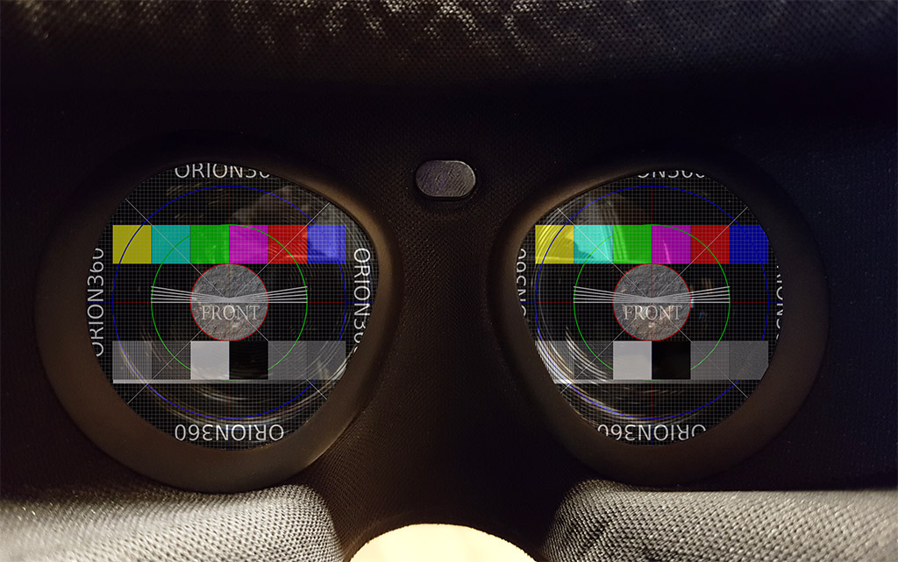
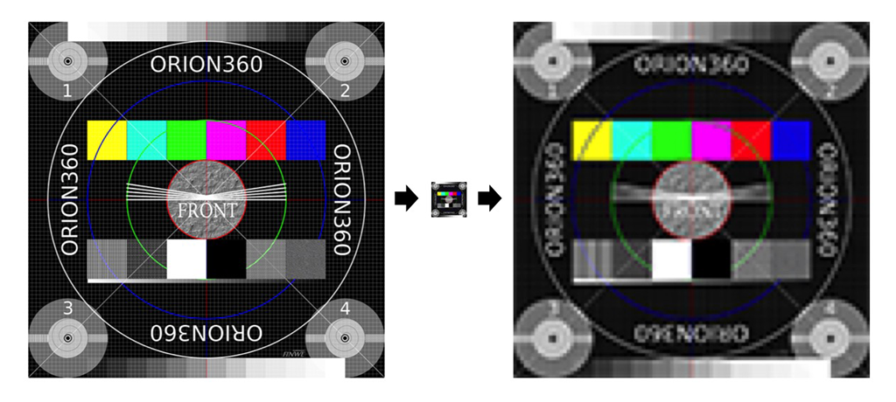
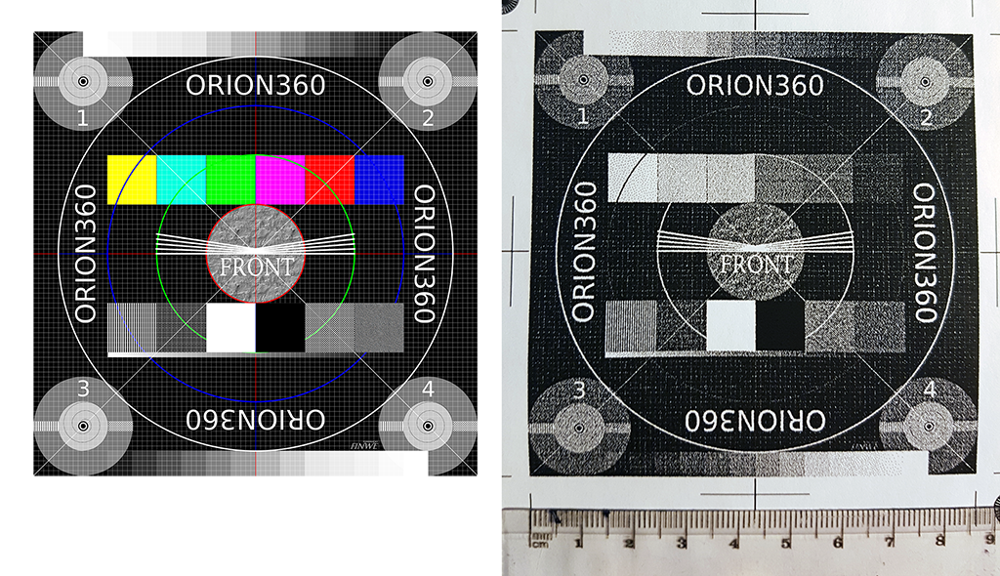

# Understanding Resolution in 360° Images



## Abstract

This article discusses image quality. We focus on image resolution:  the amount of detail and clarity. These are very significant to the perceived quality of an image.

A content producer must find a reasonable balance between image quality and size. There are also many technical limitations to take into account. We have collected relevant information to one place to make it easier to choose a resolution. We also provide insights from Finwe experts.

The article starts with the basics. We explore many different ways to understand, describe, and measure resolution. Then, we expand what we have learned to panoramic images. Devices used for content production and playback are presented and technical limitations discussed. Finally, we present our best practices and recommendations.

## Definition

First, let us define what we mean by *image resolution*.

> Image resolution is the detail an image holds ... Higher resolution means more image detail. ([1])

The concept of image resolution applies to *raster digital images* ([2]), such as JPG, PNG and BMP images. Images created with *vector graphics* ([3]) are different: they are defined mathematically. One example is SVG images, which are used in apps and on web pages. For vector images, a resolution is meaningful only when they are saved as raster images.

Digital cameras produce raster images. 360-degree photos and video frames make no exception. Sometimes a 360-degree image is *rendered* from a mathematical model, such as a CAD model of a building. The concept of resolution applies to the rasterized output file.

To be specific, in this article we mostly discuss *pixel resolution* ie. the pixel count in the image. We also sometimes refer to *spatial resolution* ie. how closely lines can be resolved in an image, for example in a printed photograph. We do not discuss *spectral resolution* ie. the ability to resolve spectral features and bands, for example, colors. From now on, when we use the words *image resolution* or *resolution* alone, we mean pixel resolution.


*Pixel resolution illustration by Wikipedia ([1])*

## Resolution in 2D images

### Image resolution

There are several methods to describe image resolution. In this article, we will use many of them:

> ... the convention is to describe the pixel resolution with the set of two positive integer 
> numbers, where the first number is the number of pixel columns (width) and the second is the 
> number of pixel rows (height), for example as 7680 × 6876. Another popular convention is to 
> cite resolution as the total number of pixels in the image, typically given as number of 
> megapixels, which can be calculated by multiplying pixel columns by pixel rows and dividing 
> by one million. Other conventions include describing pixels per length unit or pixels per area 
> unit, such as pixels per inch or per square inch. ([1])

As an example, the image below is 1024 pixels wide and 1024 pixels tall. We can describe its resolution as 1024 x 1024 pixels (width x height). We can also calculate the total number of pixels
the image contains by multiplying width and height:

```
1024 px x 1024 px = 1048576 px
```

After dividing this value by one million, we get the resolution in megapixels. It is usually rounded to the nearest integer, but sometimes to the first decimal:

```
1048576 px / 1000000 = 1.048576 MPx ~ 1.0 MPx ~ 1 MPx
```

In other words, this image has a 1024x1024 or 1-megapixel resolution. It looks pretty sharp on the screen. It means that its resolution is high enough for the amount of detail it represents.


We cannot say much about its number of pixels *per length unit* or *per area unit*. The reason is that on this website its size will be *scaled* to match with the width of this text column. The physical size of this text column depends on the size of the display device and application window. Hence, at the time of writing this, it is impossible to know the size of the image as it appears on *your* screen.

As an example, let us consider a tablet's screen. The width of this column could be, say 163 mm. Hence, we could argue that its resolution must be about 6 pixels per millimeter:

```
1024 px / 163 mm = ~6.28 px/mm
```

A more common representation uses the imperial notation, pixels per inch (ppi):

```
1024 px / 6.4 in = 160 ppi
```

The value calculated above is not correct. If you are reading this from a computer screen, try changing the width of your browser window. You should see that the image above will be automatically resized. The resolution of the image file that your browser has downloaded has not changed. What you see on screen is actually a *copy* of the original image that your browser has created and scaled to match with this column's width. That copy probably has a different resolution than the original file does. Hence, our statement is using a wrong pixel count and is not true.

How to find out *the resolution of an image that appears on screen*? We need to know the physical size of the image on the screen and the pixel density of the display device. For example, a modern Apple iPad has 264 pixels per inch (ppi) ([4]). Thus, an image that is 6.4 inches wide should have about 1690 pixels when it is drawn on an iPad's screen. Curiously, this happens to be 666 pixels *more* than we have in the original image! Where did these extra pixels come from?

```
264 ppi * 6.4 in = ~1690 px
1690 px - 1024 px = +666 px 
```

### Screen resolution

When an image is captured and saved into a file, the file maintains the original *image resolution* ie. the number of pixels that were captured. When the image is loaded from a file and rendered on screen, it has a new property called *screen resolution*. This is the number of display pixels that are used for drawing the image on the screen.

The former describes the amount of detail in the image but has nothing to do with its physical size. The latter has everything to do with physical size but says nothing about detail. Detail and size can be both expressed as a number of pixels, yet they are two different things.

Now, although they are different things, they both play a part in the end result. Thus, we must understand the *relation* between image resolution and screen resolution. Consider our test image again: what happens if we reduce its image resolution to 100 x 100 pixels? Certainly, it would lose most of its detail! You cannot express such a complex image properly with so few pixels. Yet, on screen the browser would still scale it to match with the width of this column, no questions asked.

This loss of detail is illustrated below. A 1024 x 1024 pixel image is first downscaled to 100 x 100 pixels and then upscaled back to 1024 x 1024 pixels. The result is a blurry mess.



*Left: Original image, 1024 x 1024 pixels.*

*Center: Downscaled image, 100 x 100 pixels. Most of the detail has been permanently lost.*

*Right: Upscaled image (1024 x 1024 pixels). Lost detail could not be recovered.*

How does this happen? Obviously, your computer must use much more than 100 x 100 pixels to draw the image on the screen. The display pixels are small and you need lots of them to draw a large image. But your computer cannot magically recreate the detail that was lost when we scaled down the original image. It is not possible, even if you see this happen regularly in crime series on TV. Hence, to create a larger image ie. a scaled-up version, the only option is to copy the same (or interpolated) pixels side by side. The resulting image on the screen will indeed have lots of pixels. But that only means it has high *screen resolution* ie. large size. Its *image resolution* is still 100 x 100 pixels, and contains very little detail.

How to ensure that we get a sharp image on the screen? We must have enough space for detail (high enough image resolution). Or, we must decrease image size (low enough screen resolution). In the beginning, we briefly mentioned *spatial resolution*. This is what it describes: the ability to distinguish detail from an image that has a certain physical size. Or, more simply put: the clarity of the image.

Spatial resolution is not just the value of pixels per inch. The maximum spatial resolution of an image is limited by the properties of the system that created the image. As an example, the lens of your camera is the first loop in a long chain. You can easily make things worse by manipulating image resolution and/or screen resolution, but you cannot make it better. (Well, maybe a little, by applying a filter that emphasizes certain features in the image.)

What is the optimal relation between image resolution and screen resolution? When we prepare the final version of our image, then the optimal relation is that they are *equal*. Screen resolution defines what will be drawn on the screen ie. what user will see. Higher image resolution does not bring any benefit, as added detail cannot be seen. On the other hand, it may cause downscaling artifacts and will require a larger file size. Lower image resolution leads to upscaling ie. less detail than what an equal resolution would provide.

### Print resolution

To complete our analysis for 2D images, let us briefly consider 
*printing*. If we printed our test image on paper in 100 x 100 mm size, we would have point density of ~10 points per millimeter. Correct?
```
1024 px / 100 mm = 10.24 points/mm
```

A more common representation uses the imperial notation, dots per inch (dpi):

```
1024 px / 3.94 in = ~260 dpi
```

It is not correct. A printer cannot print *any* number of points per millimeter. It has a resolution of its own, just like a display device has.

The calculated value is a bit less than what a typical 300 dpi resolution laser printer is capable of. If we wish to use the printer's maximum resolution to reach the best possible print quality, we must satisfy with smaller image size than 100 mm x 100 mm:

```
1024 px / 300 dpi = 3.41 in ~ 87 mm
```



*1024 x 1024 pixel image (left) printed from Photoshop in 300 dpi with a laser printer (right) is about 87 x 87 mm on paper.*

If we decide to print the image in 100 x 100 mm size, then the printer's driver must scale up our image to produce content for the "missing" pixels (actually dots). This is similar to what a web browser
does when it stretches an image to a larger size on display by copying/interpolating pixels.

```
300 dpi * 3.94 in = 1182 px
1182 px - 1024 px = +152 px
```

In reality, a laser printer users a rasterization algorithm to produce gray colors. It does this by alternating empty space between black printed dots. Hence, there will not be a 1:1 mapping from pixels to dots when you print a photograph. You can see this in action in the printed image above by looking at the grayscale squares. 

Nowadays many laser printers have 600 dpi or higher resolution. Inkjet printers often claim much higher dpi values. This is most aggressive marketing, but they also measure dpi as the number of drops of ink per inch. Moreover, they use algorithms that are supposed to improve print quality via optimization. Furthermore, in an image file the pixels are next to each other but on paper, the drops of ink have space between them.

All in all, it is not straightforward to understand what is the actual mapping of image pixels to dots on paper. One rule of thumb is that most book publishers require images in 300 ppi resolution. Hence, if you want to print an image in 100 x 100 mm size on a book page, your image file should be *at least* 1182 x 1182 pixels.

```
300 dpi * 3.94 in = 1182 px
```

## Resolution in 360-degree images

### Equirectangular projection

Now we will move on to discuss image resolution in 360-degree images. Let us begin by creating a wide-angle version of our test image. We will use our original test image as a single cube face and make five copies of it to produce the six faces of a cube. Then we will put a virtual camera to its center point and render a spherical 360-degree image. To save that 3D image into a flat PNG file, we must choose *a projection*. It must be one of those that are designed for projecting a sphere into a planar surface. (This is similar to how we project a map of our dear planet Earth to a piece of paper.) Here we will use the most common panorama projection: the equirectangular. The result looks like this:


*360-degree image rendered from inside a test cube using equirectangular projection.*
 
Take a moment to examine the image above and find the four cube faces at the horizon level (front, right, back, left) as well as the cube's top and bottom faces (they are heavily distorted).

The image covers 360 degrees horizontally: at the center of the cube, our virtual camera has turned around full 360 degrees along the yaw angle. As a consequence, left and right edges of the image match with each other seamlessly.
 
The image also covers 180 degrees vertically: at the center of the cube, our virtual camera has turned around 180 degrees along the pitch angle. The top row of pixels are all the same and they illustrate what is exactly above the camera (zenith). The bottom row of pixels are also all the same and they illustrate what is exactly below the camera (natural direction, nadir).

Thus, this is a *full spherical 360x180 degree image* and it covers every possible viewing direction that can be seen from the center of the cube.

*Of course, the described camera rotation is just a convention. It could have turned 180 degrees horizontally and 360 degrees vertically to produce a spherical image with a 1:2 aspect ratio. Also, the rotation angles do not need to align with the main axis at all to produce a spherical image, they just need to be perpendicular to each other.*

**Notice that a spherical image is NOT 360x360 degrees; that is mathematically incorrect representation although it is sometimes seen in marketing materials. A 720-degree image is even more wrong!**

To see how a video player projects equirectangular video frames on screen, play the video below. Try interacting with it by panning. It is easier if you first select the fullscreen mode.

<iframe src="https://player.vimeo.com/video/191954539" width="640" height="274" frameborder="0" webkitallowfullscreen mozallowfullscreen allowfullscreen></iframe>

While playing the video you may notice that image clarity suddenly changes. This is *adaptive streaming* in action: the player measures network bandwidth during playback and changes to the maximum resolution that bandwidth allows.

### Aspect ratio

Equirectangular projection looks perhaps a bit weird at first sight. To understand it better, let us remind ourselves how the map of the World looks like in this projection. You have probably seen it before:


*An example of equirectangular projection by Wikipedia ([5])*

In our previous example, we started from a *3D cube*. We saw how straight lines got bent when the equirectangular projection was applied. This time we start from a *3D sphere* (the Earth). Notice how the meridians are projected as *vertical straight lines of constant spacing*. And circles of latitude as *horizontal straight lines of constant spacing*.

The equirectangular projection has many fallacies. It is not an equal area projection (see how large the Antarctic appears!) It is not conformal (angles are not preserved!) It is wasteful (lots of redundant pixels)! Yet, the equirectangular projection is the de-facto standard in 360-degree imaging. This is probably related to the particularly simple relationship between the position of a pixel in the image and corresponding point on the surface of a sphere. It makes the life of software developers easy.

Consider a full spherical equirectangular image whose resolution is 1024 x 512 pixels. (The map above will do.) Choose *any* pixel in the image. Now, if you want to move 30 degrees east, you can calculate this in pixels as shown below. To move in a vertical direction, you use 180° degrees instead of 360°. If you pass the edge of the image, continue in the same direction from the opposite edge of the image. That's it. Simple linear relationship. It may not be obvious, but other projections are considerably more complex to handle.

```
1024 px * (30°/360°) = 85 px
```

2D images have a property called *aspect ratio*. It describes the proportional relationship between its width and its height. For example, a square has aspect ratio 1:1 because width and height are
the same. An image whose resolution is 1920 x 1080 pixels has aspect ratio 16:9 or 1.77:1.

```
1920 x 1080 = (120 * 16) x (120 * 9)
16 : 9 = 1.77 
```

In the World map image, horizontal and vertical lines appear at 15-degree intervals. Count the lines. You will notice that there is twice the number of vertical lines than horizontal lines. We can make a conclusion that **proper aspect ratio for a full spherical equirectangular image must be 2:1**. This is because horizontally there are twice the amount of degrees than vertically (360 x 180). Also, we want to treat horizontal and vertical degrees equally ie. use the same amount of pixels per degree.

2:1 aspect ratio is a bit different than what we have used to, but not that far off from common video formats:

Aspect ratio | Normalized ratio | Typical use
---------|--------------------|---------------
4:3 | 1.33:1 | Traditional TV
16:9 | 1.78:1 | HD video
1.85:1 | 1.85:1 | Most movies
2:1 | 2.00:1 | **Equirectangular panoramas**
2.39:1 | 2.39:1 | Widescreen movies

When you deliver 360-degree images or videos using the equirectangular projection, use 2:1 aspect ratio. Image width should be two times its height. For example, 1920 x 960 has proper aspect ratio 2:1. Commonly used FullHD resolution 1920 x 1080 is 16:9. It is *taller*. With that resolution, your image has more capacity for detail vertically than horizontally. 360-degree video players can handle that, but from the content point of view it makes little sense. Likewise, if you aim for 4K quality use 3840x1920 (2:1), not 3840x2160 (16:9).

### Panorama resolution

Now, scroll back up and take a closer look at our equirectangular image of a cube. If you observe it carefully, you will notice that this image does not look as sharp as our original cube face. They are both 1024 pixels wide images and also scaled to the same width on the screen. Hence, both image resolution and screen resolution are exactly the same (horizontally). What is different?

Recall that we *added* 5 more cube faces - much more information - to this new image. Yet we didn't increase image resolution ie. the amount of detail the image can hold. Major error. Besides, we changed the projection and halved the vertical resolution from 1024 px to 512 px.

How can we measure the amount of detail in panoramic images, where field-of-view (the observable area) varies? As shown above, image resolution and screen resolution do not take this into account. We need something else.

Consider that four cube faces (front, right, back, left) cover 360-degree spin at the horizon level. This means that one cube face must cover 90 degrees field-of-view (360/4=90).

The width of our equirectangular image of a cube is 1024 pixels and its height is 512 pixels (2:1 aspect ratio). Thus, we can calculate its *resolution per degree* as follows and express it in *pixels per degree* (ppd):

```
1024 px / 360° = ~2.84 ppd
```

To compare, our original cube covers only 90 degrees and has a higher resolution per degree:

```
1024 px / 90° = ~11.37 ppd
```

How can we make our 360-degree cube image carry as much detail as the original 90-degree cube face? Let us focus on the horizon level where the projection does not distort the image much. We need 4x the resolution that we have now:

```
4096 px / 360° = ~11.37 ppd
```

What if we made a 180-degree version, assuming viewers will focus to the front direction? Simple:

``` 
1024 px / 180° = ~5.69 ppd 
2048 px / 180° = ~11.37 ppd
``` 

*Resolution per degree* appears to be a useful method for expressing the amount of detail in panoramic images. The benefit is that values are comparable despite used field-of-view. In this article, we will use the term *panorama resolution* to reference it.

We have also learned that 360-degree images need much higher *image resolution* than ordinary 2D images to "look the same quality". Simply because they contain larger field-of-view ie. cover a larger area with pixels. This is often hard to understand for end users. People have a mental model of what "FullHD" or "4K" is supposed to look like. But through a 360-degree player, you are likely seeing about 1/8th of the total amount of pixels at any moment of time!

*Field-of-view* (FOV) is the size of an observable area, described in degrees. We must be careful as the value can be horizontal, vertical, or diagonal measure of a rectangular area. When we view 360-degree content, there are effectively two FOVs that play a part. Image field-of-view refers to an observable area in the the whole image frame. Viewport field-of-view is a fraction of it, the part that is visible in the player. The latter can be user adjustable; is is effectively zoom level.

Let us rephrase the primary concepts of resolution for 360-degree images:

* Image resolution = total amount of detail in an image file / in a decoded video frame, in pixels

* Image field-of-view = total size of an observable area captured into an image, in degrees

* Panorama resolution = amount of detail per degree, in ppd

* Screen resolution = viewport size on screen, in pixels

* Viewport field-of-view = size of an observable area through a viewport, in degrees


### Retina resolution

In order to make an image look sharp on screen, both image resolution and screen
resolution must be high enough: you need enough pixels to store the details and enough pixels
to draw them on screen so that they remain distinguishable. We have already said that it is best
if they match perfectly: you can avoid aliasing errors that come from scaling if your image 
has *exactly* the same amount of pixels in file and on screen. You will also preserve all the detail
without wasting memory for something that cannot be seen by user. A well known example is matching
image resolutions of iOS app icons and button graphics with their screen resolutions so that 
they will look "perfect" as no scaling artifacts will occur.

Nowadays it is becoming less common to aim for pixel perfect presentation as there are so many 
different aspect ratios and screen resolutions that need to be supported. For example, on Android 
the approach is different: to support thousands of different device models developers cannot make
large amount of variants of each app icon; instead they are supposed to use vector graphics and
let the device rasterize a pixel perfect copy at runtime. This approach of course does not work
with images that have been captured with a camera and are raster images by nature. The solution
is simple: use images whose pixel resolution matches with the highest screen resolution that
will be needed. The operating system will downscale the images to lower resolutions on other
device models. You can also choose to provide a fistful of different sizes and let the system
select the nearest match. It is not perfect solution but good enough.

It is also worth to realize that the concept of pixel perfect imaging mainly applies to traditional
2D images; pixel-to-pixel matching is not possible with spherical 360-degree images as they
need to be projected from a spherical (curved) surface to a flat surface in order to be stored 
in common image and video formats, then projected back to spherical (curved) surface for 3D 
presentation within the image viewer / video player application, and once again to flat display 
surface when it is time to render part of the 360-degree image on screen. Try to preserve
pixel-to-pixel matching through those operations!

This leads us to a question: what would be the equivalent of pixel perfect presentation in 
360-degree images? Since we cannot know all the internal processing that occurs when a specific
pipeline renders our image on screen, in practice we just need an image that has *enough* 
resolution so that all the processing will not become visible in the end result. 

Then, what resolution is needed to make a 360-degree image look "perfect"? There is no single 
answer, as it depends on many parameters such as display resolution, used field-of-view, 
viewing distance, and projection. Let's discuss a few selected cases.

When Apple introduced iPhone4, they claimed that their new Retina displays have high enough
pixel density that the human eye cannot notice pixelation at a typical viewing distance. In
other words, the display would appear to look perfect (when it comes to resolution) since
you are unable to see the small dots that the image is made of. According to Apple the
spatial resolution required for this is about 300 ppi *for a device held 10-12 inches from
the eye*. In reality, a typical iPad has 9.7" inch screen size (diagonally), 264 ppi display
panel and 2048 x 1536 resolution.

Now, if we want to view a 360-degree photograph from an iPad's screen that we will hold 10 inches
from the eye, what would be the minimum pixel resolution for our 360-degree image so that it
would provide optimal quality ie. have enough pixels for that display when we turn full 360 
degrees around? Let's do some math:

Consider a circle that aligns with the horizon around a spectators head. This is the path the 
iPad travels when we hold it in front of our eyes and turn around 360 degrees to see the
complete 360-degree image. To simplify matters, we will assume a single eye at the center
of the circle. The radius of the circle is 10 inches (25.4 cm) and its circumference is:

```
2 * PI * 10 in = 62.8 in ~160 cm
```

Let us imagine that instead of moving a real iPad along this circular path, Apple would
produce a *round* cylindrical display and we would simply go stand at the center of it. 
Our imaginary round iPad retina display would be 62.8 inches "wide" (circumference).
Then, how many pixels would it have (horizontally)?

```
62.8 in * 264 ppi = ~16588 px
```

If our imaginary display would be *spherical*, its resolution would be 16588 x 8294 pixels
(because of aspect ratio 2:1). That would be a big display with almost 140 megapixels and
not practical at all (how would you even get inside?) Of course, in reality we will move
an ordinary tablet along a circular path, detect the movement with sensors, and update 
image content on screen.

```
16588 x 8294 = 137580872 ~ 138 Mpx
```

Yet from content creation point of view our target *is* that imaginary spherical display. 
Creating content for such a display is not impossible at all: we can easily create much, much
larger 360-degree photographs, and 8K 360-degree video is becoming commonplace - when we double
that to 16K a few years later, we have achieved *retina resolution* for iPads. Neat.

What if our 360-degree image is viewed through VR glasses? It is difficult to say what would
be the correct distance for the radius of the circle that we used in the previous analysis: the
display itself is really close to the eye, so the radius appears to be a small value. But 
in reality the image is viewed through a lens, and that must be taken into account. The focal 
distances in different headsets is usually not mentioned in the product specifications. 

Fortunately, there is a nice shortcut. Let us consider Oculus Go, whose display resolution is 
2560 x 1440 in total, and 1280 x 1440 per eye. The horizontal field-of-view that a single eye
covers in Oculus Go is said to be about the same as in Oculus Rift, where it was 94 degrees.
Therefore, a 360-degree panorama image for Oculus Go should have at least 4902 x 2451 resolution
or about 12 megapixels. This can be easily satisfied already by filming 360-degree photos and
videos in 8K (or 6K) and providing final output in about 5K. 

```
1280 px / 94° = 13.61 px/°
360° * 13.61 px/° = 4902 px
4902 px / 2 = 2451 px
4902 px * 2451 px = ~12015115 px ~ 12.0 Mpx
```

### Human eye resolution

However, Oculus Go is a nice headset but far from the concept of a retina display. If we want to
future-proof our content and target for VR headsets that have "retina displays", what resolution
do we need? This is the same question as what is the resolution of a human eye itself, how many 
megapixels?


*Human eye illustration by Wikipedia ([6])*

According to ([7]), let us consider a view in front of a spectator that is 90 degrees by 90 degrees.
The number of pixels a human eye could see through such window is ~324 Mpx. Remember our cube face
that was also 90 by 90 degrees? To have full 360-degree view we need 6 cube faces, resulting to 
6 * 324 Mpx = 1944 Mpx or 1.9 Gpx. If we wanted to use equirectangular projection instead, we
will find that if square contains 324 Mpx then its side length is 18000 px and at horizon line
we need 4 x 90 degrees for a 360-degree images, therefore 4 x 18000 px = 72000 px. Aspect ratio 2:1
yields 72000 x 36000 px and in total 2592 Mpx or 2.6 Gpx.

*Why do we need so much more pixels with equirectangular projection, compared to a cube map? This is
because equirectangular projection is wasteful: there are multiple copies of same pixels ie. pixels
that provide no new information. Cubemap projection requires 25% less pixels to produce same output.*

The interesting point is that about 2-3 Gpx image (72000 x 36000 px) should be enough for human eye,
now and in the future. 

Hey, wait a minute? What about Apple's retina displays - we already
calculated that 138 Mpx should be enough, right? Well, it is kind of apples and oranges case:
The claim about retina displays is that at the typical viewing distance of 10-12 inches user is
not suppose to see individual pixels, which is not exactly the same thing as how much details a
human eye can see in best conditions. Also, ([7]) adds an interesting scientific point of view -
apparently humans can see *more* details than our retina alone is able to distinguish:

> The eye is not a single frame snapshot camera. It is more like a video stream. The eye moves 
> rapidly in small angular amounts and continually updates the image in one's brain to "paint" 
> the detail. We also have two eyes, and our brains combine the signals to increase the resolution
> further. We also typically move our eyes around the scene to gather more information. Because of
> these factors, the eye plus brain assembles a higher resolution image than possible with the 
> number of photoreceptors in the retina. So the megapixel equivalent numbers below refer to the 
> spatial detail in an image that would be required to show what the human eye could see when you
> view a scene.

## Hardware

### Camera resolution

### Display resolution

### VR headset resolution

## Technical limitations

### Video encoder

### OpenGL

### Network

## Best practices

## Recommendations

## Summary

A summary of some useful terms and their meaning:

* Pixel resolution = the amount of detail an image can hold in file and in memory
* Screen resolution = the physical size of an image on screen in screen pixels
* Spatial resolution = the amount of pixels per length unit (the clarity of an image on screen / paper)
* Panorama resolution = the amount of pixels per degree (the amount of detail per angle)

## References

[1]: https://en.wikipedia.org/wiki/Image_resolution
[2]: https://en.wikipedia.org/wiki/Raster_graphics
[3]: https://en.wikipedia.org/wiki/Vector_graphics
[4]: https://www.apple.com/lae/ipad/compare/
[5]: https://en.wikipedia.org/wiki/Equirectangular_projection
[6]: https://en.wikipedia.org/wiki/Retina
[7]: http://clarkvision.com/imagedetail/eye-resolution.html

