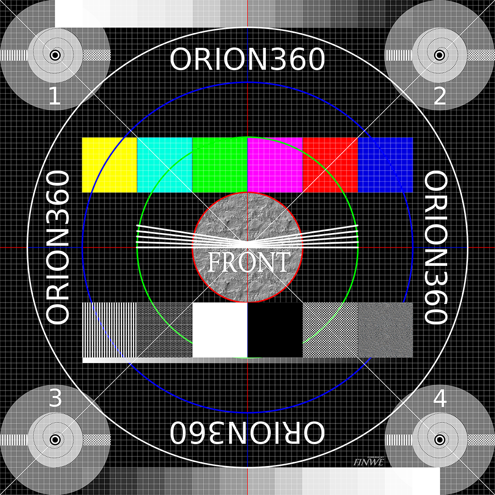
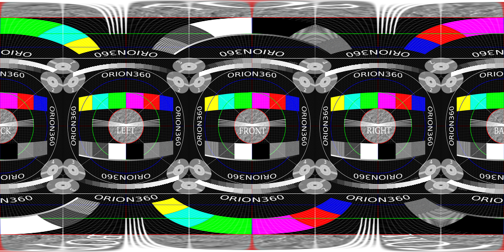

# Understanding Resolution in 360°


## Definition

First, let us define what we mean by *image resolution*.

> Image resolution is the detail an image holds ... Higher resolution means more image detail. ([1])

The concept of image resolution applies to *raster digital images* ([2]), such as JPG, PNG and BMP
images. It is important to differentiate images created with *vector graphics* ([3]), such as SVG
images, as they are defined mathematically and image resolution for such images becomes meaningful
only when the image is saved in a different format (rasterized to JPG, for instance). 

Digital cameras produce raster images. 360-degree photos and video frames make no exception. 
Sometimes a 360-degree image is *rendered* from a mathematical model (such as a CAD model of a 
building) using a virtual camera. Even if the model uses vector graphics internally, the concept 
of resolution applies to the rasterized output file (compare to an SVG image rasterized to JPG).

To be specific, in this article we mostly discuss *pixel resolution* ie. the pixel count in the 
image, not *spatial resolution* (how closely lines can be resolved in an image - for example from
a printed photograph) or *spectral resolution* (the ability to resolve spectral features and bands
- for example colors). From now on, when we use the word *resolution* we mean pixel resolution.


*Pixel resolution illustration by Wikipedia ([1])*

## Describing Resolution

### Methods

There are several methods to describe image resolution. In this article, we will use many of them:

> ... the convention is to describe the pixel resolution with the set of two positive integer 
> numbers, where the first number is the number of pixel columns (width) and the second is the 
> number of pixel rows (height), for example as 7680 × 6876. Another popular convention is to 
> cite resolution as the total number of pixels in the image, typically given as number of 
> megapixels, which can be calculated by multiplying pixel columns by pixel rows and dividing 
> by one million. Other conventions include describing pixels per length unit or pixels per area 
> unit, such as pixels per inch or per square inch. ([1])

As an example, the image below is 1024 pixels wide and 1024 pixels tall and we can describe its
resolution as 1024 x 1024 pixels (width x height). We can also calculate the total number of pixels
the image contains simply by multiplying width and height:

```
1024 px x 1024 px = 1048576 px
```

By dividing this value by one million, we get the resolution in megapixels, which is usually rounded
to the nearest integer or sometimes to the first decimal:

```
1048576 px / 1000000 = 1.048576 MPx ~ 1.0 MPx ~ 1 MPx
```

In other words, this image has 1024x1024 or 1 megapixel resolution. It looks pretty sharp on screen.



We cannot say much about its number of pixels *per length unit* or *per area unit*, because its 
size will be *scaled* to match with the width of this text column, and the size of this text 
column in millimeters (or inches) depends on the display device and window where the content
is rendered to. For example, on a tablet's screen the width of this column could be, say 163 mm, 
hence we could argue that its resolution must be about 6 pixels per millimeter:

```
1024 px / 163 mm = ~6.28 px/mm
```

A more common representation uses the imperial notation, pixels per inch (ppi):

```
1024 px / 6.4 in = 160 ppi
```

The value calculated above is not correct. For example, if you are reading this from a computer 
screen, try resizing the width of your browser window: you should see that the image above will 
be automatically resized. The resolution of the original image file that your browser has 
downloaded remains the same and what you see on screen is actually a *copy* of the original image
that your browser has created and scaled to match with this column's width. That copy probably 
has a different resolution than the original file does, hence our statement is not true. 

In order to calculate *the resolution of the image that appears on screen*, we need to know the
pixel density of the display itself. For example, a modern Apple iPad has 264 pixels per inch (ppi)
([4]) and therefore an image that is 6.4 inches wide should have about 1690 pixels when it is drawn
on iPad's screen. That happens to be 666 pixels wider than our original image! Where did these 
extra pixels came from?

```
264 ppi * 6.4 in = ~1690 px
```

### Screen resolution

Let us rephrase what we just learned: When an image is captured and saved into a file, the file
maintains the original *image resolution* (the amount of pixels that were captured and stored into 
the file). But when it is loaded from the file and rendered on screen, it has *screen resolution* 
(the amount of pixels used for drawing it on screen). The former describes the amount of detail in
the image but has nothing to do with its physical size (which will be fixed only when it is either
rendered on screen or printed on paper so that we can see it). The latter has everything to do with
physical size, but says nothing about detail. Try to remember that detail and size can be both 
expressed as an amount of pixels, but they are two different things.

Now, although they are different things, they both play apart in the end result. Therefore, 
it is important to understand the relation between the resolution of an image in a file
and on screen. Consider the image above: what if its (file) resolution would be reduced to
10 x 10 pixels? Certainly it would become a blurry mess; you cannot express such a complex
image properly with so few pixels. Yet on screen the browser would still scale it to match 
with the width of this column, no questions asked.

Obviously, your computer must use much more than 10 x 10 pixels to draw the image on screen since
the display pixels are really small and you need lots of them to draw a wide image. But your 
computer cannot magically recreate the detail that was lost when we scaled down the original image.
Hence, its only option is to copy similar pixels that it loaded from the file side by side
to create a larger image (a scaled up version). This resulting image on screen will have lots of 
pixels, meaning that it has high *screen resolution* ie. large size, but its *image resolution* 
would still be really low ie. very little detail.

To make such a blurry image look good, you must either increase detail (image resolution) or 
decrease size (screen resolution). This is what *spatial resolution*, which we briefly mentioned
in the beginning, is all about: the ability to distinguish detail from an image that has a
certain physical size.

### Print resolution

To complete our analysis of describing pixel resolution for 2D images, let us briefly consider 
printing: if we printed our image on paper into a square whose dimensions are 100 mm x 100 mm, 
we would have point density of ~10 points per millimeter, right?

```
1024 px / 100 mm = 10.24 points/mm
```

A more common representation uses the imperial notation, dots per inch (dpi):

```
1024 px / 3.94 in = ~260 dpi
```

Wrong again! Obviously a printer cannot print *any* number of points per millimeter; it has a
resolution of its own, just like a display device does. 

The calculated value is a bit less than what a typical 300 dpi resolution laser printer is 
capable of. If we wish to use such printer's maximum resolution to get the best possible print 
quality, we must satisfy with slightly smaller image size than 100 mm x 100 mm.

```
1024 px / 300 dpi = 3.41 in ~ 87 mm
```

Else, the printer must scale up our image to produce content for the "missing" pixels (actually 
dots), similar to what a web browser does when it stretches an image to a larger size by 
copying/interpolating pixels:

```
300 dpi * 3.94 in = 1182 px
1182 px - 1024 px = +152 px
```

*Note: In reality a laser printer users a rasterization algorithm to produce gray colors by
alternating empty space between black printed dots, hence it will not be a 1:1 mapping from
pixels to dots when you print a photograph.*

### Panorama resolution

So far we haven't said anything about resolution in 360-degree images. Let's first create one:
We will use the image above as a single cube face and make 5 more copies of it to produce the
six faces that are required to form a cube. Then we will put a virtual camera inside the cube, 
exactly to its center point, and render a spherical 360-degree image. In order to save that 3D 
image into a PNG file, we must choose *a projection* that can be used for projecting a sphere 
into a planar surface, just like we project a map of our dear planet Earth to a piece of paper 
(that is a topic of its own for another article). For simplicity, we will use most common 
panorama projection: the equirectangular. The output looks like this:



Use a moment to examine the image above and find the four cube faces at the horizon level 
(front, right, back, left) as well as the cube's top and bottom faces (heavily distorted).

The image covers 360 degrees horizontally: at the center of the cube, our virtual camera has 
turned around full 360 degrees along the yaw angle. As a consequence, left and and right edges 
of the image fit to each other seamlessly.
 
The image also also covers 180 degrees vertically: at the center of the cube, our virtual camera
has turned around 180 degrees along the pitch angle. The top row of pixels are all the same and
they illustrate what is exactly above the camera (zenith). The bottom row of pixels are also all
the same and they illustrate what is exactly below the camera (natural direction, nadir).

Therefore, this is a *full spherical 360x180 degree image* and it covers every possible viewing 
direction that can be seen from the center of the cube.

**Notice that a spherical image is NOT 360x360 degrees; that is mathematically incorrect 
representation although it is sometimes seen in marketing materials. 720 degree image is
even more wrong!**

We can immediately see that the proper *aspect ratio* of a full spherical image is always 2:1, 
as there are horizontally twice the amount of degrees than vertically and we want to treat
horizontal and vertical degrees equally. This aspect ratio is a bit different than what we
have used to: 4:3 (standard TV), 16:9 (HD channels), 21:9 (most movies).

*Of course the described camera rotation is just a convention: it could have turned 180 degrees
horizontally and 360 degrees vertically to produce a spherical image with 1:2 aspect ratio. Also, 
the rotation angles do not need to align with the main axis at all to produce a spherical image,
they just need to be perpendicular to each other.*

The width of our equirectangular image above is 1024 pixels and its height is 512 pixels 
(2:1 aspect ratio). Therefore, we can calculate its *resolution per degree* as follows and 
express it in *pixels per degree* (ppd):

```
1024 px / 360° = ~2.84 ppd
```

We can also see that the image does not look as sharp as our original cube face. Why is that?
Remember that we have added 5 more cube faces, changed the projection, and halved the vertical
resolution from 1024 px to 512 px! Consider that four cube faces (front, right, back, left)
cover 360 degree spin at the horizon level. This means that one cube face covers 90 degrees
field-of-view horizontally (360/4=90). To compare, our original cube face had much higher
resolution per degree (exactly 4x higher, of course):

```
1024 px / 90° = ~11.37 ppd
```

To make our 360-degree cube contain as much detail as the original cube face (at least on
the horizon level where the projection does not distort the image much), we'd need 4x the
resolution that we have now:

```
4096 px / 360° = ~11.37 ppd
```

We can now see that *resolution per degree* is a useful method for expressing resolution
(the amount of detail image holds) when we talk about wide-angle panoramic images. We will
use the term *panorama resolution* to reference it.

We have also learned that 360-degree images need much higher *image resolution* than ordinary
2D photos to provide the same amount of detail per degree ie. to "look the same quality".

### Retina resolution

In order to make an image look sharp on screen, both the original image resolution AND the screen
resolution must be high enough: you need enough pixels to store the details and enough pixels
to draw them on screen so that they remain distinguishable. It is best if they match perfectly: 
you can avoid aliasing errors that come from scaling if your image has *exactly* the same amount 
of pixels in file and on screen. A well known example is matching the file resolution of iOS app
icons and button graphics with their screen resolutions so that they will look "perfect" as no 
scaling artifacts will occur.

Nowadays it is becoming rare to aim for pixel perfect presentation as there are so many different 
aspect ratios and screen resolutions that need to be supported. For example, on Android the
approach is different: to support thousands of different device models developers cannot make
large amount of variants of each app icon; instead they are supposed to use vector graphics and
let the device rasterize a pixel perfect copy at runtime. This approach of course does not work
with images that have been captured with a camera and are raster images by nature.

It is also worth to realize that the concept of pixel perfect imaging mainly applies to traditional
2D images; pixel-to-pixel matching is not possible with spherical 360-degree images as they
need to be projected from a spherical (curved) surface to a flat surface in order to be stored 
in common image and video formats, then projected back to spherical (curved) surface for 3D 
presentation within the image viewer / video player application, and once again to flat display 
surface when it is time to render part of the 360-degree image on screen.

This leads us to a question: what would be the equivalent of pixel perfect presentation in 
360-degree images? What resolution is needed to make a 360-degree image look "perfect"? 
There is no single answer, as it depends on many parameters such as display resolution, 
used field-of-view, and projection.

Apple made a famous claim that ... todo

However, we can calculate human eye resolution ... todo


## References

[1]: https://en.wikipedia.org/wiki/Image_resolution
[2]: https://en.wikipedia.org/wiki/Raster_graphics
[3]: https://en.wikipedia.org/wiki/Vector_graphics
[4]: https://www.apple.com/lae/ipad/compare/
[5]: http://clarkvision.com/imagedetail/eye-resolution.html
