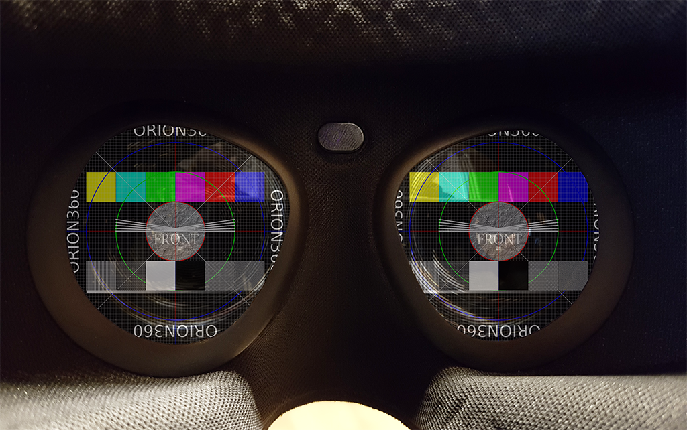

# Understanding Resolution in 360°



## Definition

First, let us define what we mean by *image resolution*.

> Image resolution is the detail an image holds ... Higher resolution means more image detail. ([1])

The concept of image resolution applies to *raster digital images* ([2]), such as JPG, PNG and BMP
images. It is important to differentiate images created with *vector graphics* ([3]), such as SVG
images, as they are defined mathematically and image resolution for such images becomes meaningful
only when the image is saved in a different format (rasterized to JPG, for instance). 

Digital cameras produce raster images. 360-degree photos and video frames make no exception. 
Sometimes a 360-degree image is *rendered* from a mathematical model, such as a CAD model of a 
building, using a virtual camera. Even if the model uses vector graphics internally, the concept 
of resolution applies to the rasterized output file.

To be specific, in this article we mostly discuss *pixel resolution* ie. the pixel count in the 
image. We also sometimes refer to *spatial resolution* ie. how closely lines can be resolved in 
an image, for example a printed photograph. We do not discuss about *spectral resolution* 
ie. the ability to resolve spectral features and bands, for example colors. From now on, when we
use the words *image resolution* or *resolution* alone we mean pixel resolution.


*Pixel resolution illustration by Wikipedia ([1])*

## Image resolution

There are several methods to describe image resolution. In this article, we will use many of them:

> ... the convention is to describe the pixel resolution with the set of two positive integer 
> numbers, where the first number is the number of pixel columns (width) and the second is the 
> number of pixel rows (height), for example as 7680 × 6876. Another popular convention is to 
> cite resolution as the total number of pixels in the image, typically given as number of 
> megapixels, which can be calculated by multiplying pixel columns by pixel rows and dividing 
> by one million. Other conventions include describing pixels per length unit or pixels per area 
> unit, such as pixels per inch or per square inch. ([1])

As an example, the image below is 1024 pixels wide and 1024 pixels tall and we can describe its
resolution as 1024 x 1024 pixels (width x height). We can also calculate the total number of pixels
the image contains simply by multiplying width and height:

```
1024 px x 1024 px = 1048576 px
```

After dividing this value by one million we get the resolution in megapixels, which is usually 
rounded to the nearest integer but sometimes to the first decimal:

```
1048576 px / 1000000 = 1.048576 MPx ~ 1.0 MPx ~ 1 MPx
```

In other words, this image has 1024x1024 or 1 megapixel resolution. It looks pretty sharp on screen.


We cannot say much about its number of pixels *per length unit* or *per area unit*, because on this
website its size will be *scaled* to match with the width of this text column, and the size of 
this text column in millimeters (or inches) depends on the display device and window where the 
content is rendered to. For example, on a tablet's screen the width of this column could be, 
say 163 mm, hence we could argue that its resolution must be about 6 pixels per millimeter:

```
1024 px / 163 mm = ~6.28 px/mm
```

A more common representation uses the imperial notation, pixels per inch (ppi):

```
1024 px / 6.4 in = 160 ppi
```

The value calculated above is not correct. For example, if you are reading this from a computer 
screen, try changing the width of your browser window: you should see that the image above will 
be automatically resized. The resolution of the original image file that your browser has 
downloaded remains the same and what you see on screen is actually a *copy* of the original image
that your browser has created and scaled to match with this column's width. That copy probably 
has a different resolution than the original file does, hence our statement is using wrong
pixel count and is not true. 

In order to calculate *the resolution of an image that appears on screen*, we need to know its
physical size and the pixel density of the display. For example, a modern Apple iPad has 264 
pixels per inch (ppi) ([4]) and therefore an image that is 6.4 inches wide should have about 
1690 pixels when it is drawn on iPad's screen. That happens to be 666 pixels more than we have
in the original image! Where did these extra pixels come from?

```
264 ppi * 6.4 in = ~1690 px
1690 px - 1024 px = +666 px 
```

## Screen resolution

Let us rephrase what we just learned: When an image is captured and saved into a file, the file
maintains the original *image resolution* ie. the amount of pixels that were captured and stored 
into the file. But when it is loaded from the file and rendered on screen, it has a property called
*screen resolution*: the amount of pixels that were used for drawing the image on screen. 

The former describes the amount of detail in the image but has nothing to do with its physical size
(which will be fixed only when it is either rendered on screen or printed on paper). The latter 
has everything to do with physical size, but says nothing about detail. Try to remember that detail 
and size can be both  expressed as an amount of pixels, but they are two different things.

Now, although they are different things, they both play apart in the end result. Therefore, 
it is important to understand the *relation* between image resolution and screen resolution. 
Consider our test image again: what if its image resolution would be reduced to
100 x 100 pixels? Certainly it would lose most of its details; you cannot express such a complex
image properly with so few pixels. Yet on screen the browser would still scale it to match 
with the width of this column, no questions asked. This is illustrated below, where a 1024 x 1024
pixel image is first downscaled to 100 x 100 pixels and then upscaled back to 1024 x 1024 pixels. 
The result is a blurry mess.


*Left: Original image, 1024 x 1024 pixels.*

*Center: Downscaled image, 100 x 100 pixels. Most of the detail has been permanently lost.*

*Right: Upscaled image (1024 x 1024 pixels). Lost detail could not be recovered.*

How did this happen? Obviously, your computer must use much more than 100 x 100 pixels to draw 
the image on screen since the display pixels are really small and you need lots of them to draw 
a large image. But your computer cannot magically recreate the detail that was permanently lost 
when we scaled down the original image. Hence, its only option is to copy same (or interpolated) 
pixels that it loaded  from the file side by side to create a larger image ie. a scaled up version. 
This resulting image on screen will indeed have lots of pixels, but that only means it has high 
*screen resolution* ie. large size. Its *image resolution* is still 100 x 100 pixels and contains 
very little detail.

To ensure that we get sharp image on screen, we must have enough detail (image resolution) or 
we must decrease image size (screen resolution). This is what *spatial resolution*, which we 
briefly mentioned in the beginning, describes: the ability to distinguish detail from an image 
that has a certain physical size. Or, more simply put: the clarity of the image. Of course, 
spatial resolution is not just the value of pixels per inch; the properties of the system that 
created the image define the maximum spatial resolution an image can have. You can make it worse 
by manipulating image resolution and screen resolution (as we did in the example above), but not 
better. Well, maybe a little, by applying a filter that emphasizes certain features in the image.

When we prepare the final version of an image that is intended for being displayed (not edited),
then the optimal relation between image resolution and screen resolution is that they are *equal*:
screen resolution defines what will be drawn on screen ie. what user will see, therefore higher
image resolution does not bring any benefit (but can cause downscaling artifacts) and lower image
resolution leads to upscaling ie. less detail than what an equal resolution would provide.

## Print resolution

To complete our analysis of describing pixel resolution for 2D images, let us briefly consider 
printing: if we printed our image on paper as a square whose dimensions are 100 mm x 100 mm, 
we would have point density of ~10 points per millimeter, right?

```
1024 px / 100 mm = 10.24 points/mm
```

A more common representation uses the imperial notation, dots per inch (dpi):

```
1024 px / 3.94 in = ~260 dpi
```

Wrong again! Obviously a printer cannot print *any* number of points per millimeter; it has a
resolution of its own, just like a display device does. 

The calculated value is a bit less than what a typical 300 dpi resolution laser printer is 
capable of. If we wish to use the printer's maximum resolution to get the best possible print 
quality, we must satisfy with slightly smaller image size than 100 mm x 100 mm:

```
1024 px / 300 dpi = 3.41 in ~ 87 mm
```


*1024 x 1024 pixel image (left) printed from Photoshop in 300 dpi with a laser printer (right).*

Else, the printer driver must scale up our image to produce content for the "missing" pixels 
(actually dots), similar to what a web browser does when it stretches an image to a larger 
size by copying/interpolating pixels:

```
300 dpi * 3.94 in = 1182 px
1182 px - 1024 px = +152 px
```

*Note: In reality a laser printer users a rasterization algorithm to produce gray colors by
alternating empty space between black printed dots, hence it will not be a 1:1 mapping from
pixels to dots when you print a photograph.*

## Panorama resolution

So far we haven't said anything about resolution in 360-degree images. Let's first create one:
We will use the image above as a single cube face and make 5 more copies of it to produce the
six faces that are required to form a cube. Then we will put a virtual camera inside the cube, 
exactly to its center point, and render a spherical 360-degree image. In order to save that 3D 
image into a PNG file, we must choose *a projection* that can be used for projecting a sphere 
into a planar surface, just like we project a map of our dear planet Earth to a piece of paper 
(projections are a topic of its own for another article). For simplicity, we will use the most
common panorama projection: the equirectangular. The output looks like this:


Use a moment to examine the image above and find the four cube faces at the horizon level 
(front, right, back, left) as well as the cube's top and bottom faces (heavily distorted).

The image covers 360 degrees horizontally: at the center of the cube, our virtual camera has 
turned around full 360 degrees along the yaw angle. As a consequence, left and and right edges 
of the image fit to each other seamlessly.
 
The image also covers 180 degrees vertically: at the center of the cube, our virtual camera
has turned around 180 degrees along the pitch angle. The top row of pixels are all the same and
they illustrate what is exactly above the camera (zenith). The bottom row of pixels are also all
the same and they illustrate what is exactly below the camera (natural direction, nadir).

Therefore, this is a *full spherical 360x180 degree image* and it covers every possible viewing 
direction that can be seen from the center of the cube. 

*Of course the described camera rotation is just a convention: it could have turned 180 degrees
horizontally and 360 degrees vertically to produce a spherical image with 1:2 aspect ratio. Also, 
the rotation angles do not need to align with the main axis at all to produce a spherical image,
they just need to be perpendicular to each other.*

**Notice that a spherical image is NOT 360x360 degrees; that is mathematically incorrect 
representation although it is sometimes seen in marketing materials. 720 degree image is
even more wrong!**

To be honest, that projection looks a bit weird at first sight. To understand it better, let us 
remind ourselves how the map of the World looks like when drawn with this projection:


*An example of equirectangular projection by Wikipedia ([5])*

Pay attention how the meridians are projected as vertical straight lines of constant spacing,
and circles of latitude to horizontal straight lines of constant spacing (here every 15 degrees).
We can immediately see that the proper *aspect ratio* of a full spherical equirectangular image 
is always 2:1, as there are horizontally twice the amount of degrees (lines) than vertically, 
and usually we want to treat horizontal and vertical degrees equally in a spherical image.

This aspect ratio is a bit different than what we have used to: 

Aspect ratio | Normalized ratio | Typical use
---------|--------------------|---------------
4:3 | 1.33:1 | Traditional TV
16:9 | 1.78:1 | HD video
1.85:1 | 1.85:1 | Most movies
2:1 | 2.00:1 | **Equirectangular panoramas**
2.39:1 | 2.39:1 | Widescreen movies

Now, scroll back up and take a closer look at our equirectangular image of cube. If you look 
carefully, you'll notice that this image does not look as sharp as our original cube face, 
although they are both 1024 pixels wide images and also scaled to same width on screen,
hence image resolution and screen resolution are exactly the same. What is different, then?

We must remember that we have *added* 5 more cube faces - much more information - to this
new image without increasing pixel resolution ie. the amount of detail the image can hold. 
In addition, we have changed the projection, and halved the vertical resolution from 1024 px 
to only 512 px. 

How can we measure the amount of detail in panoramic images, where the field-of-view (the
observable area an image covers) is not always the same? As shown above, image resolution
and screen resolution do not take this into account and therefore we need something else.

Consider that four cube faces (front, right, back, left) cover 360 degree spin at the horizon 
level. This means that one cube face must cover 90 degrees field-of-view horizontally (360/4=90).

The width of our equirectangular image of cube is 1024 pixels and its height is 512 pixels 
(2:1 aspect ratio). Therefore, we can calculate its *resolution per degree* as follows and 
express it in *pixels per degree* (ppd):

```
1024 px / 360° = ~2.84 ppd
```

To compare, our original cube that covers only 90 degrees has much higher resolution *per degree*
(exactly 4x higher, of course):

```
1024 px / 90° = ~11.37 ppd
```

To make our 360-degree cube image carry as much detail as the original 90-degree cube face (at 
least on the horizon level where the projection does not distort the image much), we'd need 4x 
the resolution that we have now:

```
4096 px / 360° = ~11.37 ppd
```

From this simple analysis we can learn that *resolution per degree* is a useful method for 
expressing resolution (the amount of detail image holds) when we talk about wide-angle 
panoramic images. In this article we will use the term *panorama resolution* to reference it. 

We have also learned that 360-degree images need much higher *image resolution* than ordinary
2D photos to provide the same amount of detail per degree ie. to "look the same quality",
simply because they contain larger field-of-view ie. cover larger area with pixels.

## Retina resolution

In order to make an image look sharp on screen, both image resolution and screen
resolution must be high enough: you need enough pixels to store the details and enough pixels
to draw them on screen so that they remain distinguishable. We have already said that it is best
if they match perfectly: you can avoid aliasing errors that come from scaling if your image 
has *exactly* the same amount of pixels in file and on screen. You will also preserve all the detail
without wasting memory for something that cannot be seen by user. A well known example is matching
image resolutions of iOS app icons and button graphics with their screen resolutions so that 
they will look "perfect" as no scaling artifacts will occur.

Nowadays it is becoming less common to aim for pixel perfect presentation as there are so many 
different aspect ratios and screen resolutions that need to be supported. For example, on Android 
the approach is different: to support thousands of different device models developers cannot make
large amount of variants of each app icon; instead they are supposed to use vector graphics and
let the device rasterize a pixel perfect copy at runtime. This approach of course does not work
with images that have been captured with a camera and are raster images by nature. The solution
is simple: use images whose pixel resolution matches with the highest screen resolution that
will be needed. The operating system will downscale the images to lower resolutions on other
device models. You can also choose to provide a fistful of different sizes and let the system
select the nearest match. It is not perfect solution but good enough.

It is also worth to realize that the concept of pixel perfect imaging mainly applies to traditional
2D images; pixel-to-pixel matching is not possible with spherical 360-degree images as they
need to be projected from a spherical (curved) surface to a flat surface in order to be stored 
in common image and video formats, then projected back to spherical (curved) surface for 3D 
presentation within the image viewer / video player application, and once again to flat display 
surface when it is time to render part of the 360-degree image on screen. Try to preserve
pixel-to-pixel matching through those operations!

This leads us to a question: what would be the equivalent of pixel perfect presentation in 
360-degree images? Since we cannot know all the internal processing that occurs when a specific
pipeline renders our image on screen, in practice we just need an image that has *enough* 
resolution so that all the processing will not become visible in the end result. 

Then, what resolution is needed to make a 360-degree image look "perfect"? There is no single 
answer, as it depends on many parameters such as display resolution, used field-of-view, 
viewing distance, and projection. Let's discuss a few selected cases.

When Apple introduced iPhone4, they claimed that their new Retina displays have high enough
pixel density that the human eye cannot notice pixelation at a typical viewing distance. In
other words, the display would appear to look perfect (when it comes to resolution) since
you are unable to see the small dots that the image is made of. According to Apple the
spatial resolution required for this is about 300 ppi *for a device held 10-12 inches from
the eye*. In reality, a typical iPad has 9.7" inch screen size (diagonally), 264 ppi display
panel and 2048 x 1536 resolution.

Now, if we want to view a 360-degree photograph from an iPad's screen that we will hold 10 inches
from the eye, what would be the minimum pixel resolution for our 360-degree image so that it
would provide optimal quality ie. have enough pixels for that display when we turn full 360 
degrees around? Let's do some math:

Consider a circle that aligns with the horizon around a spectators head. This is the path the 
iPad travels when we hold it in front of our eyes and turn around 360 degrees to see the
complete 360-degree image. To simplify matters, we will assume a single eye at the center
of the circle. The radius of the circle is 10 inches (25.4 cm) and its circumference is:

```
2 * PI * 10 in = 62.8 in ~160 cm
```

Let us imagine that instead of moving a real iPad along this circular path, Apple would
produce a *round* cylindrical display and we would simply go stand at the center of it. 
Our imaginary round iPad retina display would be 62.8 inches "wide" (circumference).
Then, how many pixels would it have (horizontally)?

```
62.8 in * 264 ppi = ~16588 px
```

If our imaginary display would be *spherical*, its resolution would be 16588 x 8294 pixels
(because of aspect ratio 2:1). That would be a big display with almost 140 megapixels and
not practical at all (how would you even get inside?) Of course, in reality we will move
an ordinary tablet along a circular path, detect the movement with sensors, and update 
image content on screen.

```
16588 x 8294 = 137580872 ~ 138 Mpx
```

Yet from content creation point of view our target *is* that imaginary spherical display. 
Creating content for such a display is not impossible at all: we can easily create much, much
larger 360-degree photographs, and 8K 360-degree video is becoming commonplace - when we double
that to 16K a few years later, we have achieved *retina resolution* for iPads. Neat.

What if our 360-degree image is viewed through VR glasses? It is difficult to say what would
be the correct distance for the radius of the circle that we used in the previous analysis: the
display itself is really close to the eye, so the radius appears to be a small value. But 
in reality the image is viewed through a lens, and that must be taken into account. The focal 
distances in different headsets is usually not mentioned in the product specifications. 

Fortunately, there is a nice shortcut. Let us consider Oculus Go, whose display resolution is 
2560 x 1440 in total, and 1280 x 1440 per eye. The horizontal field-of-view that a single eye
covers in Oculus Go is said to be about the same as in Oculus Rift, where it was 94 degrees.
Therefore, a 360-degree panorama image for Oculus Go should have at least 4902 x 2451 resolution
or about 12 megapixels. This can be easily satisfied already by filming 360-degree photos and
videos in 8K (or 6K) and providing final output in about 5K. 

```
1280 px / 94° = 13.61 px/°
360° * 13.61 px/° = 4902 px
4902 px / 2 = 2451 px
4902 px * 2451 px = ~12015115 px ~ 12.0 Mpx
```

## Human eye resolution

However, Oculus Go is a nice headset but far from the concept of a retina display. If we want to
future-proof our content and target for VR headsets that have "retina displays", what resolution
do we need? This is the same question as what is the resolution of a human eye itself, how many 
megapixels?


*Human eye illustration by Wikipedia ([6])*

According to ([7]), let us consider a view in front of a spectator that is 90 degrees by 90 degrees.
The number of pixels a human eye could see through such window is ~324 Mpx. Remember our cube face
that was also 90 by 90 degrees? To have full 360-degree view we need 6 cube faces, resulting to 
6 * 324 Mpx = 1944 Mpx or 1.9 Gpx. If we wanted to use equirectangular projection instead, we
will find that if square contains 324 Mpx then its side length is 18 Mpx and at horizon line
we need 4 x 90 degrees for a 360-degree images, therefore 4 x 18 Mpx = 72 Mpx. Aspect ratio 2:1
yields 72 Mpx x 36 Mpx and in total 2592 Mpx or 2.6 Gpx.

Why do we need so much more pixels with equirectangular projection, compared to a cube map? This is
because equirectangular projection is wasteful: there are multiple copies of same pixels ie. pixels
that provide no new information. Cubemap projection requires 25% less pixels to produce same output.

Nevertheless, the interesting point is that about 2-3 Gpx image should be enough for human eye,
now and in the future. Hey, wait a minute? What about Apple's retina displays - we already
calculated that 138 Mpx should be enough, right? Well, it is kind of apples and oranges case:
The claim about retina displays is that at the typical viewing distance of 10-12 inches user is
not suppose to see individual pixels, which is not exactly the same thing as how much details a
human eye can see. Plus technical limitations combined to aggressive marketing, perhaps. 
Also, ([7]) adds an interesting scientific point of view:

> The eye is not a single frame snapshot camera. It is more like a video stream. The eye moves 
> rapidly in small angular amounts and continually updates the image in one's brain to "paint" 
> the detail. We also have two eyes, and our brains combine the signals to increase the resolution
> further. We also typically move our eyes around the scene to gather more information. Because of
> these factors, the eye plus brain assembles a higher resolution image than possible with the 
> number of photoreceptors in the retina. So the megapixel equivalent numbers below refer to the 
> spatial detail in an image that would be required to show what the human eye could see when you
> view a scene.

In short: with two eyes, smart brain and a little bit of observing time you can see mode details
than your retina is capable of. Makes sense.

## Display resolution


## VR headset resolution


## Other technical limitations


## Recommendations


## Summary

A summary of some useful terms and their meaning:

* Pixel resolution = the amount of detail an image can hold in file and in memory
* Screen resolution = the physical size of an image on screen in screen pixels
* Spatial resolution = the amount of pixels per length unit (the clarity of an image on screen / paper)
* Panorama resolution = the amount of pixels per degree (the amount of detail per angle)


## References

[1]: https://en.wikipedia.org/wiki/Image_resolution
[2]: https://en.wikipedia.org/wiki/Raster_graphics
[3]: https://en.wikipedia.org/wiki/Vector_graphics
[4]: https://www.apple.com/lae/ipad/compare/
[5]: https://en.wikipedia.org/wiki/Equirectangular_projection
[6]: https://en.wikipedia.org/wiki/Retina
[7]: http://clarkvision.com/imagedetail/eye-resolution.html
