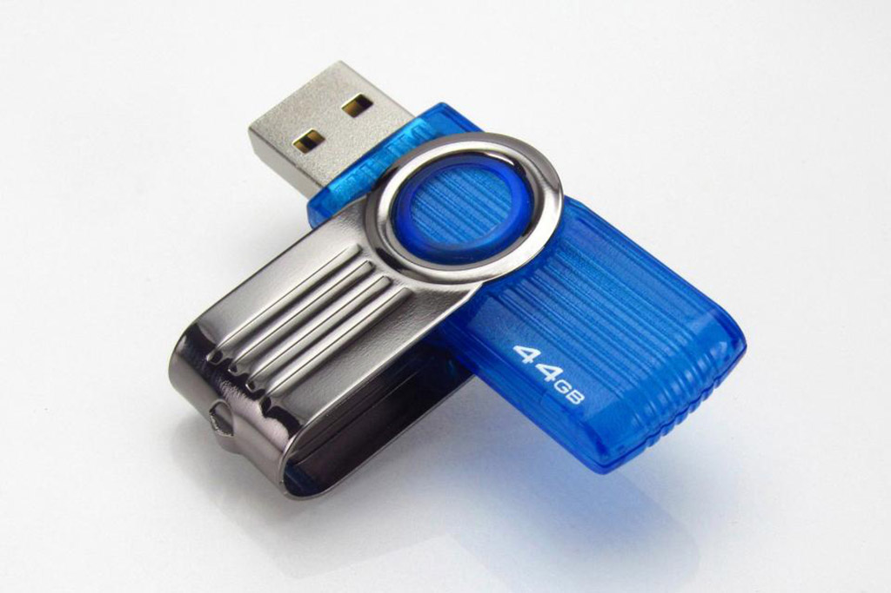

# Downloads

Here you will find an archive of downloadable files. Please read the [license](#license) below before using them.

## Content Samples

### Demo Photo

*Photo Copyright (c) Tapani Rantakokko*

This photo was shot with Canon 6D DSLR camera through a 10mm fisheye lens, and stitched with PtGui.
The same photo is bundled with the app ("Olos") as a smaller file / lower quality version.

Full spherical 360x180° photo, equirectangular projection, 24-bit JPG 

[Download 4096x2048 (2.6 MB)](https://s3.amazonaws.com/orion360-us/Orion360_example_image_1_4096x2048.jpg)

[Download 8192x4096 (9.2 MB)](https://s3.amazonaws.com/orion360-us/Orion360_example_image_1_8192x4096.jpg)

### Demo Video

*Video Copyright (c) Juha Kela*

This video was shot with 6x GoPro Hero cameras, and stitched with Kolor AVP.
The same video is bundled with the app ("PowerPark") as a smaller file / lower quality version.

Full spherical 360x180° video, equirectangular projection, MP4

[Download 1920x1080 25fps 55sec h264 (81.5 MB)](https://s3.amazonaws.com/orion360-us/PowerPark_test_video_2d_equi_360x180deg_1920x1080_25fps_55s_x264.mp4)

[Download 3840x2160 25fps 55sec h264 (155.7 MB)](https://s3.amazonaws.com/orion360-us/PowerPark_test_video_2d_equi_360x180deg_3840x2160_25fps_55s_x264.mp4)

### Test Image

*Image Copyright (c) Finwe Ltd.*

This image was drawn with Inkscape (6x cube walls) and stitched with PtGui.

Full spherical 360x180° image, equirectangular projection, 24-bit JPG

[Download 2048x1024 (2.2 MB)](https://s3.amazonaws.com/orion360-us/Orion360_test_image_2048x1024.jpg)

[Download 4096x2048 (7.7 MB)](https://s3.amazonaws.com/orion360-us/Orion360_test_image_4096x2048.jpg)

[Download 8192x4096 (22.9 MB)](https://s3.amazonaws.com/orion360-us/Orion360_test_image_8192x4096.jpg)

### Test Video

*Video Copyright (c) Finwe Ltd.*

This video was first drawn with Inkscape (6x cube walls) and stitched with PtGui, then encoded to video with ffmpeg.

[Download 1920x960 30fps 30sec h264 (2.6 MB)](https://s3.amazonaws.com/orion360-us/Orion360_test_video_2d_equi_360x180deg_1920x960pix_30fps_30sec_x264.mp4)

[Download 1920x960 60fps 30sec h264 (4.5 MB)](https://s3.amazonaws.com/orion360-us/Orion360_test_video_2d_equi_360x180deg_1920x960pix_60fps_30sec_x264.mp4)

[Download 3840x1920 30fps 30sec h264 (8.3 MB)](https://s3.amazonaws.com/orion360-us/Orion360_test_video_2d_equi_360x180deg_3840x1920pix_30fps_30sec_x264.mp4)

[Download 3840x1920 60fps 30sec h264 (14.5 MB)](https://s3.amazonaws.com/orion360-us/Orion360_test_video_2d_equi_360x180deg_3840x1920pix_60fps_30sec_x264.mp4)

### Stereo (3D) Test Video

*Video Copyright (c) Finwe Ltd.*

This image was first drawn with Blender and rendered to stereo (3D) image, then encoded to video 
with ffmpeg. Notice that top half contains left eye image and bottom half right eye image. 

**Use a VR headset for viewing this video in stereo; on phone/tablet only left eye image is shown.**

**This video was encoded with more efficient h265 encoder. Not all devices support it.**

[Download 3D 3840x1920 30fps 30sec h265 (3.4 MB)](https://s3.amazonaws.com/orion360-us/Orion360_test_video_3d_equi_360x180deg_3840x1920pix_30fps_30sec_x265_3DOU.mp4)

[Download 3D 3840x3840 30fps 30sec h265 (8.3 MB)](https://s3.amazonaws.com/orion360-us/Orion360_test_video_3d_equi_360x180deg_3840x3840pix_30fps_30sec_x265_3DOU.mp4)

## Templates

### settings.ini

settings.ini is an optional configuration file that you can copy to the LiveSYNC root folder (same
location where content files are copied to). The file contains many configuration options in a
user-friendly windows ini-file format. Each setting is described with a comment.

[Download latest version](https://raw.githubusercontent.com/FinweLtd/cfg-livesync-player/master/settings.ini)

### exampleProject.json

This JSON is autogenerated by LiveSYNC and saved in the directory when a user saves a project after adding hotspot icon/s. 

## License

### Creative Commons

This work is licensed under a Creative Commons Attribution-Share Alike 3.0 Unported 
[License](http://creativecommons.org/licenses/by-sa/3.0/)
