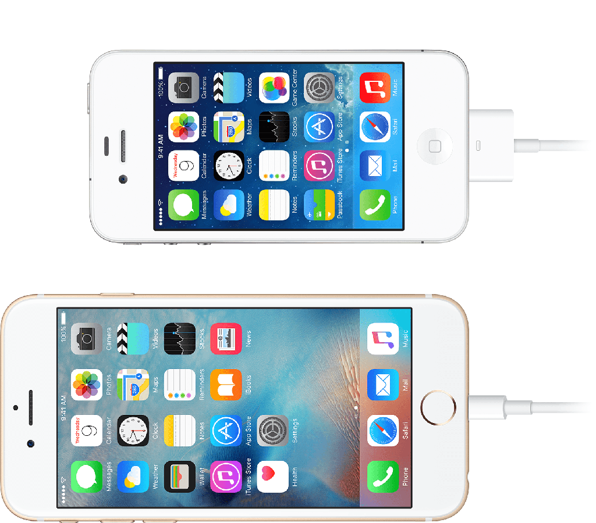

# Quick start: Presentation

## Devices

In a LiveSYNC-enabled presentation, the person giving the presentation has *a control device* and the audience members each have *a viewer device*. Hence, to give a presentation using the LiveSYNC tool you will need:

* 1 device for controlling the presentation (LiveSYNC tool in *Director Mode*)

* 1-n devices for viewing the presentation (LiveSYNC tool in *Audience Mode*)

### Director Mode

The Director Mode is currently available for **iOS** and **Android**. Thus, you can use either a phone or a tablet for controlling a presentation.

!!! tip
    We highly recommend using a tablet for the Director Mode because of its larger screen.

### Audience Mode

The Audience Mode is currently available for **iOS**, **Android**, **GearVR**, and **Oculus Go**. Thus, you can view a presentation either from a phone screen, a tablet screen, or via a phone based or standalone VR headset.

!!! note
    VR mode is available also for iOS and Android phones. A Google Cardboard or a compatible VR headset can be used, but user experience is much superior with a high quality headset and dedicated app version (GearVR, Oculus Go).

### Networking

Communication between the control device and the viewer devices is *wireless*. You can choose from available options during [channel configuration](presentation_configuration.md).

Make sure that the necessary radio technology is enabled on all devices. Depending on your selection this can be for example Bluetooth, Wifi or mobile data.

### Power

During a presentation the devices will consume a lot of power. Power consumption is related to active radios (communication), photo and video decoding, continuous screen updates, display brightness, and disabled power saving (sleep).

**We recommend that you recharge the batteries of all devices before a presentation**. If you use VR headsets with hand remotes, check the batteries inside the remotes. If you plan to run a presentation repeatedly, you probably need spare devices that are being recharged while others are in use.

### Big screen

In addition to personal viewing devices you can use a big screen. This can be for example a large TV screen or a projector.

We recommend a wired connection between the control device and the big screen. For example, an iPad can be connected to a TV using an HDMI cable via a separately sold adapter.

To mirror content from your iPad on a secondary display, you need the correct adapter.

**Get connected**

1. Connect your iPhone, iPad to a display.
2. Plug your Digital AV or VGA adapter into the charging port on the bottom of your iOS device.

3. Connect an HDMI or VGA cable to your adapter.

4. Connect the other end of your HDMI or VGA cable to your secondary display (TV, monitor, or projector).
5. Turn on your secondary display.
6. If necessary, switch to the correct video source on your secondary display. If you need help, use your display's manual.

Now the screen on your iPhone, iPad, or iPod touch should appear on your TV, display, or projector. It is also possible to connect wirelessly using [AirPlay](https://support.apple.com/en-gb/HT204289) if you are using Apple TV.

For LiveSYNC there are two screen mirroring modes, which are used when iPad is connected to TV/projector via HDMI cable:

* Presentation = show only the presentation area on TV (360 content)
* Mirroring = show the complete app on TV (to let audience see you use the app)

Third option "Show touches" visualizes touches on iPads screen so that audience watching TV screen can understand why things are happening.

### Speakers or headphones

Many presentations use sound. You must decide whether you want to use room audio (audience devices muted) or viewer device audio. In the latter case, headphones are highly recommended.

### Chairs

If your presentation takes more than a few minutes, the audience probably wants to sit. In order to allow comfortable 360-degree photo/video exploration, swivel chairs with enough spacing between them are recommended.
