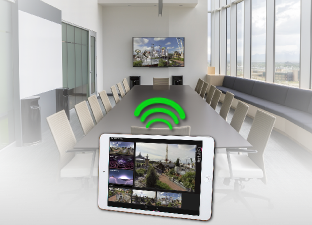

# Quick start: Presentation

## Mirroring

To mirror content from your control device to a big screen (a secondary display), follow the steps below.

### iOS

1. Plug your Digital AV or VGA adapter into the charging port at the bottom of your iOS device.
    

3. Connect an HDMI or VGA cable to your adapter. Notice that the adapter has also a charging port; you can charge your iPad during mirroring.
    

4. Connect the other end of your HDMI or VGA cable to your secondary display (TV, monitor, or projector).

5. Turn on your secondary display.

6. If necessary, switch to the correct video source on your secondary display. If you need help, use your display's manual.

Now the screen on your iPad should appear on your TV, display, or projector.

!!! tip
    It is also possible to connect wirelessly using [AirPlay](https://support.apple.com/en-gb/HT204289) if you connect an Apple TV to your secondary display.

### Modes

LiveSYNC provides two screen mirroring modes:

* **Presentation**: shows only the *Presentation area* on the secondary display

* **Mirroring**: show the complete app on the secondary display

Typically, *Presentation* mode is the correct one. However, if you want to show how you use the app (training) or for example share the *Mosaic* screen, then switch to *Mirroring* mode.

There is also a third option *Show touches*. This visualizes touches on your control device's screen, so that audience watching the secondary display can better understand your actions.

## What's next

You have barely scratched the surface of what you can do with the LiveSYNC tool. Learn more by reading some of the [tutorials](../tutorials/tutorials.md) or dive into the [User Guide](../user_guide/user_guide.md).
