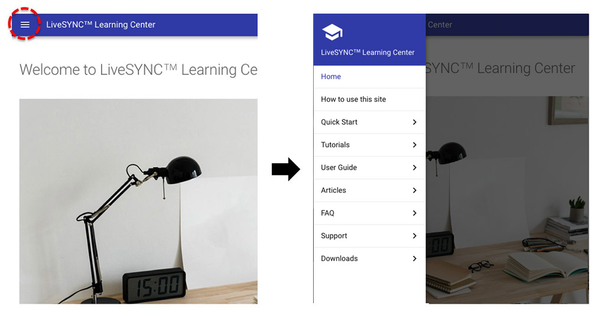

# How to Use This Site


## Accessing

### Web browser

This site is publicly available in HTML format in this URL:

<https://docs.livesync.app>

You can use any modern web browser for accessing the site. Simply type the site's URL to the browser's address bar or click the link above.

Your computing platform probably has a built-in web browser. If not, there are multiple supported options for each platform. These are listed below.

!!! note
    This site does not require any specific browser application, any specific version, or any third party plugins.

#### Windows PC

Use the built-in **Internet Explorer** or **Microsoft Edge** browser. Or, install a 3rd party application:

* [Mozilla Firefox](https://www.mozilla.org/en-US/firefox/)
* [Google Chrome](https://www.google.com/chrome/)

#### Mac

Use the built-in **Safari** browser. Or, install a 3rd party application:

* [Mozilla Firefox](https://www.mozilla.org/en-US/firefox/)
* [Google Chrome](https://www.google.com/chrome/)

#### Linux

Use the browser included to your distribution (varies). Or, install a 3rd party application:

* [Mozilla Firefox](https://www.mozilla.org/en-US/firefox/)
* [Google Chrome](https://www.google.com/chrome/)

#### iOS (iPhone & iPad)

Use the built-in **Safari** browser. Or, install a 3rd party application from **Apple Appstore**:

* [Mozilla Firefox](https://itunes.apple.com/fi/app/firefox-web-browser/id989804926?mt=8)
* [Google Chrome](https://itunes.apple.com/us/app/google-chrome/id535886823?mt=8)

#### Android (phones & tablets)

Use the built-in browser (varies, look for **Internet** app from the menu). Or, install a 3rd party application from **Google Play**:

* [Mozilla Firefox](https://play.google.com/store/apps/details?id=org.mozilla.firefox&hl=en)
* [Google Chrome](https://play.google.com/store/apps/details?id=com.android.chrome&hl=en)

#### GearVR

Use the built-in **Oculus Browser** or **Samsung Internet** app. If you don't have them installed search from the **[Oculus Store](https://www.oculus.com/experiences/gear-vr)**. There are two ways to start them:

a) Starting a browser from the Oculus GearVR app (outside VR):

1. Remove the phone from the GearVR headset.
2. In the Android app menu, find *Oculus* app (GearVR text in the icon), and start it.
3. Once started, navigate to *Library* tab in the bottom bar.
4. Find *Oculus Browser* or *Samsung Internet* from the app grid, and start it.
5. Put the phone into the GearVR headset when a dialog suggests that.

!!! note
    If an application does not start when you tap it, you probably need to update your GearVR software. Put the phone into the GearVR headset. Update the software if a dialog suggests that (you have to remove the phone from the headset to do that).

b) Starting a browser from the Oculus Home (inside VR):

1. Put the phone into the GearVR headset.
2. In Oculus Home, select *Library* from the *Navigate* tab in the bottom bar.
3. Find *Oculus Browser* or *Samsung Internet* from the app grid, and start it.

!!! tip
     You can also start the default browser by selecting *Internet* from the *Navigate* tab in the bottom bar.

#### Oculus Go

Use the built-in **Oculus Browser**. Or, install a 3rd party application:

* [Firefox Reality](https://www.oculus.com/experiences/go/2208418715853974/)

Starting a browser from the Oculus Home (inside VR):

1. In Oculus Home, select *Library* from the *Navigate* tab in the bottom bar.
2. Find *Oculus Browser* or *Firefox Reality* from the app grid, and start it.

!!! tip
     You can also start the default browser by selecting *Browser* from the *Navigate* tab in the bottom bar.

### LiveSYNC App

#### iOS & Android

On iOS and Android phones and tablets, the documentation is accessible via the LiveSYNC app. In fact, there are *two* locations inside the app where you can access the site:

a. Start the LiveSYNC app and enter the *Home* screen. Select *Learning Center* from the bottom bar. The landing page of the site is loaded into an internal browser view:
    

b. On the *Home* screen, select a configured channel (Director Mode) and enter the *Mosaic* view. From the bottom bar, select *Help* tab. The landing page of the site is loaded into an internal browser view:
    

!!! tip
    You can access the documentation during a presentation using the *Help* tab.

!!! note
    Network connection is required for accessing the documentation via the app.

#### GearVR & Oculus Go

On GearVR and Oculus Go headsets, the documentation cannot be accessed via the LiveSYNC app. Please use the headset's native or 3rd party browser as explained above, or another device.

## Navigating

### Site menu

Different areas of the *LiveSYNC Learning Center* are accessible via *the site menu*. The site menu appears in one of two different ways:

#### Tabs & menu

If your browser window is wide, different areas appear as *tabs* in the top bar. Simply click any of the tabs to navigate to another area of the site. When you scroll down, tabs disappear to save space. Scroll back up to reveal them again.

The pages of an active area appear in a menu at the left side of the page. Click a title to navigate to another page.

This option is typical for desktop and laptop computers.


*On wide screens, different site areas appear as tabs in the top bar. Pages that belong to an area are listed on the left.*

#### Collapsed menu

If your browser window is narrow, the menu appears as a collapsed *hamburger menu* in *the top bar*. Click the hamburger icon to temporarily expand the site menu. Different areas of the site appear as submenus, which you can open by clicking them. To navigate to a page, click its title. Once selected, the menu will collapse again.

This option is typical for phones, tablets, and VR headsets.



*On narrow screens, the site menu appears collapsed. It can be opened by clicking the hamburger menu icon. Clicking a submenu reveals pages that belong to that area. Clicking a page title opens that page.*

### Table of contents

Each page on this site has an automatically generated *table-of-contents* (TOC). You can navigate *within a page* by clicking the titles in the page's TOC.

The TOC will appear on the right side of the page, but only if the browser window is wide enough. If not, it will be integrated to the site menu.


*On wide screens, table-of-contents appears on the right.*


*On narrow screens, table-of-contents appears integrated to the site menu.*

### Navigation arrows

Some pages have one or two *navigation arrows* that appear at the bottom of the page. Some pages do not have them.

Use the navigation arrows for moving to the next or to the previous page when you have read the current page.


*On some pages you can move forward or backward by clicking the navigation arrows.*

### Search

The top bar contains *the search field*. The search field may appear in one of two different ways:

#### Expanded search field

If your browser window is wide, the search bar appears permanently expanded on the right side of the top bar. Simply click the text field and begin to type. The results will appear in a floating window as you type.

This option is typical for desktop and laptop computers, as well as tablets.


*On wide screens, the search field is expanded and results appear floating over the page.*

#### Collapsed search field

If your browser window is narrow, the search bar appears as a collapsed widget on the right side of the top bar. You can recognize it from the magnifier glass icon. Simply click the icon and begin to type. The results will appear in full window mode as you type.

This option is typical for phones and VR headsets.


*On narrow screens, the search field is collapsed and results appear in full window mode.*

## Reading

### Languages

The documentation is currently available only in English. Translating the documentation to other selected languages will be considered if there is enough customer demand.

You can contact us via our [contact form](../support/support.md).

### Product variants

Different customer segments need different features. For example, most 360-degree video professionals are interested in using LiveSYNC's presentation capabilities. On the other hand, industrial users focus on tagging and reporting. Thus, the LiveSYNC app is offered in multiple variants. The variants have a common core, but available features vary. The purchased license defines what features are available in a particular app installation.

The documentation site is common to all versions. This means that parts of the documentation discuss features that are available only for a subset of customers.  To differentiate such parts, they are clearly marked with *banners*. For example, users who do not have the Enterprise version of the app should skip sections that are marked with this banner:


*An example of a product variant specific documentation. The content below this banner, up to the next section/title, is relevant only for users of the Enterprise version of the LiveSYNC app.*

### Product versions

The LiveSYNC solution is continuously under development and updates are released frequently. We recommend that you keep the app up-to-date. There is one exception to this rule. Do you have an important presentation coming up soon and everything is already set up and working smoothly? Then we recommend that you do not update the app before the presentation.

The documentation site contains documentation for the *latest* version of the LiveSYNC app.

### Conventions

The goal when writing the documentation was to make it as readable as possible. Hence, we use many conventions throughout the text.

We also wanted to provide the facility for readers to learn at their own pace. There are plenty of cross-references (links). Use them for learning more about a specific topic.

#### Example title

There are multiple levels of titles. All titles appear in the table of contents. Simply click a title to scroll the page there. The titles are also *permalinks* (permanent links). You can see the link symbol by hovering over the title with mouse cursor. Then, hover over the link symbol. The link appears in the bottom bar of your browser (if supported). You can also copy the link with the right mouse button.

Regular text appears like this. Important terms and text that appears in a user interface are written in *italics*. Product names are often written in **black**. Links appear [like this](https://en.wikipedia.org/wiki/Hyperlink). Numbered references appear inside parentheses [(1.1)][ref1].

[ref1]: https://en.wikipedia.org/wiki/Reference (Reference)

Mathematical operations, configuration file contents, and software code appear in code blocks. Notice that you can easily copy its contents to the clipboard. Simply click the copy icon at the right edge of the block.

```
1 + 1 = 2
```

Quotations are indented:

> Life is short.

Data is often presented as a table:

Hours of sleep | Laziness
---------------|---------
5 | Severe
7 | Mild
8 | None

Lists can be ordered (numbered):

1. Skip the manual
2. Try to use the product
3. Read the manual

Lists can also be unordered (bulleted):

* First things first
* Second things second

Footnotes are used for providing additional information. They appear at the end of the page. You can read a footnote by clicking the link that appears as a number: [^1]

Sometimes, a horizontal rule is used for separating things:

***

Throughout the documentation, you'll find various types of notes complementing the regular text:

!!! note
    A note is designed to provide an important piece of information.

!!! tip
    A tip is something that will help when you need to perform the task being described. Alternatively, it can be something can make your life easier when using the LiveSYNC tool.

!!! example
    An example applies theory to practice. It will help your understanding of the topic being discussed.

!!! question
    A question is a short practice task for the reader.

!!! summary
    A summary is a collection of the key points, typically at the end of a section.

!!! caution
    A caution is something you should certainly pay attention to. It warns of a hidden danger or caveat.

!!! danger
    A danger is a something that can potentially harm you. You probably should not do what is being discussed.

[^1]: This is a foot note. You can return to the text by clicking the return arrow link: