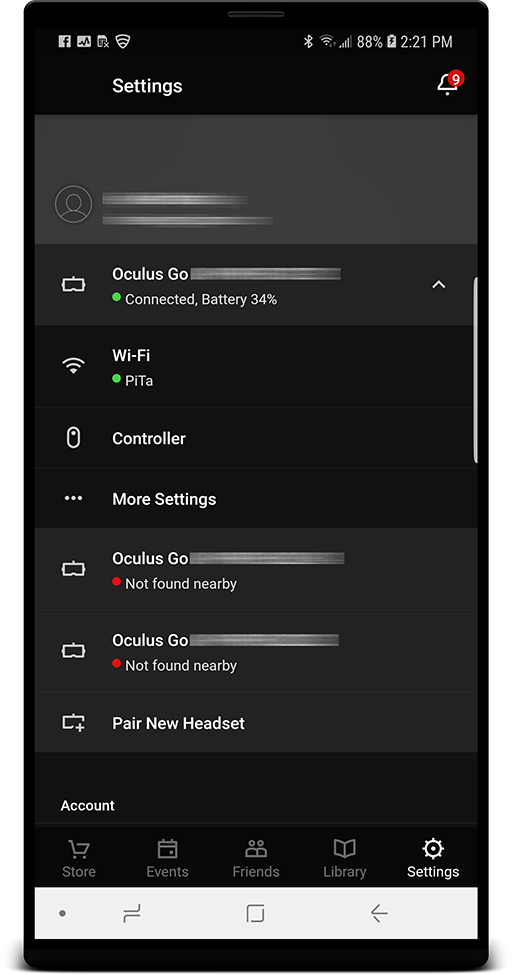
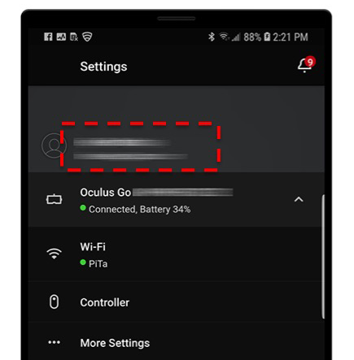

# Using LiveSYNC on Oculus Go

## Device

#### What is it?

[**Oculus Go**](https://www.oculus.com/go/) is an affordable standalone VR headset from [Oculus](https://www.oculus.com), a company owned by [Facebook](https://www.facebook.com).

It has many similarities to [**GearVR**](https://www.samsung.com/global/galaxy/gear-vr/), a product made by [Samsung](https://www.samsung.com). In fact, GearVR uses technology and software from Oculus and is marketed under *Powered by Oculus* term.

The main difference is that Oculus Go is a new standalone device, whereas GearVR consists of an older style combination of a VR frame and a compatible Samsung phone.

In both cases applications are installed from [Oculus Store](https://www.oculus.com/experiences/go/) and same app builds can work on both products. Also the user experience, visual quality and interaction mechanism are almost the same.

Both products are 3DOF devices (three degrees of freedom), ie. you can look around in VR by turning your head, but you cannot walk in VR by physically taking steps. There are no need for a computer and no wires. You can simply take the headset out of your bag, put it on your face and start using it. Bundled hand remote is used as a pointer when selecting objects from screen.

#### Should I get an Oculus Go or a GearVR?

If you already own a [compatible](https://www.samsung.com/global/galaxy/gear-vr/) Samsung phone, purchasing only the VR frame is an affordable choice (about $110). GearVR headset is a lightweight addition to your bag if you travel a lot and carry a large-screen phone anyway.

However, in most cases Oculus Go is a better choice. Since it is a standalone device it has a battery of its own and you can dedicate the device for its sole purpose: VR. You will also save a fortune if you need a large number of headsets.

To learn more about their differences, read comparison articles:

* [Android Central: Oculus Go vs Samsung Gear VR](https://www.androidcentral.com/oculus-go-vs-samsung-gear-vr)

* [How-To Geek: Gear VR vs Oculus Go: Which One is Better?](https://www.howtogeek.com/352453/gear-vr-vs-oculus-go-which-one-is-better/)

* [ThreeSixtyCameras.com: Gear VR vs Oculus Go: Which is the better VR experience?](http://www.threesixtycameras.com/gear-vr-vs-oculus-go-which-is-the-better-vr-experience/)

#### How do I get one?

You can purchase an Oculus Go directly from [Oculus](https://www.oculus.com/go/), from various online stores such as [Amazon](https://www.amazon.com/s/ref=nb_sb_noss_2?url=search-alias%3Daps&field-keywords=oculus+go), or from local computer and electronics stores.

A 32 GB model costs $199 (€219) and a 64 GB model $249 (€269).

## Initial setup

### Oculus app

It might be a bit surprising that when you unpack the Oculus Go headset and begin the initial setup procedure, you must install *an application to your phone*:

> To set up and connect your Oculus Go, you'll need to download the Oculus app on your supported mobile phone. With the Oculus app, you can set up your headset, browse VR games and apps and customize your device settings. *(Oculus Go website)*

This accompanying app is **mandatory** during the initial setup of the headset. After that you will need it very rarely, if ever. If you plan to purchase multiple headsets, they can be all set up and configured from a single phone. Download the Oculus Go app from here:

<https://oculus.com/app>

Alternatively, you can use these direct links for [Android](https://play.google.com/store/apps/details?id=com.oculus.twilight) and [iOS](https://itunes.apple.com/us/app/oculus-vr/id1366478176).

!!! note
    This is NOT the same app that you use with a GearVR headset. Both apps have the same name *Oculus*. You can differentiate them from the icon: GearVR app icon has text GearVR, Oculus Go app icon does not have any text.

*Oculus Go accompanying app on Android phone.*

### Pairing & setup

1. Download the Oculus app using the links above, then launch the installed app

2. If you don't have an Oculus account yet, sign up first and then log in

3. Once logged in, navigate to *Settings* and select *Pair New Headset*

4. Select *Oculus Go* from *Choose a Headset* menu, and press *Start Now*

5. Turn on your Oculus Go device and press *Continue*

6. Plug your Oculus Go into a power source and press *Continue*

7. After search completes found headsets are listed. If multiple devices were found nearby, choose the one that matches the serial number in your headset (under the barcode), and press *Continue*

8. Select a Wifi access point that will be used for connecting the headset to the network, and press *Continue*

9. Put a battery into the controller and choose with which hand you want to use your controller, and press *Continue*

10. Select language to use in VR, and press *Continue*

11. Add a payment method (a credit card or a PayPal account) or press *Skip*

12. Go through safety etc. information, press *Continue* to proceed

When ready, you will see a dialog saying *Preparing your Oculus Go...*. Once it’s finished, pairing and setup has completed.

For more information, see the questions and answers [here](https://support.oculus.com/183135912238400/).

*Once the pairing and setup is complete, your headset(s) will appear in *Settings* tab.*

### First time use

Go to your Oculus Go device. Put the headset on your face. There is *an infrared proximity sensor* inside the headset (between the lenses). The headset will wake up automatically and you will hear a greeting sound.

Grab the hand controller, point straight ahead (to the direction you are looking at), and *press and hold* the Oculus button (ring symbol) on the hand controller.

*Whenever the device wakes up from sleep you must calibrate the hand remote.*

!!! note
    Every time the headset wakes up from sleep it will present *a calibration dialog*. Calibration is necessary, because the headset and the hand remote are two independent devices that are both only aware of *rotation around their own center point*. The devices do not know what actual direction they are pointing at (for example, North, South-East, etc.) Hence, they need to be calibrated by making them point to the same direction, and then pressing a button to signal this. Unfortunately, this needs to be repeated every time the headset wakes up, because sensors are turned off to save power during sleep and they will lose the tracking.

After calibration and first time use tutorial you will enter *Oculus Home*. Here you can install new apps, start installed apps, configure the headset, and use services offered by Oculus.

*The Oculus Home.*

!!! tip
    We recommend that you spend some time to play around with the device. Get familiar with the hand remote and Oculus Home. Try a couple of pre-installed apps. Ask your boss a permission to take it home for the weekend and watch a couple of movies from Netflix or Youtube VR.

### Installing LiveSYNC

Once you feel familiar with Oculus Go, it is time to install the LiveSYNC app. The installation can be triggered either via the accompanying Oculus app on your phone (outside VR) or via Oculus Home (inside VR).

!!! info
    LiveSYNC has not officially launched on Oculus platform yet. However, you can start using it already by installing it from our beta channel. Follow the steps below.

1. Check your Oculus username and email: start the Oculus accompanying app on your phone, navigate to *Settings*, and find the username and email (see the image below):
   

2. Installing software from Oculus beta channel requires *an invite*. [Contact us](../support/support.md) and tell that you want to join LiveSYNC beta channel for Oculus Go. **We need the email address from Step 1 to be able to add you.** This cannot be just one of your email addresses; it has to be the one that is connected with your Oculus account.

3. Once you receive an invite email from Oculus to that email address, accept the invite by clicking a confirmation link in the email. Notice that we must send each invite manually, so it can take a while before the email arrives.
   

4. You have multiple options how to install the application:
    1. Using the accompanying Oculus app on your phone: tap the magnifier class icon to open search, type *livesync* and select *LiveSYNC Oculus Go*, then click *Install on ...* button.
    

    2. You can also select *Library* tab from the bottom bar and see if *LiveSYNC Oculus Go* already appears in the apps list. Select it from the list and then click *Install on ...* button.
    

    3. Using the Oculus Go device, select *Search* from the bottom bar, type *livesync* and select *LiveSYNC Oculus Go*, then click *Get*.
    

    4. You can also select *Library* tab from the bottom bar and then *Not Installed* page from the left side menu to see if *LiveSYNC Oculus Go* already appears in the apps list. Select it from the list and then click *Get*.
    

5. When the installation has completed, you will see *LiveSYNC Oculus Go* listed in the headset when you select *Library* tab from the bottom bar and then *Apps* page from the left side menu.

### Optimizing for presentations

