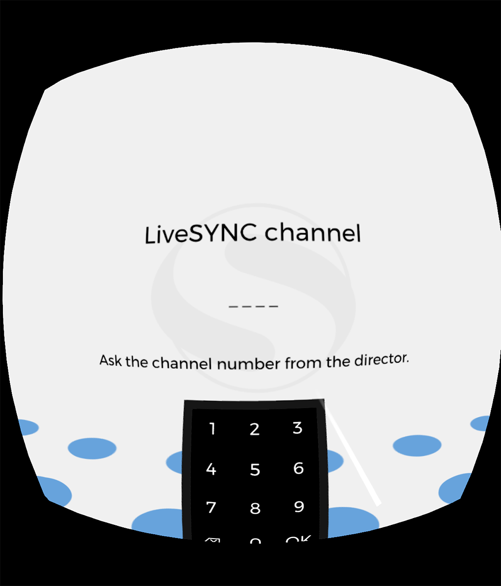
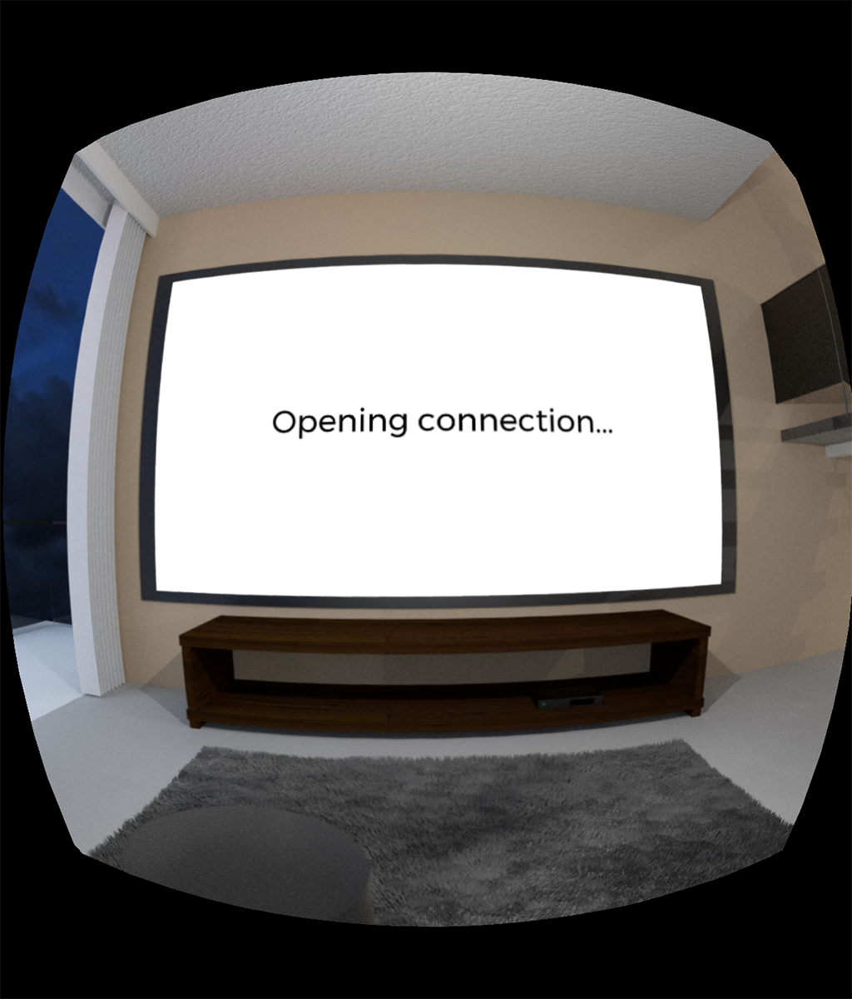
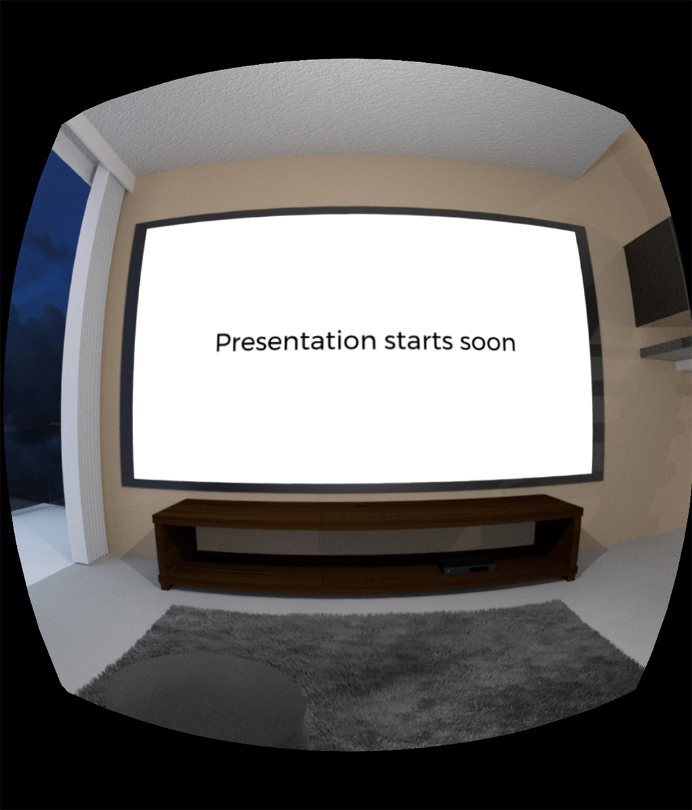

# LiveSYNC on Oculus Go

## Preparing

Next, we will go through basic preparations before a presentation.

As a reminder, presenting with the LiveSYNC tool works as follows:

* The presenter controls the presentation with a separate control device. This is typically an iOS or an Android tablet. The presenter will *reserve a communication channel* for the presentation. A channel number consists of four digits from range 1000-9999.

* Each member of the audience uses a personal viewing device. This can be an iOS/Android phone or tablet, or GearVR/Oculus Go headset. The viewer devices will *join the communication channel* using the channel number.

### Channel configuration

!!! note
    Here we assume that you have already set up a channel in Director Mode on your control device (tablet). As an example, we will use channel number *5034*. Refer to [User Guide](../user_guide/configuration.md) for more information.

To view a presentation, the headset must join the same channel that the control device is using. To configure a new presentation channel (in Audience Mode) for your Oculus Go headset:

1. On your Oculus Go device, start the LiveSYNC app, and select '+' from the *Home* screen.

    

2. Type in the channel number using the virtual numeric keypad, and click *OK*.

    

3. The configured channel appears on the *Home* screen.

    

!!! tip
    If you have multiple control devices you can configure more channels by repeating the steps 1-3. This way you can easily choose which channel to join ie. whose presentation to follow.

!!! example
    Joan's marketing team is participating in a trade show. Their company is launching a new product, and Joan's team is using a 360-degree video to showcase it at their booth. They are controlling six Oculus Go headsets with LiveSYNC. To minimize the waiting time they run two groups of three headsets in parallel and control the groups with two iPads. Whenever one of the representatives needs a break, they want to temporarily connect all six headsets to one iPad. Their iPads are using channels 2054 and 5039. Joan configures both channels to all six headsets. Now they can quickly swap a headset from one iPad to the other.

!!! note
    Bluetooth connections are local and hence a channel number is reserved from a control device's own pool. Thus, you can reuse a configured channel as many times as you want.

    This is different when you use Finwe's *GlobalSYNC* connection (a cloud service). A channel number is reserved from a globally shared pool for a limited period of time. After your lease time expires, the channel will be returned to the pool. In this case, you must reserve a new channel for your next presentation.

### Connection test

To test a configured channel, perform the following steps:

1. On your control device (tablet), start the LiveSYNC app, and select a channel from the *Home* screen. The *Mosaic* tab will appear, showing *My device* item only (tablet's own view).

    

2. On your Oculus Go device, select the same channel from the *Home* screen.

    !!! note
        If this is the first time you join a channel from this device, a permission dialog appears. It is shown also if you have removed file access permission. Select *Allow* to grant file access permission. Else, LiveSYNC app cannot access your own presentation files.

    

    Next, *the Lobby* appears. Audience members will wait here for a connection to the control device. The Lobby is a 360-degree environment where users can look around. One wall contains a 2D screen panel, where notifications to the user are presented.

    

3. The headset connects to the control device automatically as soon as it is available and within reach. **User does not have to do anything**.

    !!! note
        Usually, this takes only a few seconds. However, with Bluetooth technology and multiple devices, it can take up to tens of seconds. The devices share the same radio frequencies. Because of this connection times become longer when the number of devices increases.

      

4. Once the connection is established, live view from the Oculus Go headset appears on the control device's screen. The *Mosaic* view now contains a new item:

    

    Simultaneously on the headset, a notification tells that the device is ready for presentation:

    

!!! tip
    If necessary, you can connect more viewing devices by repeating steps 2-4. They will all appear in the *Mosaic* view. You can freely mix all kinds of viewing devices: phones, tablets, and VR headsets.

!!! tip
    If you use a Bluetooth connection, be aware that Bluetooth implementations (chipsets and drivers) vary. Some perform better than others and have different maximum capabilities. When a Bluetooth chipset cannot handle the load, problems may occur. Usually disabling and enabling Bluetooth feature helps, but sometimes the device needs to be restarted.

    In case you encounter repeated connection problems, follow these steps:

    1. On your control device, disable Bluetooth, wait 10 seconds, and enable it again. All devices will reconnect.

    2. If the problem is not solved, restart the Oculus Go headset that has trouble connecting.

    3. If the problem is still not solved, restart also the control device.

!!! note
    Your license type, used connection method, and used hardware set an upper limit for the number of simultaneous connections. You should test this in advance, before your presentation.

### Presentation test

When devices are connected you can test presenting by using bundled demo content:

1. On your control device, switch to the *Player* tab from the bottom bar. Drag an item from the *Content* tab to the *Presentation area* at the center of the screen.

    

2. On the headset, the playback command will be received, requested media item loaded, and the image rendered on screen.

    

3. The headset will notify the control device of success or failure. (For example, if the content file could not be found). The control device shows a live monitoring view from the headset in the *Devices* tab and in *Mosaic* tab.

    

### Leaving a presentation

When someone in the audience wishes to leave the presentation:

1. Press the *Back* button (arrow to left) from his Oculus Go headset's hand remote controller. A confirmation dialog will appear.

    

2. After selecting *OK*, the headset will disconnect from the control device and return to *Home*. Simultaneously, the headset will disappear from the control device's *Mosaic* and *Devices* tabs. Other connected devices (if any) are not affected.

!!! note
    The presenter can stop the presentation from the control device by pressing the *Home* icon (top left corner). A confirmation dialog will appear before the presentation is stopped. However, this method disconnects *all* connected viewer devices.

### Understanding view mirroring

How does LiveSYNC actually work? What is possible and what is not? In general, there are two ways to mirror a live view of one device's screen to another:

1. **Streaming video**

    *Principle: Capture screenshots from the device's screen, encode them into a video stream, and send this to another device over a network connection.*

    One benefit of this method is that the mirrored view is an *exact* copy of what the other user is seeing. Another is that mirroring feature can be implemented on the platform level and is thus available for all apps.

    There are many downsides, too. The method consumes a fair amount of CPU/GPU resources and power in *both* devices. It requires lots of network bandwidth. It does not scale well: the network and the resources in the receiving end quickly become a bottleneck when more devices connect. Furthermore, when using a VR headset, we do not actually *want* to stream an exact copy of what is on screen. Instead of the two barrels, we want to mirror a normal view.

2. **Streaming commands**

    *Principle: Integrate deep into the app and transmit only commands that allow the receiving end to reconstruct the view from the same assets.*

    The benefits of this method include low CPU/GPU and power consumption, trivial use of network bandwidth, and scalability. It is also possible to render the mirrored view a bit differently from the source device.

    The downside is that all devices must have their own copies of the content files. With video content, the resources of the control device can become a limitation. A control device may not have enough hardware resources to decode and play multiple videos simultaneously. Or, the same video simultaneously from different stream positions. This is not a problem, though, when all devices watch the same content in sync.

Many devices have type 1 screen mirroring built-in. This is often handy for mirroring your phone's screen on TV at home. Or, in a meeting room at the office. However, mirroring a view by streaming video over Wifi becomes often impossible in crowded places. Wifi does not work and/or the organizers do not allow using own Wifi hotspots.

As you probably guessed already, LiveSYNC uses type 2 method: streaming commands. This approach allows operation in crowded trade shows, especially when Bluetooth technology is used for communication. Also, observing a large number of viewer devices is possible. Etc.

!!! note
    You must copy the presentation files to all devices *before* the presentation.

### Copying content files

You can, of course, present your own content with the LiveSYNC tool. To do this, copy your content files (photos, videos, hotspot icons) to each device that will be used in your presentation. This means the control device and every viewing device. Read more from the [User Guide](../user_guide/asset_management.md).

Next, we will go through how to copy content files to your Oculus Go headset.

#### Windows PC

1. Connect your Oculus Go headset to your PC using the bundled USB cable.

2. Put on your headset and select *Accept* to confirm you want to allow your computer to access files on the headset.

2. Once Windows detects the headset, it appears as a new device in *Explorer*. For example, on Windows 10 you'll find it under *This PC* -> *VR-Headset*.

3. Copy your content files and folders to your Oculus Go just like you'd copy them into a USB flash drive. The correct location is **\Movies\LiveSYNC** folder. This folder will be created automatically when LiveSYNC is run. Notice that the directory cannot be created if you haven't granted file access permission.

!!! info
    If your PC does not recognize the headset when you connect it with a USB cable, check that *Developer Mode* is not enabled in your headset. On the Oculus companion app, navigate to *Settings* -> Your Oculus Go -> *More Settings* -> *Developer Mode*.

    If it is enabled, the device will be detected in a different a USB mode, and it will not appear in Explorer. You can temporarily disable *Developer Mode*. Or, use *Android Debug Bridge* (ADB) command line tool for transferring files.

#### Mac

1. Install Android File Transfer app for transferring files:

    <https://www.android.com/filetransfer/>

2. Connect your Oculus Go headset to your Mac using the bundled USB cable.

3. Put on your headset and select *Accept* to confirm you want to allow your computer to access files on the headset.

4. Once Android File Transfer detects the headset, a new file management window appears.

5. Copy your content files and folders to your Oculus Go by dragging them from your Mac's *Finder* window. The correct location is **\Movies\LiveSYNC** folder. This folder will be created automatically when LiveSYNC is run. Notice that the directory cannot be created if you haven't granted file access permission.

!!! tip
    If your headset is not detected and you are using a USB hub, try connecting the headset directly to your computer (without the USB hub).

#### No LiveSYNC folder?

In case you cannot find the *LiveSYNC* folder under *Movies*:

* *LiveSYNC* folder is automatically generated when the app is run (if the folder is not found).

* To be able to create the folder under */Movies*, the LiveSYNC app needs ** permission from the user to access the file system** (read/write). This permission is asked when you attempt to join a presentation. It remains until you remove the permission or re-install the app.

* You can also set the permission on your headset via *Oculus Home* as follows:

    1. From the bottom bar, select *Navigate* tab and then *Library*.

    2. From the left menu, select *Apps*. Find the LiveSYNC app from the app grid.

    3. Tap the three dots next to text *LiveSYNC Oculus Go*, and select *Permissions* from the appearing menu.

    4. Note the position of the switches. Both switches should be enabled: *Location* is required by Bluetooth connectivity and *Storage* for file access.

    5. Run LiveSYNC again to trigger folder creation.

!!! tip
    You can also use Explorer on Windows or Android File Transfer on Mac to create the folder yourself. LiveSYNC will still need the *Storage* permission for reading the files from this location.
