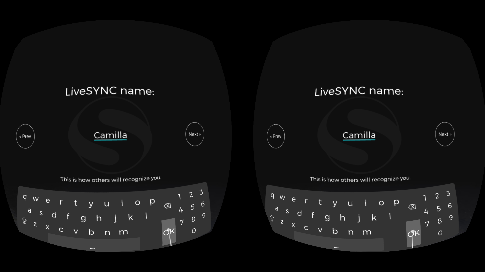
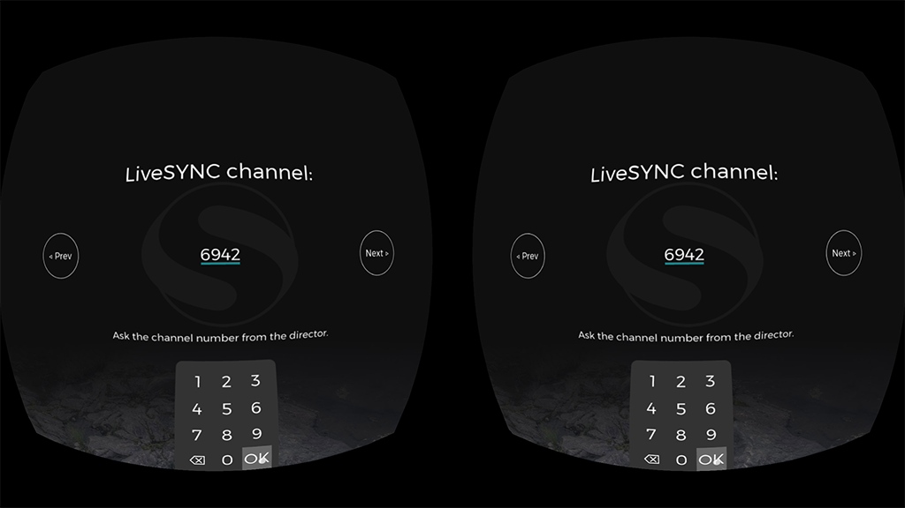
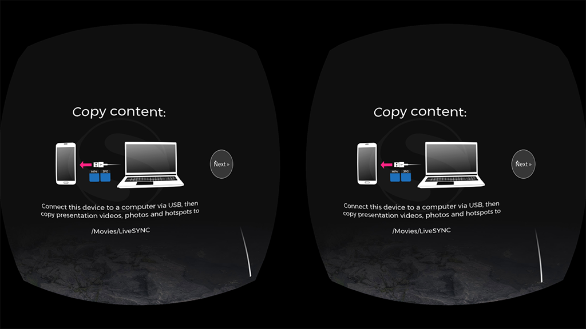
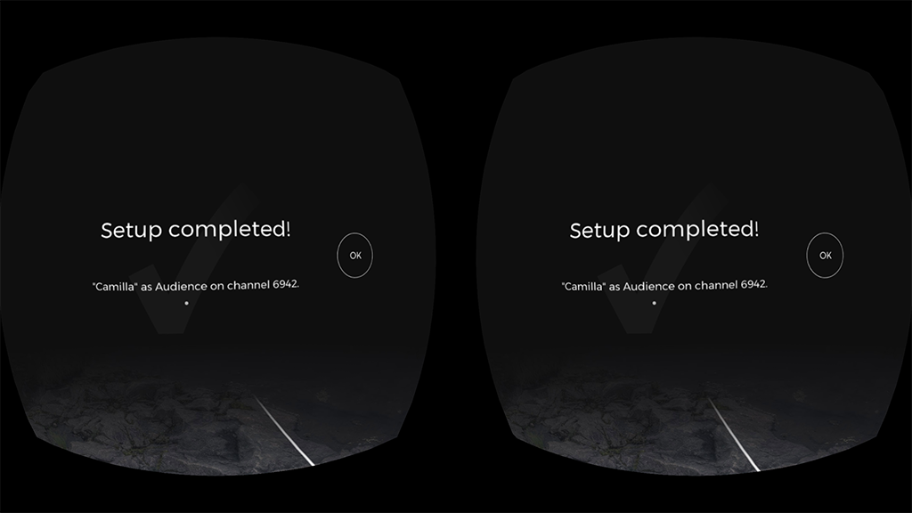
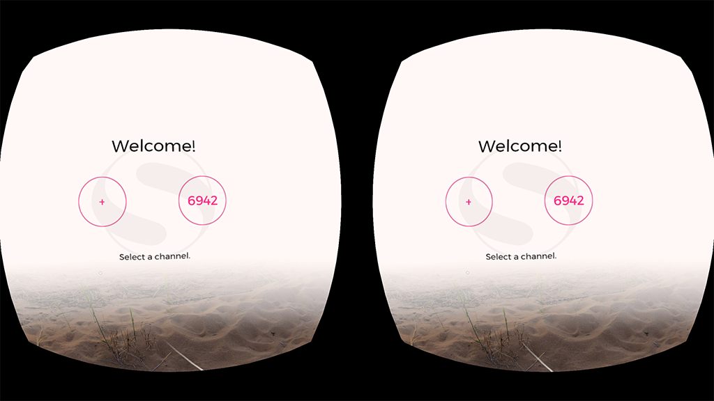

# LiveSYNC on Oculus Go

## Preparing

Next, we will go through basic preparations before a presentation.

As a reminder, presenting with the LiveSYNC tool works as follows:

* The presenter controls the presentation with a separate control device. This is typically an iOS or an Android tablet. The presenter will *reserve a communication channel* for the presentation. A channel number consists of four digits from range 1000-9999.

* Each member of the audience uses a personal viewing device. This can be an iOS/Android phone or tablet, or GearVR/Oculus Go headset. The viewer devices will *join the communication channel* using the channel number.

### Channel configuration

!!! note
    Here we assume that you have already set up a channel in Director Mode on your control device (tablet). As an example, we will use channel number *6942*. Refer to [User Guide](../user_guide/configuration.md) for more information.

To view a presentation, the headset must join the same channel that the control device is using. Follow these steps to configure a new presentation channel to your Oculus Go headset:

1. Start the LiveSYNC app. The *Home* screen appears. Initially, channel configurations do not exist. To create a new channel configuration, point at the big (+) button and click the selection button.

    

2. The *Setup* screen appears. First, point and click the *Audience* button to select the audience role. Your selection is marked by underlining it, as in the image below. Point and click *Next* button on the right to proceed.

    

3. Other users can identify you by your LiveSYNC name. This can be for example your own name, a name that you have given to your device, or your device's model name. The name cannot be left empty. Its maximum length is 32 characters. Click the text field to open a virtual keyboard and type a name. Then click *Next* to proceed.

    

4. Communication between the control device and viewing devices uses a wireless connection. The currently available connection types are listed. Choose a connection type that you wish to use. **The director device and the audience devices must use the same connection type**. Click *Next* to proceed.

    

5. Devices using the same connection type and the same channel can exchange messages. Devices on a different channel will not see them. Click the text field to type a channel number. Use the same channel number that you configured to your control device. The channel numbers are in the range 1000-9999. Click *Next* to proceed.

    

7. A dialog appears to ask your permission to access the files on your device. Without permission, the app cannot create the directory where your assets will go. Also, it cannot read from this directory even if you create it manually. Click *Allow* to give file access permission.

    

8. The channel configuration is almost complete. This setup page reminds you that the presentation's assets must be copied to the device. This task will be covered in detail in the next chapter [Managing assets](../user_guide/asset_management.md). You can copy the assets in place now, but you can also do that after completing the setup phase. Click *Next* to proceed.

    

9. The channel configuration is now created and the setup phase has been completed. Click *OK* to return to the *Home* screen.

    

10. Your new channel configuration now appears on the *Home* screen. If you create many channel configurations, click arrow buttons on the left or right to find the one you wish to use (they will appear when the page is full).

    

!!! tip
    If you have multiple control devices (tablets), you can configure a separate channel for each by repeating the steps above. This way you can easily choose which channel number to join ie. whose presentation to follow.

!!! example
    Joan's marketing team is participating in a trade show. Their company is launching a new product. Joan's team is using a 360-degree video to showcase it at their booth. They are controlling six Oculus Go headsets with LiveSYNC. To reduce waiting time, they run two groups of three headsets in parallel. The groups are controlled with two iPads. When one of the representatives needs a break, they will temporarily connect all headsets to one iPad. Their iPads are using channels 2054 and 5039. Joan configures both channels to all six headsets. Now they can quickly swap a headset from one iPad to the other.

!!! note
    Bluetooth connections are local and hence a channel number is reserved from a control device's own pool. Thus, you can reuse a configured channel as many times as you want.

    This is different when you use Finwe's *GlobalSYNC* connection (a cloud service). A channel number is reserved from a globally shared pool for a limited period of time. After your lease time expires, the channel will be returned to the pool. When this happens, you must reserve a new channel for your next presentation.

### Connection test

To test a configured channel, perform the following steps:

1. On your control device (tablet), start the LiveSYNC app, and select a channel from the *Home* screen. The *Mosaic* tab will appear, showing *My device* item only (tablet's own view).

    

2. On your Oculus Go device, select the same channel from the *Home* screen.

    !!! note
        If this is the first time you join a channel from this device, a permission dialog appears. It is shown also if you have removed file access permission. Select *Allow* to grant file access permission. Else, LiveSYNC app cannot access your own presentation files.

    

    Next, *the Lobby* appears. Audience members will wait here for a connection to the control device. The Lobby is a 360-degree environment where users can look around. The front wall contains a 2D screen panel, where notifications to the user are presented.

    

3. The headset connects to the control device automatically as soon as it is available and within reach. **User does not have to do anything**.

    !!! note
        Usually, this takes only a few seconds. However, with Bluetooth technology and multiple devices, it can take up to tens of seconds. The devices share the same radio frequencies. Because of this, connection times become longer when the number of devices increases.

      

4. Once the connection is established, live view from the Oculus Go headset appears on the control device's screen. The *Mosaic* view now contains a new item:

    

    Simultaneously on the headset, a notification tells that the device is ready for presentation:

    

!!! tip
    If necessary, you can connect more viewing devices by repeating steps 2-4. They will all appear in the *Mosaic* view. You can freely mix all kinds of viewing devices: phones, tablets, and VR headsets.

!!! note
    Your license type, used connection method, and used hardware set an upper limit for the number of simultaneous connections. You should test this in advance, before your presentation.

!!! tip
    If you use a Bluetooth connection, be aware that Bluetooth implementations (chipsets and drivers) vary. Some perform better than others and have different maximum capabilities. When a Bluetooth chipset cannot handle the load, problems may occur. Usually disabling and enabling Bluetooth feature helps, but sometimes the device needs to be restarted.

    In case you encounter repeated connection problems, follow these steps:

    1. On your control device, disable Bluetooth, wait 10 seconds, and enable it again. All devices will reconnect.

    2. If the problem is not solved, restart the Oculus Go headset that has trouble connecting.

    3. If the problem is still not solved, restart also the control device.

    4. If the problem is still not solved, try to use a smaller amount of devices. Bluetooth 4.x compatible control devices typically allow connecting to 4-8 devices simultaneously.

!!! warning
    The Oculus accompanying app uses Bluetooth for communicating with the Oculus Go headset. When the app is running, it tends to keep a Bluetooth connection open. Or, automatically opens a new connection when the headset appears within range. This can interfere with LiveSYNC when you try to connect to a channel using Bluetooth. The Oculus app does not provide a method for manually disconnecting. Also, it does not automatically disconnect when it is sent to the background. Thus, we recommend that you **kill the Oculus app after use to disconnect it from the headset**:

    1. Launch the recent applications menu (a.k.a task list / overview). How to do this depends on the Android version and phone brand. Often it is a simple square icon or an icon that resembles two rectangles overlapping each other. In portrait orientation, the button is located at the bottom of the screen next to the home button.

    2. Scroll through the apps until you find the Oculus app.

    3. Drag the app off the screen. In portrait orientation, swipe it to the right. When it disappears from the screen it will be closed and the Bluetooth connection will be freed.

### Presentation test

When devices are connected you can test presenting by using bundled demo content:

1. On your control device, switch to the *Player* tab from the bottom bar. Drag an item from the *Content* tab to the *Presentation area* at the center of the screen, and drop it there.

    

2. On the headset, the playback command will be received, requested media item loaded, and the image rendered on screen.

    

3. The headset will notify the control device of success or failure. (For example, if the content file could not be found). The control device shows a live view from the headset in the *Devices* tab and in the *Mosaic* tab. This allows monitoring the headset's operation.

    

### Leaving a presentation

To leave an ongoing presentation, follow these steps:

1. Press the *Back* button (arrow to left) from your Oculus Go headset's hand remote controller. A confirmation dialog will appear.

    

2. After selecting *OK*, the headset will disconnect from the control device and return to *Home*. Simultaneously, the headset will disappear from the control device's *Mosaic* and *Devices* tabs. Other connected devices (if any) are not affected.

!!! note
    The presenter can stop the presentation from the control device by pressing the *Home* icon (top left corner). A confirmation dialog will appear before the presentation is stopped. This method disconnects *all* connected viewing devices.

### Copying content files

The LiveSYNC app contains sample files for testing. You can, of course, present also your own content. To do this, **copy your content files (photos, videos, hotspot icons) to each device that will be used in your presentation**. This means the control device and every viewing device. Read more from the [User Guide](../user_guide/asset_management.md).

Next, we will go through how to copy content files to your Oculus Go headset.

#### Windows PC

1. Connect your Oculus Go headset to your PC using the bundled USB cable.

2. Put on your headset and select *Accept* to confirm you want to allow your computer to access files on the headset.

2. Once Windows detects the headset and you choose to handle this device by exploring its files, it appears as a new device in *Explorer*. For example, on Windows 10 you'll find it under *This PC* -> *VR-Headset*.

3. Copy your content files and folders to your Oculus Go just like you'd copy them into a USB flash drive. The correct location is **\Movies\LiveSYNC** folder. This folder will be created automatically when the LiveSYNC app is run. Notice that the directory cannot be created if you haven't granted file access permission.

    

!!! note
    If your PC does not recognize the headset when you connect it with a USB cable, check that *Developer Mode* isn't enabled in your headset. On the Oculus companion app, navigate to *Settings* -> Your Oculus Go -> *More Settings* -> *Developer Mode*. Read more from [Tips & Tricks](oculus_go_tips.md).

    If it is enabled, the device will be detected in a different a USB mode, and it will not appear in Explorer. You can temporarily disable *Developer Mode*. Or, use the *Android Debug Bridge* (ADB) command line tool for transferring files.

#### Mac

1. Install Android File Transfer app for transferring files:

    <https://www.android.com/filetransfer/>

2. Connect your Oculus Go headset to your Mac using the bundled USB cable.

3. Put on your headset and select *Accept* to confirm you want to allow your computer to access files on the headset.

4. Once Android File Transfer detects the headset, a new file management window appears.

5. Copy your content files and folders to your Oculus Go by dragging them from your Mac's *Finder* window. The correct location is **\Movies\LiveSYNC** folder. This folder will be created automatically when the LiveSYNC app is run. Notice that the directory cannot be created if you haven't granted file access permission.

    

!!! note
    If your headset is not detected and you are using a USB hub or an extension cable, try connecting the headset's cable directly to your computer. If this doesn't help, try connecting the cable to a different USB port.

#### Storage Permission

Check permissions in case you cannot find the *LiveSYNC* folder under *Movies*, or the LiveSYNC app cannot find your own files from that folder.

* */LiveSYNC* folder is automatically generated when the app is run (if the folder is not found).

* To be able to create the folder under */Movies*, the LiveSYNC app needs ** permission from the user to access the file system** (read/write). This permission is first asked when you attempt to join a presentation. The permission remains until you manually remove it or re-install the app.

* You can also set the permission on your headset via *Oculus Home* as follows:

    1. From the bottom bar, select *Navigate* tab and then *Library*.

    2. From the left menu, select *Apps*. Find the LiveSYNC app from the app grid.

    3. Tap the three dots next to text *LiveSYNC Oculus Go*, and select *Permissions* from the appearing menu.

    4. Note the position of the switches. Both switches should be enabled: *Location* is required by Bluetooth connectivity and *Storage* for file access.

    5. Run the LiveSYNC app again to trigger folder creation.

    

!!! note
    You can also use Explorer on Windows or Android File Transfer on Mac to create the folder yourself. LiveSYNC will still need the *Storage* permission for reading the files from this location.

#### File naming conventions

The folder */Movies/LiveSYNC* is the content root folder for the LiveSYNC app on all Android-based devices (Oculus Go runs on Android OS). When you copy your content files there, **make sure to use exactly the same filenames that you use on your control device**. For example, the names are case sensitive: *MyVideo.mp4* is not the same as *myvideo.mp4*.

If the filenames do not match, the LiveSYNC app running on your Oculus Go headset cannot find the file that the control device tells it to load. When this happens, a textual error notification will appear on the headset and also in the control device's live view for this particular headset. Notice that while the filenames must match, the file content *can* be different.

!!! example
    Matt is using an old iPad as a control device for his presentation. The iPad can play FullHD resolution videos, but not 4K. Matt encodes two different versions of his video: 1920x960 for his iPad and 3840x1920 for his Oculus Go. He renames the files so that they have the same filename *Christmas.mp4* on his iPad and on his Oculus Go. LiveSYNC detects them as the same video and correctly loads them on both devices.

You can copy your 360-degree photos and videos directly to */Movies/LiveSYNC* folder, but you can also create *one level* of subfolders. This helps in organizing your content. Notice that if you use subfolders on your control device, you *must* use them also on your viewing devices.

!!! example
    */Movies/LiveSYNC/Christmas2018* is a valid location for your 360-degree Christmas photos from 2018.

    */Movies/LiveSYNC/2018/Christmas* has two directory levels under the LiveSYNC root folder and is thus invalid.

!!! info
    With the LiveSYNC tool, you can present normal 2D photos and videos, 2D and 3D 360-degree photos and videos, and use your own tag images. File naming conventions allow LiveSYNC to correctly detect files. For example, whether an image file is a 2D photo, a 2D 360 photo, a 3D 360 photo, or a tag icon.
    These rules are described in the [User Guide](../user_guide/asset_management.md) and they apply also to LiveSYNC on Oculus Go.
