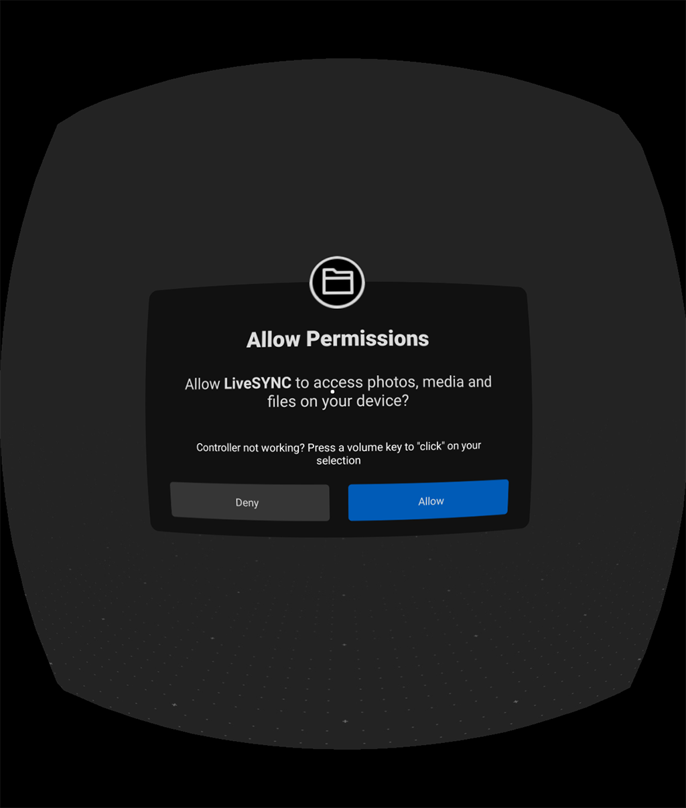
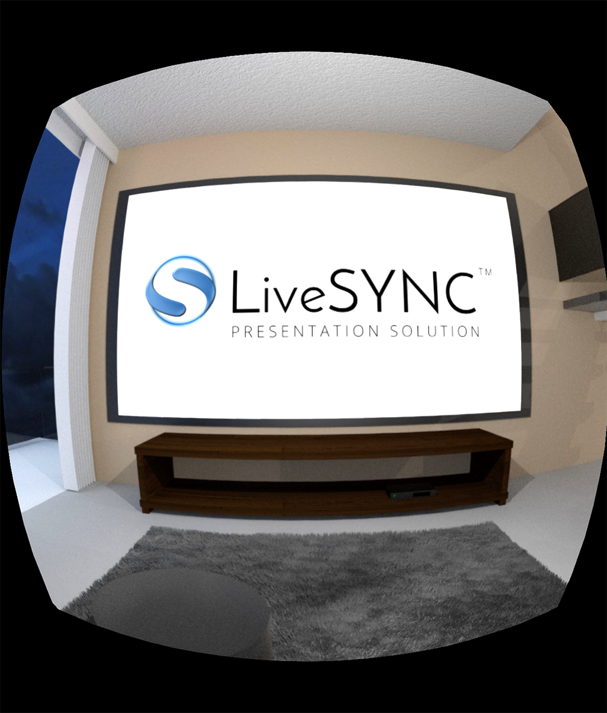
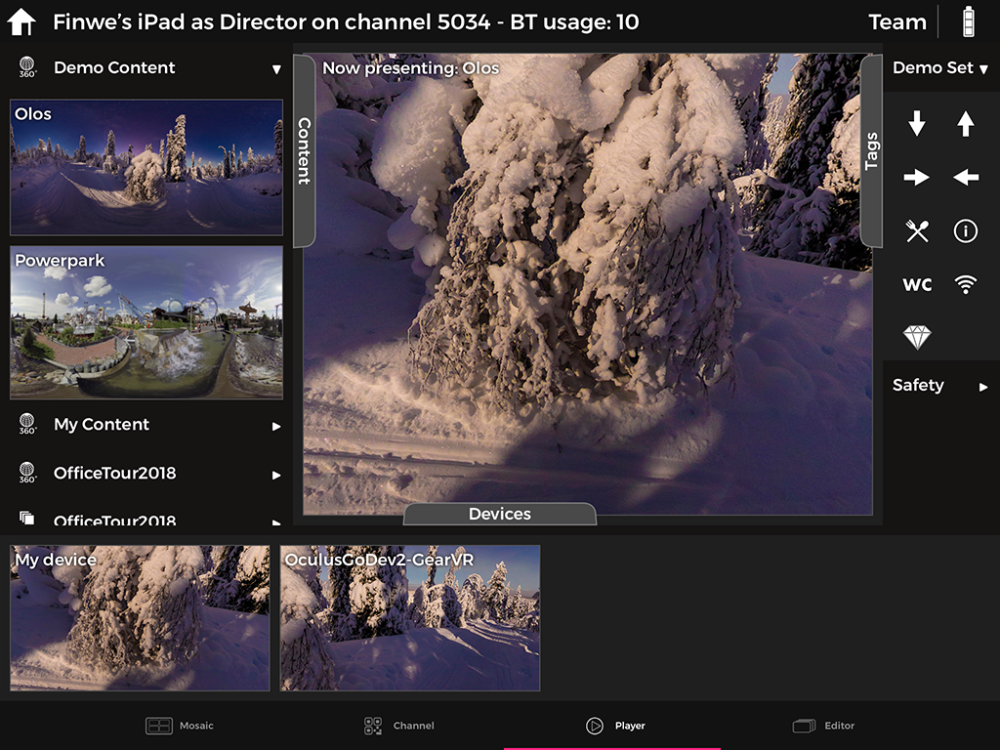

# Using LiveSYNC on Oculus Go

## Preparing

Presenting with the LiveSYNC tool works as follows:

* The presenter controls the presentation with a separate control device (typically an iOS or an Android tablet). The presenter will reserve *a communication channel* for the presentation.

* Each member of the audience uses a personal viewer device (iOS/Android phone or tablet, or GearVR/Oculus Go headset). The viewer devices will *join the communication channel*, whose number the presenter will share.

A channel number consists of four digits from the area 1000-9999.

### Channel configuration

!!! note
    Here we assume that you have already set up a presentation channel in Director Mode on your director device (tablet). As an example, we will use channel number *5034*.

Next, we will configure a new presentation channel (in Audience Mode):

1. On your Oculus Go device, start LiveSYNC app and select '+' from the *Home* screen.

    

2. Type in the channel number using the virtual numeric keypad, and click *OK*.

    

3. On your control device (tablet), start LiveSYNC app and select the channel from the *Home* screen. Mosaic view will appear, showing only *My device* item (tablet's own view).

    

4. On your Oculus Go device, select the channel from the *Home* screen.

    !!! note
        If this is the first time you join a channel from this device (or if you have removed file access permission), a permission dialog appears. Select *Allow* to give file access permission, else LiveSYNC app cannot access your own presentation files.

    

    Next, *the Lobby* appears. Audience members will wait here for a connection to the control device. This is a 360-degree environment with a 2D screen panel where notifications to the user are presented.

    

5. The headset connects with the control device automatically, as soon as it is available / within reach. User does not have to do anything.

    !!! note
        Usually this takes only a few seconds. However, with Bluetooth technology and multiple devices it can take up to tens of seconds. The devices must share the same radio frequencies, which makes connection times longer.

      

6. Once the connection is established, the view from the Oculus Go headset appears on the control device's screen: the Mosaic view now contains a new item:

    

    On the headset, a notification tells that the device is ready for presentation:

    

### Testing the setup

!!! note
    Here we assume that you still have an ongoing connection that was opened in the previous section.

1. To test presenting via the control device, switch to *Player* tab from the bottom bar and drag an item from the *Content* tab to the *Presentation area* at the center of the screen:

    

2. On the headset, the playback command will be received, requested media item loaded, and rendered on screen.

    

3. The headset will notify the contorl device of success. The control device shows live monitoring view from the headset in the *Devices* tab (and also in *Mosaic* if you return there).

    

4. Remember to copy your media files on all devices, as instructed
during the setup procedure. If you skipped it during the setup, please
do it now.
4. Make sure that Bluetooth is enabled on all devices. There is no need
to pair the devices.
5. From LiveSYNC app's Home screen, select to Control (director) or Join
(audience) your presentation channel.
6. You should see the views from your audience devices quickly appearing
to the Mosaic view on your iPad.
7. To begin your presentation, change to Player view on your iPad and
simply drag photos/videos/hotspots to the presentation area on the
center of the screen.

The basic presentation features are covered in the LiveSYNC demo video:
https://vimeo.com/207785581

### Copying content files

1. Connect the included USB 2.0 cable to your computer and Oculus Go headset.
2. Put on your headset and select Accept to confirm you want to allow your computer to access files on the headset.
    - On Windows, Oculus Go will automatically appear as a drive on your computer.
    - On Mac, you'll need to install Android File Transfer to successfully transfer files between your Oculus go and computer.
    - On Chromebook/Chrome OS, you'll need to use the Files app to access your Oculus Go headset.
3. Open Android Transfer app from your computer -> Select Movies -> LiveSYNC -> Click and drag files and folders to LiveSYNC Folder.

Are you not able to find LiveSYNC folder under Movies? LiveSYNC folder is auto generated when the app in being installed. However, to be able to create that folder LiveSYNC, needs a permission from user to access file system (read/write).

So the first thing to check is that you are given read/write permission by tapping three dots next to LiveSYNC Oculus Go -> Permissions.

Both switches should be enabled, location is required by Bluetooth connectivity, and Storage for file access.

Copy the same contents (images, videos) to director iPad

1. Connect the included USB 2.0 cable to your computer and iPad.
2. Select device from itunes on your computer
3. Select Apps/File Sharing
4. Select LiveSYNC
5. Click and drag files and folders to LiveSYNC Documents.
6. Open LiveSYNC on iPad -> Select channel number -> Player -> and pull to refresh contents on the left side (where demo contents are located)

Have a look at our video tutorial (https://vimeo.com/222670351) to see how files are copied. After adding video, image, and .png hotspot files to LiveSYNC pull-to-refresh and update contents of LiveSYNC.
