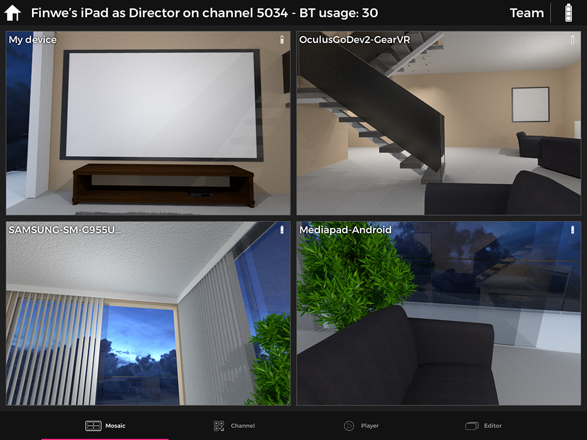
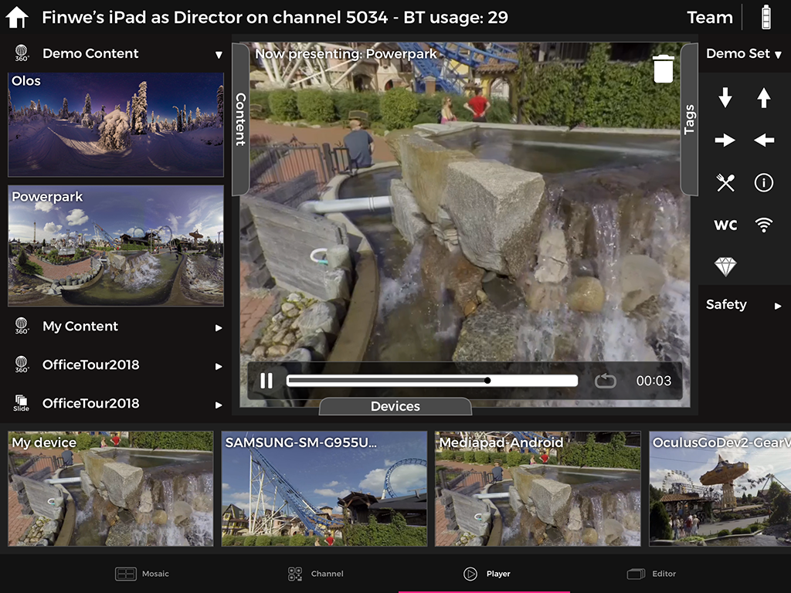
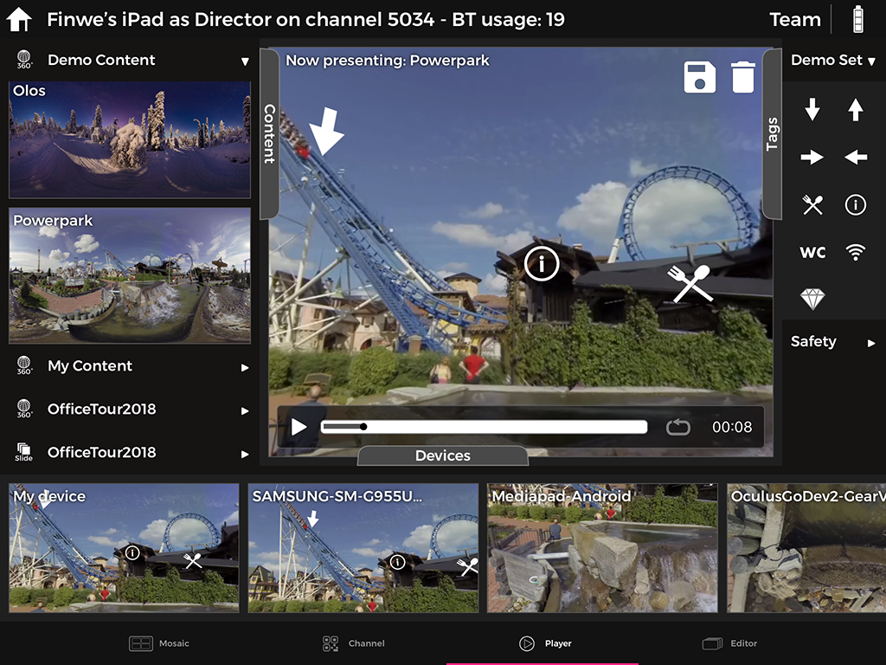
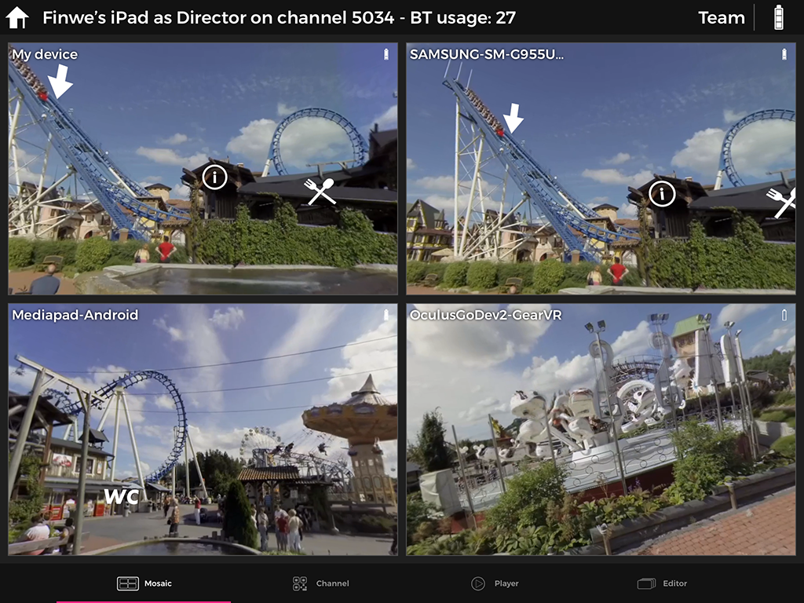
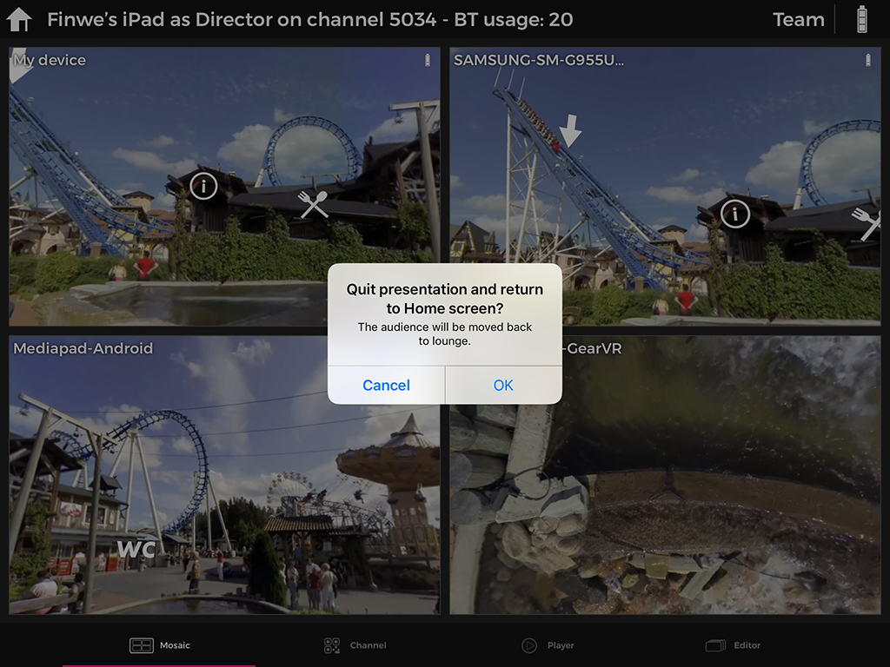

# LiveSYNC on Oculus Go

## Presenting

Presenting content with Oculus Go headsets is like presenting with other viewing devices.

### Connecting

The first step in presenting is to **connect the devices to the same LiveSYNC channel**. This allows the devices to communicate with each other ie. exchange command and status messages.

Connect all viewing devices to the control device as follows:

1. On your control device, start the LiveSYNC app. From the *Home* screen, select a channel that you want to use. The *Mosaic* view appears. The control device is now waiting for viewing devices to join the channel.

2. On each of your viewing devices, start the LiveSYNC app. From the *Home* screen, select the same channel that you selected on the control device. The *Lobby* view appears. The viewing device is now looking for the control device. It will attempt to join the specified channel.

3. Connections are created one by one. Live views from the viewing devices appear in the control device's *Mosaic* view. Wait until all connections are established and you have a live view from each viewing device.

*Connected devices appear in the *Mosaic* view. It is easy to observe what every member of the audience is looking at*.

!!! note
    The grid is automatically resized so that maximum amount of screen real estate is used.

### Playing media

Once viewing devices are connected, play photo and video content as follows:

1. On your control device, navigate to *Player* tab using the bottom bar.

2. Drag a media item from the *Content* tab to the *Presentation area* and drop it there. The content will be loaded and rendered on the screen. All connected viewing devices will also load the same content and render it on screen. Video playback starts automatically when all connected devices are ready to play.

3. You can pan the view by dragging with one finger inside the *Presentation area*. Zoom the view using the pinch gesture within the *Presentation area*. Notice that panning and zooming effect locally, not to other viewing devices. The audience will pan (and zoom on supported devices) by themselves. With VR headsets such as Oculus Go, panning is performed simply by turning one's head.

4. When playing videos, a *Control Panel* appears at the bottom of the *Presentation area*. *Play*, *Pause* and *Seekbar* controls work just like in any other video player. It is also possible to enable *Looping* to continuously repeat the video. Keep an eye on the remaining playback time so that you know when it is time to change content.

5. Change content whenever necessary. Simply drag another media item to the *Presentation area*. Existing photo or video will be immediately replaced with the new one.

*Drag a content item to the *Presentation area*. Control video playback via the Control Panel, which appears and disappears automatically*.

### Marking with tags

The presenter may want to draw the attention of the audience to a specific area of the content being played. *Tags* can be used for marking such points-of-interest during the presentation. You can use them as follows:

1. Find a tag that you wish to use from the *Tags* tab.

2. Drag a tag from the *Tags* tab to the *Presentation area* and drop it to the position where you want it to appear. The tag will stick to the content. It will appear also on the screens of the connected viewing devices.

*Drag a tag to the *Presentation area* to mark a point-of-interest*.

### Observing & guiding

Interaction and guidance are difficult when watching 360-degree content using separate viewing devices. How can you instruct if you cannot see the other guy's view? LiveSYNC solves the problem by providing *live views* on the control device's screen. It works as follows:

1. Live view from each connected device appears in the *Mosaic* tab, and also in the *Devices* area of the *Player* tab. Make a quick glance to see if someone in the audience appears to need guidance. Or, if someone has already asked for help, find his headset based on the name given to that headset. The names appear over the live views.

2. Assist the user. Observe from the live view coming from his headset that the problem is solved. For example, if someone in the audience cannot find a point-of-interest, the presenter can instruct him to turn to the correct direction.

3. If necessary, switch to *Mosaic* view and double tap a particular users' live view to make it full screen. In full-screen mode it is easier to follow another user's view. Double tap the view again to resize it back to normal size.

*Observing and guiding users is convenient using the *Mosaic* view*.

### Disconnecting

When your presentation is over, stop presenting as follows:

1. Tap the *Home* icon at the top left corner of the screen. A confirmation dialog appears.

2. Select *OK* to quit the presentation. You will return to the *Home* screen. All viewing devices will be disconnected from the control device.

3. Close the LiveSYNC app on all devices and recharge the batteries.

*To end your presentation, tap the home icon and select *OK*.*
