# LiveSYNC on Oculus Go

## Setup

### Oculus app

When you receive your Oculus Go headset, unpack it and start the initial setup procedure. It might be a bit surprising, but you must install *an application to your phone*:

> To set up and connect your Oculus Go, you'll need to download the Oculus app on your supported mobile phone. With the Oculus app, you can set up your headset, browse VR games and apps and customize your device settings. *(Oculus Go website)*

This accompanying app is **mandatory** during the initial setup of the headset. After that you will need it very rarely, if ever. If you plan to purchase multiple headsets, they can be all set up and configured from a single phone. Download the Oculus Go app from here:

<https://oculus.com/app>

Alternatively, you can use these direct links for [Android](https://play.google.com/store/apps/details?id=com.oculus.twilight) and [iOS](https://itunes.apple.com/us/app/oculus-vr/id1366478176).

!!! note
    This is NOT the same app that you use with a GearVR headset. Both apps have the same name *Oculus*. You can differentiate them from the icon: GearVR app icon has text GearVR, Oculus Go app icon does not have any text.

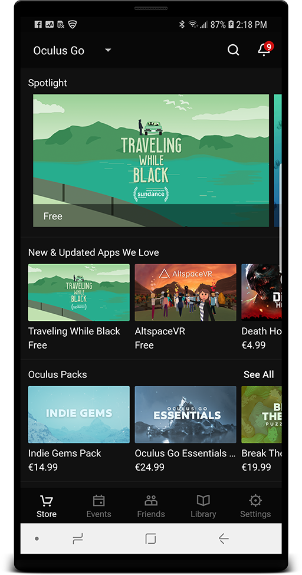

*Oculus Go accompanying app on Android phone.*

### Pairing & setup

Follow these steps to pair your phone with the headset and go through the initial setup.

1. Download the Oculus app using one of the links above, then launch the installed app.

2. If you don't have an Oculus account yet, sign up first, and then log in.

3. Once logged in, navigate to *Settings*, and select *Pair New Headset*.

4. From *Choose a Headset* menu, select *Oculus Go*, and press *Start Now*.

5. Turn on your Oculus Go device. Press *Continue*.

6. Plug your Oculus Go into a power source. Press *Continue*.

7. After search completes, found headsets are listed. If multiple devices were found nearby, choose the one with matching serial number. The number is below the barcode under the head strap. Press *Continue*.

8. Select a Wifi access point that will be used for connecting the headset to the network. Press *Continue*.

9. Put a battery into the controller and choose with which hand you want to use your controller. Press *Continue*.

10. Select language to use in VR. Press *Continue*.

11. Add a payment method (a credit card or a PayPal account), or press *Skip*.

12. Go through safety etc. information. Press *Continue*.

When ready, you will see a dialog saying *Preparing your Oculus Go...*. Once it has finished, pairing and setup has completed.

For more information, see the questions and answers [here](https://support.oculus.com/183135912238400/).

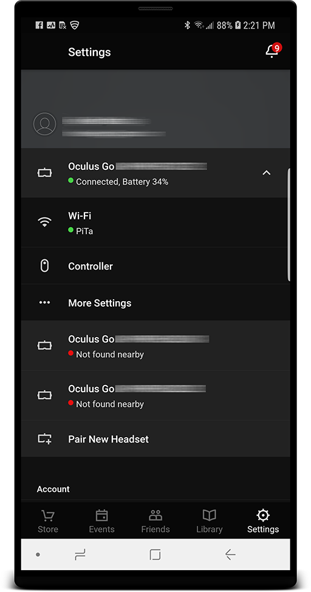

*Once the pairing and setup is complete, your headset(s) will appear in *Settings* tab.*

### First time use

Go to your Oculus Go device. Put the headset on your face. There is *an infrared proximity sensor* inside the headset (between the lenses). The headset will wake up automatically and you will hear a greeting sound.

Grab the hand controller and point straight ahead to the direction you are looking at. Then, *press and hold* the Oculus button (ring symbol) on the hand controller.

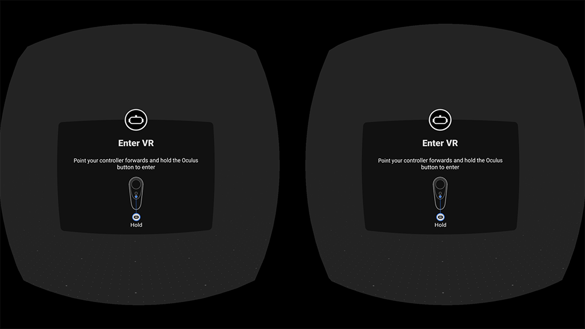

*Whenever the device wakes up from sleep you must calibrate the hand remote.*

!!! note
    Every time the headset wakes up from sleep it will present *a calibration dialog*. Calibration is necessary, because the headset and the hand remote are two independent devices. They are both only aware of *rotation around their own center point*. Moreover, the devices do not know what actual direction they are pointing at (for example, North, South-East, etc.). Hence, they need to be calibrated by making them point to the same direction and then pressing a button to signal this. Unfortunately, this needs to be repeated every time the headset wakes up. Sensors are turned off to save power during sleep, hence they will lose the tracking.

After calibration and first time use tutorial you will enter *Oculus Home*. Here you can install new apps, start installed apps, configure the headset, and use services offered by Oculus.

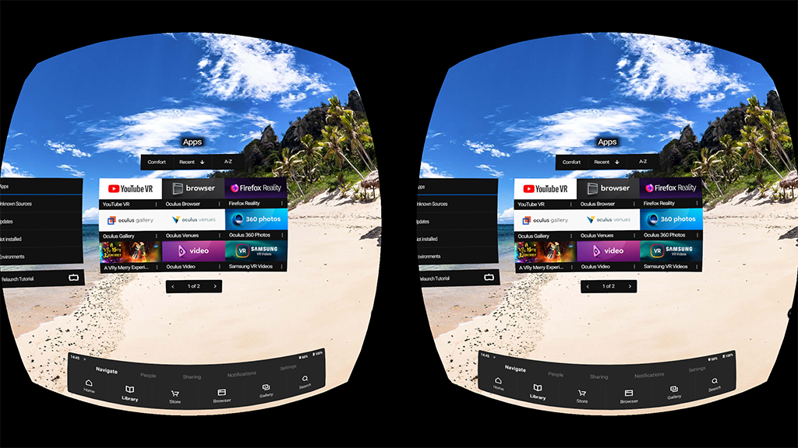

*The Oculus Home.*

!!! tip
    We recommend that you spend some time to play around with the device. Get familiar with the hand remote and Oculus Home. Try a couple of pre-installed apps. Ask your boss a permission to take it home for the weekend and watch a couple of movies from Netflix or Youtube VR.

### Installing LiveSYNC

Once you feel familiar with Oculus Go, it is time to install the LiveSYNC app. The installation can be triggered either via the accompanying Oculus app on your phone (outside VR) or via Oculus Home (inside VR).

!!! info
    LiveSYNC has not officially launched on Oculus platform yet. However, you can start using it already by installing it from our beta channel. Follow the steps below.

1. Check your Oculus username and email. Start the Oculus accompanying app on your phone, navigate to *Settings*, and find the username and email (see the image below):

    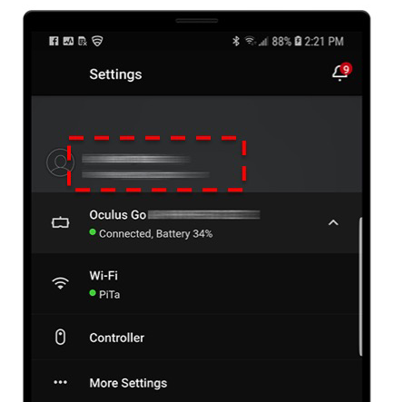

2. Installing software from Oculus beta channel requires *an invite*. [Contact us](../support/support.md) and tell that you want to join LiveSYNC beta channel for Oculus Go. **We need the email address from Step 1 to be able to add you**. This cannot be just one of your email addresses; it has to be the one that is connected with your Oculus account.

3. Once you receive an invite email from Oculus to that email address, accept the invite by clicking a confirmation link in the email. Notice that we must send each invite manually, so it can take a while before the email arrives.

    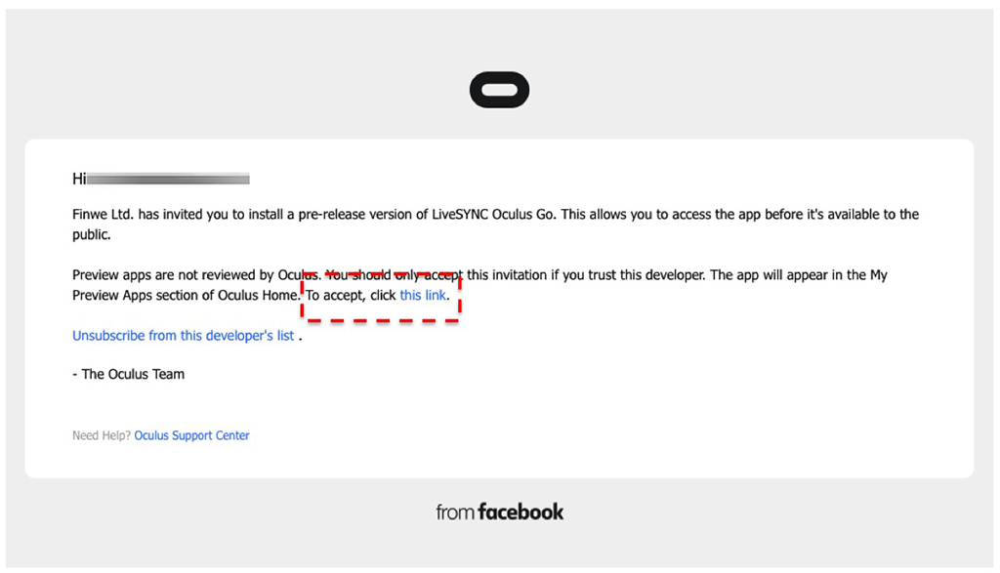

4. After accepting the invite you have multiple options how to install the application:
    1. Using the accompanying Oculus app on your phone: tap the magnifier class icon to open search, type *livesync* and select *LiveSYNC Oculus Go*, then click *Install on ...* button.

    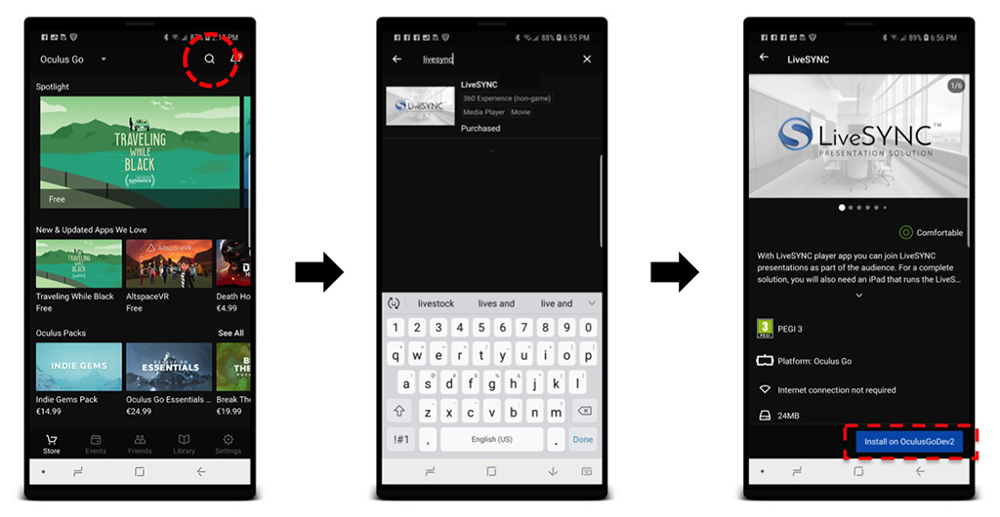

    2. You can also select *Library* tab from the bottom bar and see if *LiveSYNC Oculus Go* already appears in the apps list. Select it from the list and then click *Install on ...* button.

    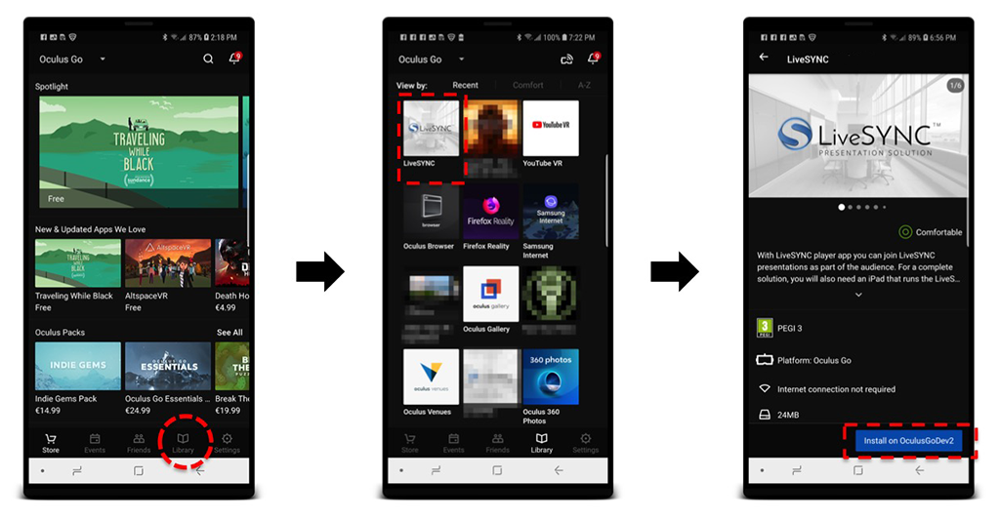

    3. Using the Oculus Go device, select *Search* from the bottom bar, type *livesync*, select *LiveSYNC Oculus Go*, then click *Get*.

    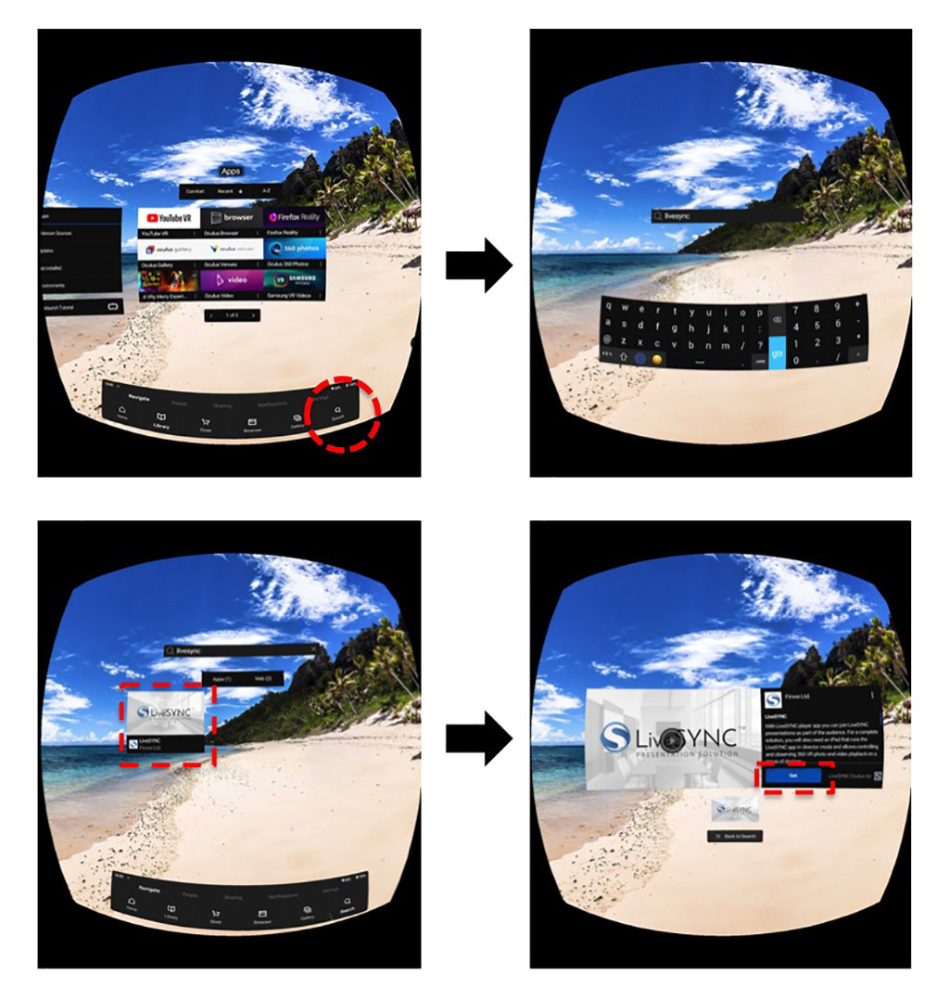

    4. You can also select *Library* tab from the bottom bar and then *Not Installed* page from the left side menu to see if *LiveSYNC Oculus Go* already appears in the apps list. Select it from the list and then click *Get*.

    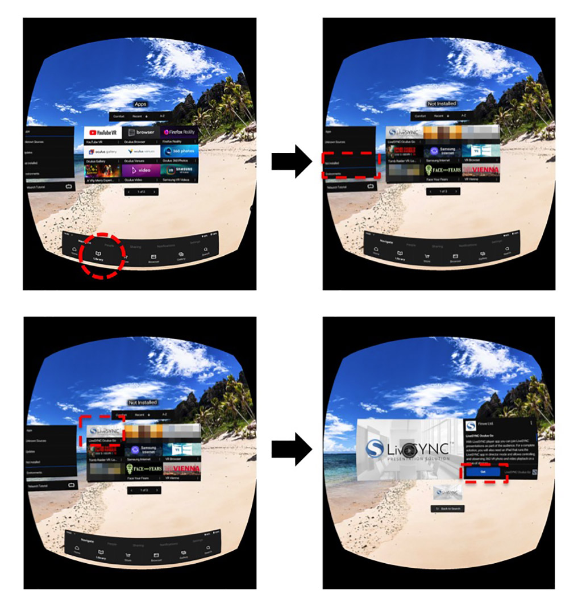

5. When the installation has completed you will find *LiveSYNC Oculus Go* listed in the headset: Select *Library* tab from the bottom bar, and then *Apps* page from the left side menu.

6. Start *LiveSYNC Oculus Go* by selecting it from the apps grid. Notice that version number appears in the splash screen below the LiveSYNC logo.

    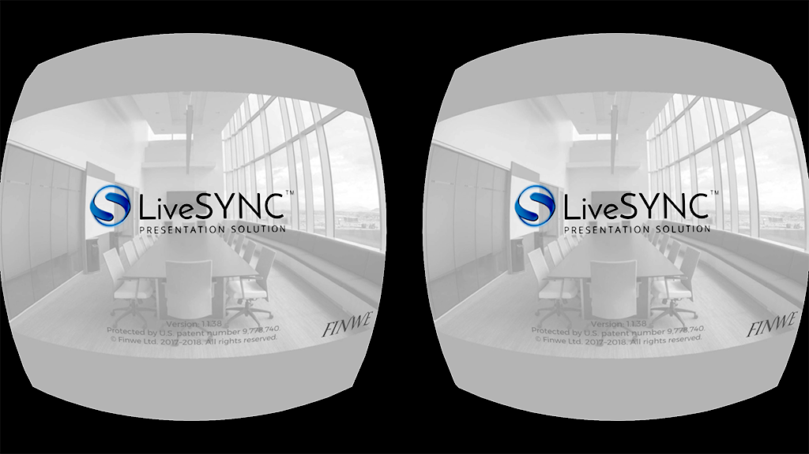
