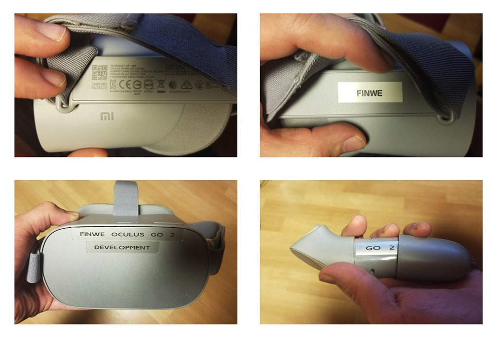
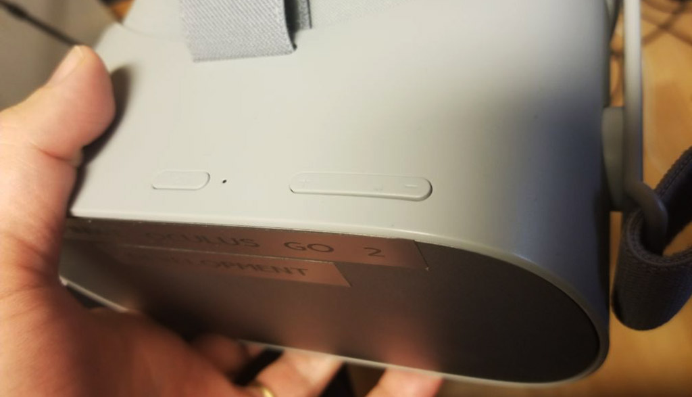
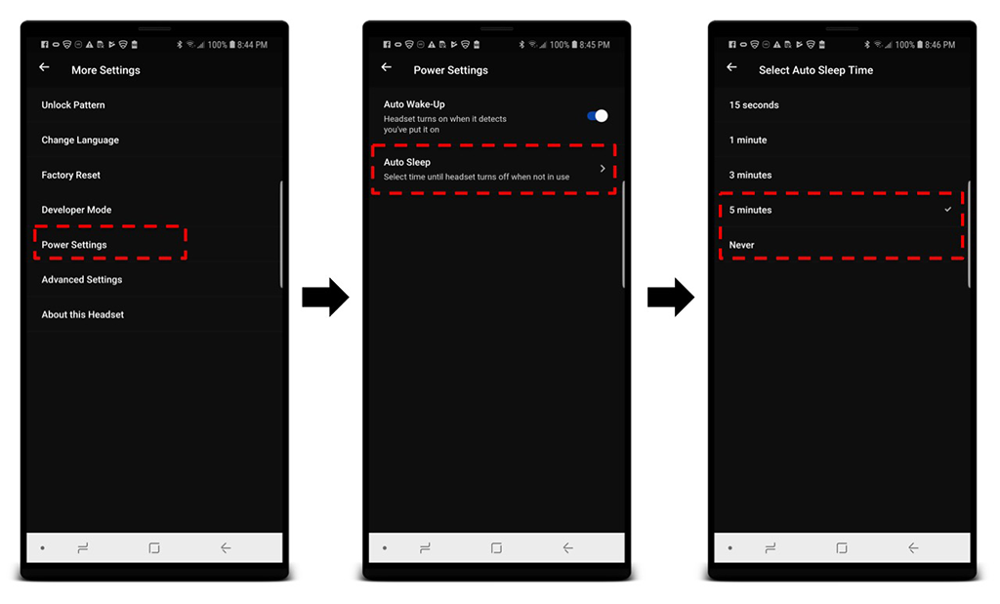
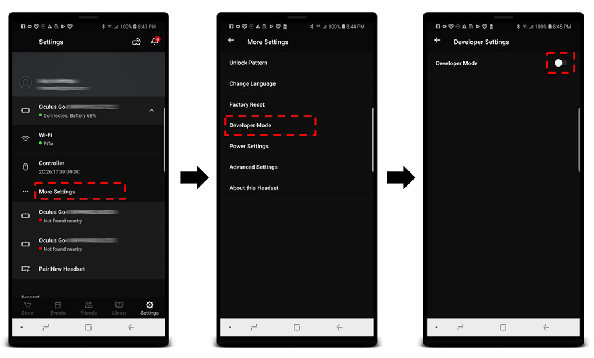

# LiveSYNC on Oculus Go

## Tips & tricks

To conclude the tutorial, we will present a set of handy tips.

### Labeling

We highly recommend that you **mark your devices with labels** for the following reasons:

* You can easily distinguish your headsets from each other, for example to find a particular headset's live view from the *Mosaic* tab.

* You can recognize which hand remote belongs to which headset, for example when you store them together.

* You can get back *your* headsets (and content!) after a presentation elsewhere, for example when you use them in a trade show or borrow to a colleague for his presentation.

* You can *brand* them with your company / team / project logo.

* You can make the headsets look fancier with a bit of decoration.

In general, two-three labels are placed at different positions:

* Oculus is using the left side of the head strap - under the fabric - for a serial number and other product info, which you should not cover. However, the right side is empty. When you place a label there it will be hidden during normal product use but is easy to check when you know where to look from. This is a great place to put your owner identification label.

* The front side of the headset has a large solid surface that is clearly visible when the headset is being used. Obviously, this is where your company logo or fancy decoration is typically placed.

    !!! warning

        The headset uses its front surface for *head dissipation*. Do not block the airflow or you will risk running your headset too hot. It will stop and you must wait until it cools down.

* LiveSYNC allows giving each device a name (*LiveSYNC name*). This is shown for example in the *Mosaic* view. It is a good idea to print a label that contains this name and put it in a place where you can easily see it when the headset is being used.

* If you have a small amount of headsets, consider using color coding: add something with *red color* to the head strap of one headset and set its name to "Red", etc. This way you can find the correct headset from the *Mosaic* view even if it is too far for reading a textual label, or if the user is looking away from you and you cannot see the front side.

* Pull the hand remote's battery cover open, and put an identification label there. This way you can easily check which hand remote belongs to which headset.



*Labeling examples*.

### Hand remote controllers

Oculus Go headset is designed to be used with a hand-held remote controller. Its main purpose is to allow selecting items by pointing at them.

In most presentations, users have no use for the controller. The presentation is controlled via the control device and users do not need to make any selections. In such a case, you may want to **consider collecting all the remote controllers away**. This way there will be much less hassle and no risk that somebody in the audience puts the remote in his pocket and forgets it there.

Remember that you still need to keep the remotes at hand, though. Whenever a headset is waken up from sleep, its hand remote *must* be calibrated. This is a requirement of the Oculus platform. An assistant or the presenter himself can do this by pressing and holding the Oculus button on each hand remote one at a time. Notice that proper calibration by pointing at the *correct* direction is not necessary if the remotes will not be used for selections. **To get rid of the calibration dialog after waking up the headset, all that is needed is a long press of the Oculus button.**

!!! note
    This is a known issue for Oculus. They have said that they are working on a solution to allow using the headset without performing hand remote calibration each time, but they have not yet released a fix.

!!! tip
    The *Developer Mode* has an interesting shortcut: to skip hand remote calibration, the user can press one of the volume keys (+/-) when the dialog appears. It is not a perfect solution as action is still required for each headset, but at least you don't need to have a bunch of remote controllers around. Read more about the Developer Mode below.



*Oculus Go headset has three buttons. From left to right, Power, Volume Up, Volume Down. In Developer Mode, hand remote calibration can be skipped by pressing Volume Up/Down button*.

### Power management

Because of the requirement to calibrate the hand remote controller each time the device wakes up from sleep, we recommend that you **increase the headset's timeout for dropping into sleep**:

1. Make sure the headset you want to configure is turned on.

2. On your phone, start Oculus app and navigate to *Settings*.

3. Find the headset you want to configure from the list, and select it.

4. Tap *More Settings* and then *Power Settings*. Select *Auto Sleep* and set it to *5 minutes* or *Never*.



*Reduce the need for hand remote calibration by adjusting the headset's sleep timeout*.

!!! tip
    You can also cover the proximity sensor (between the lenses) with a piece of tape. However, configuring *Auto Sleep* time works very well and we recommend that you use that option.

!!! tip
    If you carry your headset in a bag in a sleep mode, you may also want to consider disabling *Auto Wake-Up* feature. The head strap tends find its way in front of the proximity sensor, turn the headset on every now and then inside your bag, and drain the battery. Of course, you can also turn off the headset when you are not using it.

!!! warning
    The headset uses its front surface for *head dissipation*. When you place the headset on a table, try to avoid placing its front side towards the table surface. It is tempting because in this way the headset is in a good balance. However, head dissipation suffers because there is no air flow around the front surface.

### Developer Mode

You can easily activate and deactivate the *Developer Mode* for each headset from the Oculus accompanying app on your phone. **To do this you must first create a developer organization (real or fake) on the [Oculus Dashboard](https://dashboard.oculus.com/my-apps/1569030166732522/)**. After that, follow these steps:

1. Make sure the headset you want to configure is turned on.

2. On your phone, start Oculus app and navigate to *Settings*.

3. Find the headset you want to configure from the list, and select it.

4. Tap *More Settings* and then *Developer Mode*. Disable or enable the feature.

Read more from [here](https://developer.oculus.com/documentation/mobilesdk/latest/concepts/mobile-device-setup-go/).



*Enable/disable Developer Mode by turning the switch from the Oculus accompanying app*.

When the Developer Mode is enabled, you can:

* **Skip hand remote calibration by pressing volume +/- key from the headset**.

* Copy content files back and forth using Android Debug Bridge (adb) tool from the command line. This can be handy if you're into automating things by writing scripts.

* Sideload apps using Android Debug Bridge (adb) tool from the command line.

!!! note
    When the Developer Mode is enabled, the device connects via USB cable in a different mode and it will *NOT* appear in the Windows Explorer.

### Automation

The LiveSYNC app on Oculus Go supports *a configuration file*. The filename must be **settings.ini** and it must be copied to **\Movies\LiveSYNC** folder on the headset. (This is the same location where you will copy your own content files.)

A configuration file is written using Windows INI file format. Here is an example of contents for a configuration file:

```
[defaults]
; automatically opens given channel on startup, true/false
default_channel_on_startup=true
; channel number to open, between 1000-9999
default_channel=1000
; connection type to use (bluetooth or globalsync)
default_connection_type=bluetooth
; LiveSYNC username to use, can be left blank
default_livesync_name=Joan's
```

