# 4. Managing Assets

## Basics

With LiveSYNC, you can present various kinds of content to other people. Before your presentation, the content files must be manually copied to specific locations. This way LiveSYNC can find and access them during the presentation.
 
 The content files are called *assets*. In this chapter, we will go through various methods and strategies for managing your assets.

!!! tip
    LiveSYNC contains free content samples. These are bundled with the app. You can study and evaluate the app using the demo content. Return here when you want to learn how to present your own files.

### Assets

In short, a **presentation's assets are all the files that you will need in your presentation**. They include for example:

- 360-degree photos
- 360-degree videos
- Ordinary 2D photos
- Ordinary 2D videos
- Slide images
- Custom tag and hotspot icons
- Video stream configuration files
- Project files

- 2D map images
- 3D map models
- Camera path files

Typically, a presentation combines several kinds of assets. They can be partially the same with other presentations, and partially different.

### Big Screen

With LiveSYNC, you can use a common big screen device for showing content to an audience. This can be for example a TV or a projector. **When you present content via the big screen, copy your presentation's assets to the control device.** 

There is no need to copy them anywhere else. This is because the view from your control device is mirrored to the big screen as a video stream, not as command messages. For example, you can connect an iPad to a TV using a standard HDMI cable (you will also need an adapter from Apple).

!!! note
    Some modern TVs and projectors support playing photos and videos from a USB memory stick. You may wonder if that approach can be used for showing also 360-degree content. Technically, the photos and videos can be played. However, built-in photo and video players do not understand the special projections that are used for storing 360-degree content. In addition, they do not provide interactivity ie. ways for panning and zooming 360-degree content. Hence, this approach does not really work.

### Viewing Devices

LiveSYNC supports presenting content also via personal viewing devices such as phones, tablets, and VR headsets. You may wonder where the content comes from in this case. Is it streamed from the control device to all of the audience devices? Is it streamed from a local server or a cloud service? Or is it played from local file copies on each device? 

LiveSYNC supports more than one option. However, in most cases the recommended solution is to use local file copies. This is because streaming high-resolution video to a number of devices tends to congest local network connection. With local file copies, the user experience is great and you don't need to struggle with network bandwidth issues. **When you present content via viewing devices, copy your presentation's assets to the control device AND all viewing devices**.

!!! tip
    This chapter focuses on local file playback approach. If you want to learn how to use streaming with LiveSYNC, you can read about it from [here](streaming.md).

### File Storage Strategy

Every software product that supports embedding images, videos, and sound tracks must choose a strategy for handling multimedia files. This decision is fundamental. The chosen strategy defines how easy it is to manage your project with that application. For example, to share a finished work, store multiple versions of it, or to make some last-minute modifications.

You have probably created presentations using *PowerPoint* or *Keynote* application. These tools make adding images easy. Have you ever though about what happens in the background when you drag an image onto a slide? When you save the presentation, the output will be a single file. This file contains *everything* that belongs to your presentation, including all the images. A single file is easy to manage on disk and share via email. However, as everything is embedded file size can easily grow to several megabytes. Sometimes, tens of megabytes. What would happen if you added a couple of high-resolution videos? 

Single-file strategy becomes unpractical when the file size becomes too large. Hence, applications that make extensive use of video content typically choose a different strategy. The project is not stored as a single file that contains everything. Instead, all multimedia files are stored as individual files. A light-weight project file *references* to them - it does not embed them. This approach has many benefits, but also one drawback: a project becomes partially broken if any of the referenced files is not present. Hence, moving the files around or renaming them frequently should be avoided. Also LiveSYNC uses this approach: **a presentation consists of multiple smaller files that you need to copy in place. Not just one huge file**.

### Central Media Repository

Previously, we discussed file storage strategy and explained why LiveSYNC presentations consist of multiple files instead of a single large file. A logical follow-up questions is whether a presentation's files should be kept in a single location or scattered around the file system. Many platforms have built-in locations for photos, videos, and music - should we copy our presentation's photos to the device's *Photos* folder, videos to *Videos* folder, and so on? Short answer is: no.

If a presentation's assets were scattered around the file system, managing them would become a nightmare especially with a large number of devices. 360-degree content would show up in other photo and video applications that do not know how to play them. Likewise, all ordinary 2D photos and videos would be mixed with 360-degree content in LiveSYNC.

To avoid confusion, **LiveSYNC uses its own central media repository. It is a single location for storing all kinds of assets.** Notice that this is not the same path where content captured with device's camera appears. 

However, sometimes we *do* want to include ordinary photos and videos into our presentations. LiveSYNC allows this. For example, on iPad the contents of the device's *Camera Roll* appear as a subdirectory. It is not a real subdirectory in LiveSYNC's media repository. Consider it as a virtual link to the *Camera Roll* directory that is physically located elsewhere in the file system.

### File Access Permissions

On personal computers, almost the whole file system is accessible for applications. A file manager application is an essential, built-in part of the desktop environment. On Windows, every user is experienced in managing files via *Explorer*. On Mac, *Finder* is your best friend. This is different on mobile platforms such as iOS, Android and Oculus, where applications are *sandboxed*. Sandboxing means that the platform enforces security by isolating apps from each other. The same approach is applied to the file system: apps see only their own files by default. This has consequences to media applications such as LiveSYNC.

On Android and Oculus, user can give *a permission* for a particular app for accessing files in the common files area. This is useful in many ways. For instance, one can use different apps for playing a video file that is located in the common files area. The user can also use a file manager app for moving, copying, and renaming files. **On Android and Oculus, LiveSYNC uses a directory in the common files area as the root of its media repository.** Permission for accessing the file system is asked from user. This permission also allows reading the device's photos and videos folders. Hence, ordinary 2D content captured with the device's camera can be used in presentations.

iOS does not have a similar concept. The apps can access only their own files. You cannot open the gates by giving a permission, not even if you wanted to. **On iOS, LiveSYNC uses its own file sharing directory as the root of its media repository**. iOS provides an interface for 3rd party apps for accessing the photos folder. LiveSYNC supports this feature, if you give it a permission. Hence, ordinary 2D content captured with the device's camera can be used in presentations also on iOS.

### File System Limitations

To avoid common pitfalls when dealing with large video files in presentations, we need to understand technical and practical limitations. Some of them come from the *file system*.

All the assets that belong to a presentation must be stored as files on a mass storage device. This might be the hard drive of the computer where you edit the files. Or, the internal mass memory of the tablet you use for presentations. Or, a USB memory stick that you use for quickly copying files to multiple VR headsets. Or, an SD card that you use for expanding your Android tablet's storage capacity. All these devices use a file system for managing the files. It defines how the total size of the mass memory is divided into smaller blocks, and how these blocks are allocated for individual files. 

The type of the file system sets some important hard limits. One of them is the total number of bytes that a drive can store ie. *max volume size in bytes*. This is rarely a bottleneck nowadays as theoretical limits are far higher than current storage capacities. Another limitation is the maximum size that a single file can be ie. *max file size in bytes*. This is important when you deal with large video files. **None of your files can exceed the file system's max file size limit.** Often you encounter problems with files that are over 4 GB in size. Another common problem is that the presentation device simply does not have enough free space for the presentation's files.

!!! example
    Jean has purchased a cheap Android tablet. It has 16 GB internal storage capacity. However, Android operating system and bundled factory apps (which cannot be removed) consume 6 GB. Other apps and Jean's photos, music, video clips, and web browser cache consume another 4 GB. Jean has only 6 GB left. Thus, the total size of all the files she needs in her presentation must not exceed 6 GB. Else, she will need to clean up her tablet to release some memory. Jean regrets not buying a 32 GB model.
    
    Based on a tip from her friend, Jean buys a 16 GB SD card to expand the storage capacity of her Android tablet. The SD card is formatted with FAT32 file system. FAT32 is often used on older hard disks, USB flash drives, and memory cards. It is fairly well supported on different devices. The theoretical size of a FAT32 formatted drive could be as large as 8 TB (eight terabytes). Enough for 300 hours of 4K video captured with an iPhone. However, the size of each *individual file* may not exceed 4 GB (four gigabytes). That is only 10 minutes of 4K video captured with an iPhone. After adding the SD card, Jean has 16 GB more storage space.

    Each of her video files must stay below the 4 GB limit. However, one of Jean's videos is 6.5 GB. It is a high-resolution video that she wishes to present using an Oculus Go headset. She plans to control the presentation with her Android tablet. Jean has several options for overcoming her SD card's 4 GB max file size limitation:
       
    a) She can try to format her SD card with exFAT file system. If her tablet recognizes the card, the problem is solved. exFAT is a newer file system and has *much* larger limits. 6.5 GB file will work easily.
    
    b) She can make space on her tablet's internal memory and copy the file there instead. That drive is very likely formatted with a different file system and does not have the 4 GB limit.

    c) She can encode a smaller version (low resolution / bitrate) version of the video and use that in her tablet. She can still use the high-resolution version on her Oculus Go headset. The filenames must match, so that LiveSYNC can identify them as the same video.
    
    d) She can use a video editor application to split her video to shorter clips, each below the 4GB limit. During the presentation, she will simply start the next clip when the previous one ends.

!!! tip
    On iOS devices, you cannot expand the storage capacity with an SD card. There are memory sticks intended for iOS devices, but they only work with the manufacturer's own app - not LiveSYNC. Hence, when you are purchasing a new iPhone or iPad, invest in a model that has enough built-in storage space for your needs. 
    
    On *some* Android devices, you can use an SD card for expanding the storage capacity. When you are purchasing a new Android phone or tablet, check if it supports an SD card. If not, choose another model or invest in a model that has enough built-in storage capacity.
    
    We recommend purchasing a device that has at least 32 GBs of internal storage space.
    
!!! tip
    If you have videos that are larger than 4 GB, you may encounter problems in storing or transferring them. However, usually such problems can be solved. You might be able to simply reformat the storage device with another file system type (such as exFAT). Beware that formatting destroys all the data! 
    
    Using a different device for storing or transferring the files often helps. You can also try transferring the files via cable or via network connection.
    
    If nothing else helps, consider splitting a large file to multiple smaller ones (multiple video clips). Or, encode your video again to lower resolution and lower bitrate to create a smaller file.

### Dealing With Redundancy

Video files consume a lot of storage space. Thus, it is important to **learn to fight against unintended redundancy**. Don't get this wrong: creating a backup is always a good idea. That is intended redundancy. However, when you are busy preparing for a presentation, it is easy to forget that you have one version of a video clip here and another there. Files that consume hundreds of megabytes or even multiple gigabytes each quickly add up. And cleaning is laborious!

One strategy is to create a new folder on your computer. This folder will be the *master directory* of your presentation. It should contain all the necessary assets and nothing else. Keep it tidy: delete old and extra versions immediately. Create backups by copying the whole folder e.g. to an external drive. Delete old content on your presentation devices and copy there the contents of your master directory as-is. The idea is to focus on this one presentation and keep its assets in one directory. This approach works well if you use shared devices that must be cleared frequently.

The approach described above is not suitable for all cases. Some users have presentations often and reuse material from previous presentations. Creating a new presentation folder every time would mean redundant copies of the same files. Another strategy is to create one master directory and a number of subfolders. Folder titles can be for example dates or topics, whatever suits your situation. You will quickly get familiar with your own content archive. During a presentation, you can adapt to the audience as you go and present content directly from your content archive. Maintain a backup of the whole archive on an external drive, and copy new files to your presentation devices incrementally. This approach works well if you have a set of devices reserved for your own use.

A third option is a hybrid one. You will build a content archive as explained above. And, sometimes create a subfolder for a particular presentation by copying the necessary assets there. This means that there will be multiple copies of some of the files, but only for a while. After the presentation, you can simply delete its folder - all of its assets are already in your archive folders, too.

!!! note
    To keep the user interface simple, **LiveSYNC supports only one level of subdirectories**. We encourage you to make use of them. Choose one strategy for organizing your content, and stick to it.

### Transfer Times

Sometimes, a large number of devices is used in a presentation. It is good to remember that **the time required to copy the files grows exponentially along the total file size and the number of devices** - unless you can do it in parallel using multiple copy stations. Nevertheless, you should have the final version ready early enough so that there is enough time to copy the assets in place.

Notice that last-minute changes can be problematic. Changing even one small icon requires going through all the devices again. Moreover, on iOS devices you may have to copy the whole folder again even if you need to change a single file inside it. This is because Apple's *iTunes* application, which is used for copying files for iOS devices, has very limited file management capabilities.

!!! example 
    Lisa is a teacher in elementary school. They have a rack of 20 iPads, which any of the teachers can reserve for their class. Lisa is preparing a presentation for the parent's night. Her students have made a 360-degree video of their day at school. She plans to use the iPads to show the video to the parents. Lisa has a single presentation folder that contains one 3 GB video file and a few 360-degree photographs. Her students copied the files to all iPads during the afternoon. Suddenly Liza realizes that their 360-degree group photo is missing.
    
    If Lisa adds the missing photo to her presentation folder, she must copy the whole folder again. This is because of limitations in Apple's iTunes application. She quickly calculates that copying 3 GB * 20 devices means 60 GB in total. That will take hours. Lisa decides to create another folder that contains only this one image. Since the image is just 5 MB in size, Lisa needs to copy 5 MB * 20 devices = 100 MB. She will be ready in 15 minutes.

## Which Files Must Be Copied?

In principle, all files that you need in your presentation must be copied to the control device and to each viewing device (except the big screen). We recommend that you create a *master directory* on your computer where you collect all the assets. Then, copy the contents of this directory to your control device and viewing devices.

### 360-Degree Photos

**360-degree photos in JPG or PNG format can be copied either to the root of the LiveSYNC media repository or in a subdirectory**. You can freely choose the name for the subdirectory (with a couple exceptions shown below). Remember that LiveSYNC supports only one level of subdirectories.

Examples of valid paths:

- LiveSYNC/my_image.jpg
- LiveSYNC/my_image.png
- LiveSYNC/Another Image.jpg
- LiveSYNC/January/Flowers.png
- LiveSYNC/Summer Holiday/At the beach.jpg

Examples of invalid paths:

- LiveSYNC/my_image.tiff *TIFF image format is not supported*
- LiveSYNC/January/16/Flowers.png *Only one subdirectory level is allowed*
- LiveSYNC/slides_tuesday/my_image.jpg *Do not put 360-degree content in a subdirectory that starts with "slides_"*
- LiveSYNC/hotspots_tuesday/my_image.jpg *Do not put 360-degree content in a subdirectory that starts with "hotspots_"*
- LiveSYNC/documents/my_image.jpg *Do not put 360-degree content in a subdirectory whose name is "documents"*

### 360-Degree Videos

**360-degree videos in MP4 container can be copied either to the root of the LiveSYNC media repository or in a subdirectory**. You can freely choose the name for the subdirectory (with a couple exceptions shown below). Remember that LiveSYNC supports only one level of subdirectories.

Live 360-degree video streams can be configured as special *.videostream* config files. These files can be placed to same locations where local 360-degree video files are placed.

Examples of valid paths:

- LiveSYNC/my_video.mp4
- LiveSYNC/live.videostream
- LiveSYNC/Another Video.mp4
- LiveSYNC/January/Skiing.mp4
- LiveSYNC/Summer Holiday/At the beach.mp4

Examples of invalid paths:

- LiveSYNC/my_image.avi *AVI video container is not supported*
- LiveSYNC/January/16/Skiing.mp4 *Only one subdirectory level is allowed*
- LiveSYNC/slides_tuesday/my_video.mp4 *Do not put 360-degree content in a subdirectory that starts with "slides_"*
- LiveSYNC/hotspots_tuesday/my_video.mp4 *Do not put 360-degree content in a subdirectory that starts with "hotspots_"*
- LiveSYNC/documents/my_video.mp4 *Do not put 360-degree content in a subdirectory whose name is "documents"*

### Slides & 2D Content

Slides exported as images can be shown with LiveSYNC. Also other 2D images and videos can be shown. Currently, content files are detected as ordinary 2D files based on filename convention. **All images and videos in folders that begin with "slides_" are played as ordinary 2D content.** The prefix "slides_" is automatically stripped from the filename when the directory is shown. For example, "slides_Tuesday" appears as a folder "Tuesday" in LiveSYNC.

Live 2D video streams can be configured as special .videostream config files. These files can be placed to same locations where local 2D video files are placed.

Examples of valid paths:

- LiveSYNC/slides_Tuesday/my_2D_image.jpg
- LiveSYNC/slides_Holiday/my_2D_video.mp4
- LiveSYNC/slides_Meeting/Slide 1.png

Examples of invalid paths:

- LiveSYNC/slides_/Skiing.mp4 *Do not use the prefix alone*
- LiveSYNC/slides_Holiday/Tuesday/Skiing.mp4 *Only one subdirectory is allowed.*
- LiveSYNC/Meeting/Slide 1.png *Always put 2D content in a subdirectory that starts with "slides_"*

### Icons

Custom tag and hotspot icons are small 2D images that appear as items that you can drag & drop onto 360-degree content. **All images in folders that begin with "hotspots_" are treated as custom tag or hotspot icons.** They appear in the *Tags* tab (instead of the *Content* tab). We recommend using PNG images with transparent background (alpha).

Examples of valid paths:

- LiveSYNC/hotspots_signs/staff_only.png
- LiveSYNC/hotspots_prohibition/Do not enter.png

Examples of invalid paths:

- LiveSYNC/hotspots_/No running.png *Do not use the prefix alone*
- LiveSYNC/hotspots_signs/Traffic/Stop.png *Only one subdirectory is allowed.*
- LiveSYNC/Meeting/Reserved.png *Always put tag & hotspot icons in a subdirectory that starts with "hotspots_"*

## Where Should My Files Go?

### iOS

**On iOS, LiveSYNC uses the app's own file sharing directory as the root of its media repository**. The screen capture shows a view to it from the *iTunes* application. On this iPad, there are many folders that contain icons for tags and hotspots (folders that start with *hotspot_* prefix). There is also a 360-degree content folder *OfficeTour2018* and a 2D content content folder for the same tour (*slides_OfficeTour2018*).

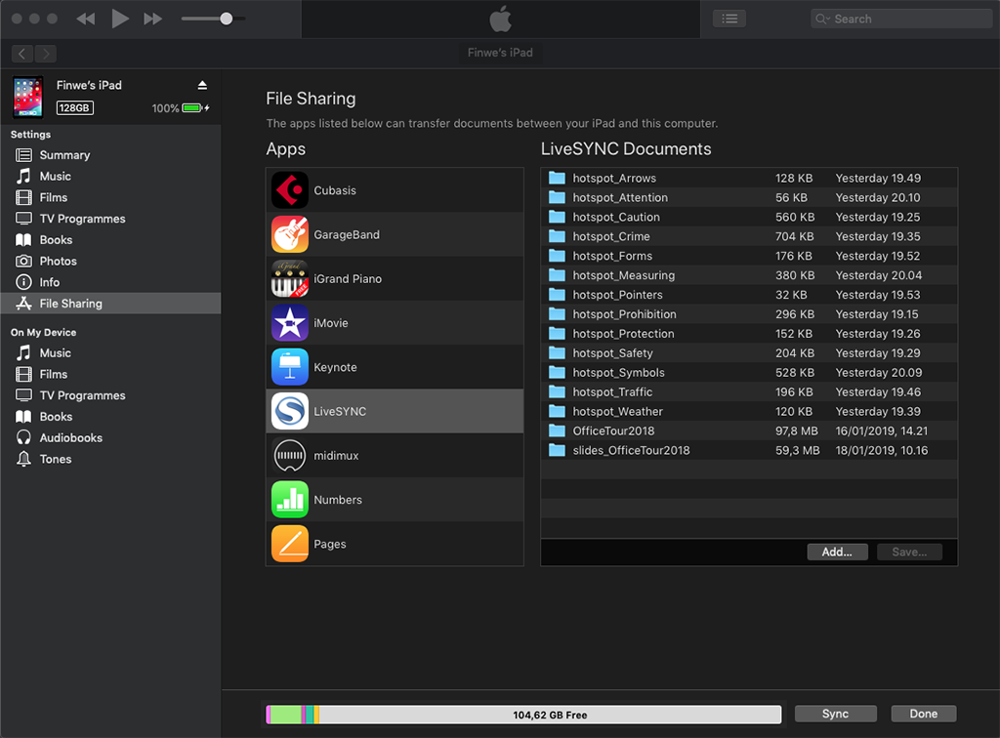

### Android

**On Android, LiveSYNC uses directory */Movies/LiveSYNC* in the common files area as the root of its media repository**. The screen capture shows a number of 360-degree content folders: an archive of 360-degree photos. There is also a license file (*license.key.lic*). This file must not be removed.

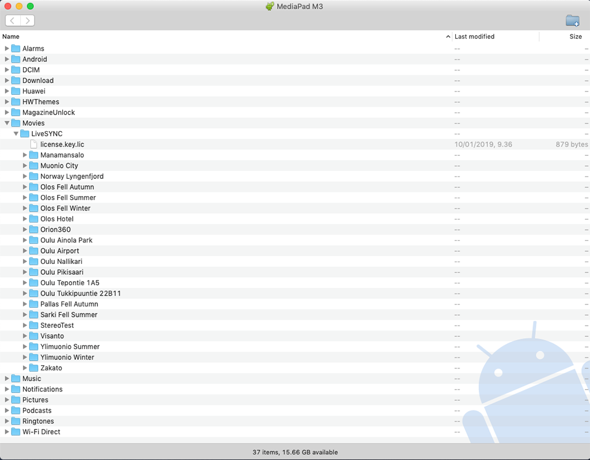

!!! note
    In case you have a device that supports a memory card (SD card), the media files can be copied there, too. The logical path will be the same: */Movies/LiveSYNC* is searched also from the SD card. In case you have same filename in both directories, the internal memory takes precedence.

### Oculus

**On Oculus, LiveSYNC uses uses directory */Movies/LiveSYNC* in the common files area as the root of its media repository**. This is exactly the same as on Android. The screen capture shows a number of 360-degree content folders: an archive of 360-degree photos. There is also a configuration file (*settings.ini*). This file is used for customizing the operation of the app.

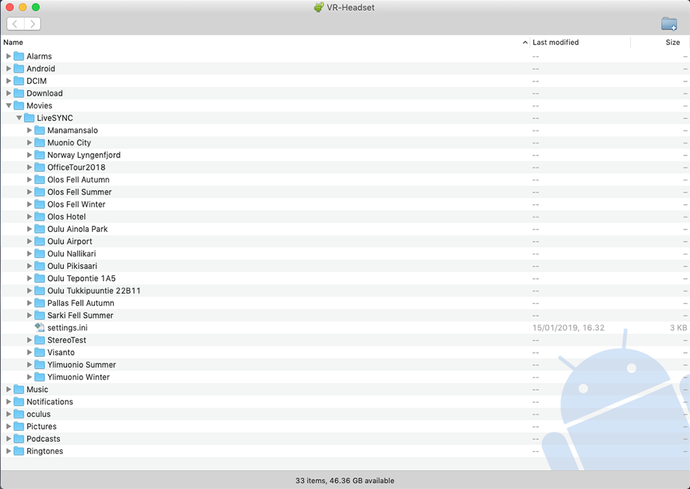

!!! note
    In case you have a GearVR compatible phone that supports a memory card (SD card), the media files can be copied there, too. The logical path will be the same: */Movies/LiveSYNC* is searched also from the SD card. In case you have same filename in both directories, the internal memory takes precedence.

## How To Copy Files?

Copying files back and forth between a computer and a mobile device is easy. However, the method depends on the platforms beings used: your computer's operating system and your mobile device's operating system. Common combinations are covered below.

### iOS

**Copying files from a computer to an iOS device requires using Apple's *iTunes* application.** iTunes is available for Mac and Windows operating systems. It is not available for Linux.
 
**Option A: Watch a video guide**

<iframe src="https://player.vimeo.com/video/222670351" width="640" height="480" frameborder="0" webkitallowfullscreen mozallowfullscreen allowfullscreen></iframe>

*Video not working? Click [here](https://vimeo.com/222670351) to open it in Vimeo.*

!!! note
    Since the video was made, Apple has slightly changed iTunes application. File Sharing is more easily accessible now. Instead of selecting *Apps* from the left side menu and scrolling down the page, simply choose *File Sharing* from that same menu.

**Option B: Follow the steps described below**

1. On your computer, open web browser and go here to download the iTunes application:
    <https://www.apple.com/itunes/download/>

    Based on your operating system, choose a download link either for macOS or Windows. 
    
    Once the download has completed, install the application on your computer just like any other app. Once the installation has completed, start the iTunes application.
    
    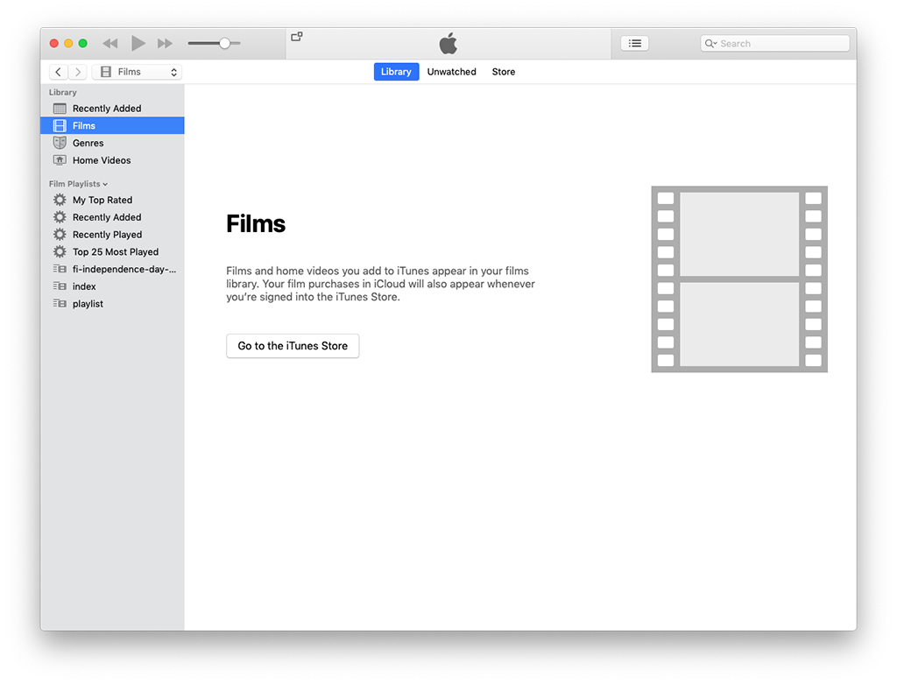

2. Your iOS device came with a bundled *USB to Lightning cable*. It is the same one you use for charging your iOS device. Connect your iOS device to your computer using this cable.

    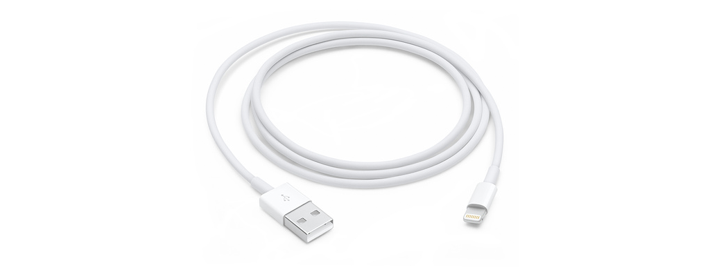

3. On your computer, take a look at the iTunes application. It begins to synchronize content between your iOS device and computer (assets for the LiveSYNC app are not automatically synchronized). Notice the small device icon that appears in the top bar. Click it.

    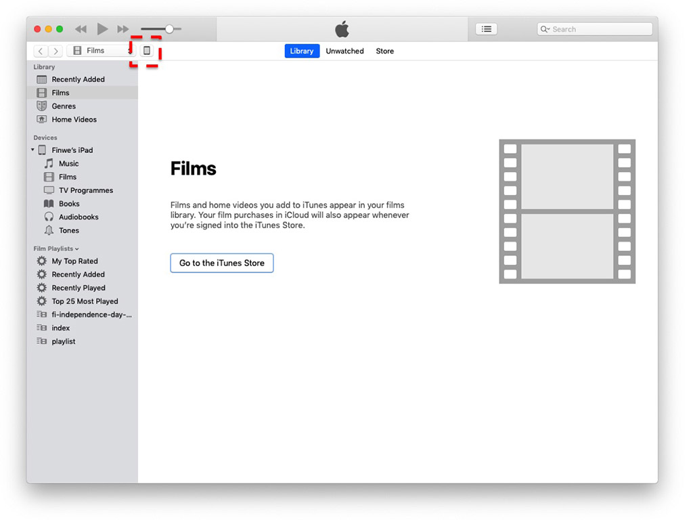

    !!! tip
        It may take a moment after connecting the cable until the device icon appears. If it doesn't appear, restart iTunes application.

4. The *Summary* page of your device appears. From the left side menu, click *File Sharing*.

    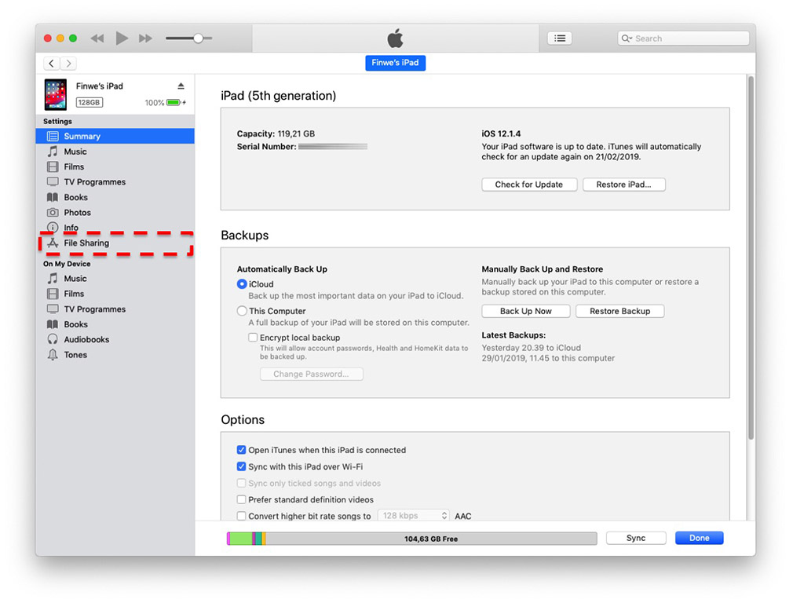

5. A list of apps that use the file sharing feature appears. Select *LiveSYNC* from the list.

    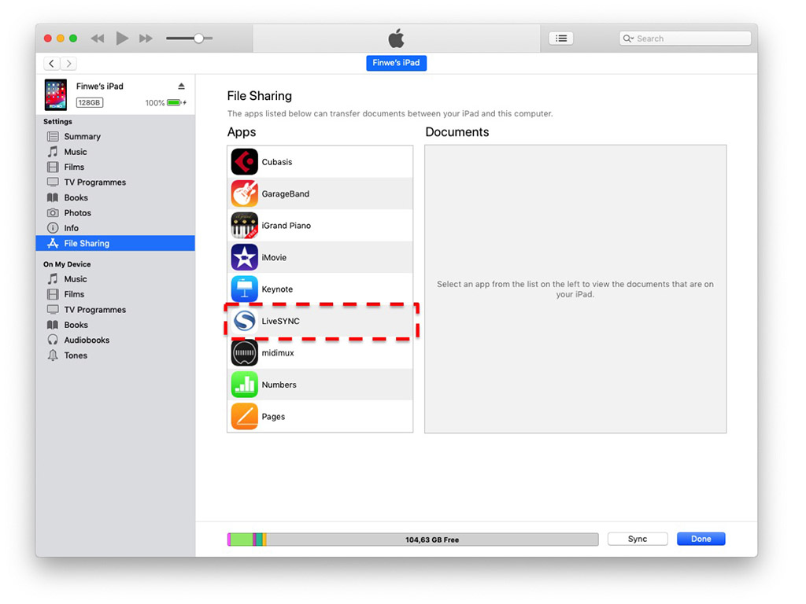

6. A list of the LiveSYNC app's files appears. From LiveSYNC's point of view, this is the root of its media repository. It is the location where you copy all your presentation's assets.

    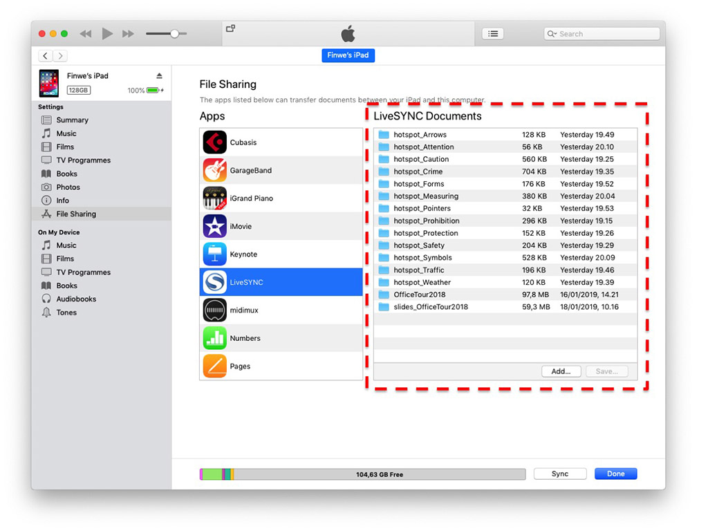

7. On your computer, find the folder that contains the assets for your presentation. Then drag it over *LiveSYNC Documents* area in the iTunes application, and drop it there. It will be copied to your iOS device. The progress will be shown in the top area of the iTunes application.

    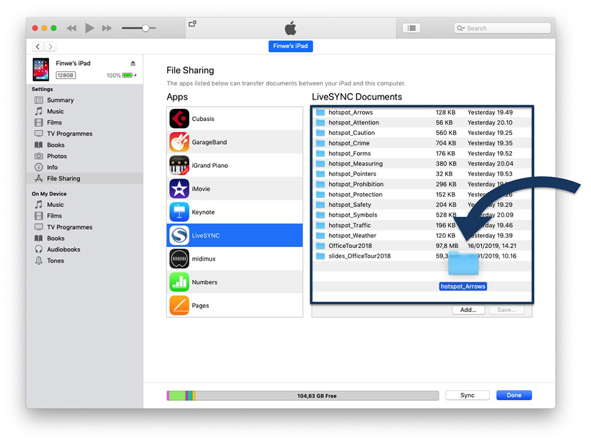

    !!! tip
        You may have noticed that there is *Add...* button at the bottom of the *LiveSYNC Documents* area. This is an alternative method for copying the files. However, we recommend using drag'n drop.

    !!! tip
        If you copy more content to your iOS device *during a presentation*, there is no need to restart the LiveSYNC app. Use pull-to-refresh gesture in the *Content* tab or in the *Tags* tab. The contents will be refreshed.

### Android

**Copying files from a computer to an Android device requires using Explorer on Windows or Android File Transfer on Mac.**
 
**Option A: Watch a video guide**

<iframe src="https://player.vimeo.com/video/222670351#t=3m13s" width="640" height="480" frameborder="0" webkitallowfullscreen mozallowfullscreen allowfullscreen></iframe>

*Video not working? Click [here](https://vimeo.com/222670351) to open it in Vimeo.*

!!! note
    The Android part starts at 3m 13sec. 
    
    On some Android devices, microUSB has been replaced with USB-C. Use the cable that came with the device.

**Option B: Follow the steps described below**

**Windows**

1. Your Android device came with a bundled *USB to microUSB* or *USB to USB-C* cable. It is the same one you use for charging your Android device. Connect your Android device to your computer using this cable.

    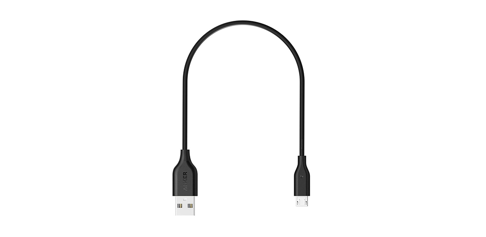

2. When you connect the cable, your Android device asks your permission for file access. Tap *Allow* to grant permission.

    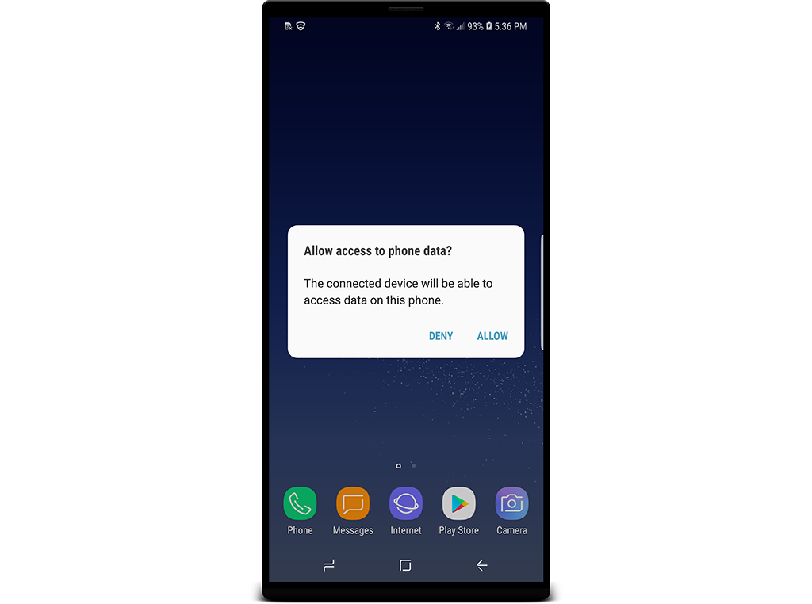

3. On your computer, Windows has detected a new device. It may ask what action to perform; you want to explore its files. When *Explorer* opens, find your Android device from the list. 

    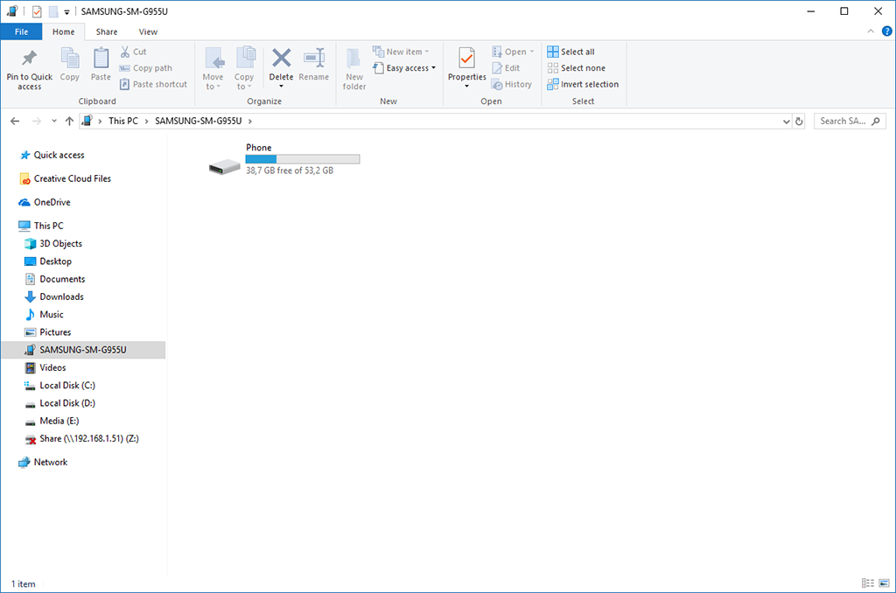

4. Expand the folder structure until you see the contents of **/Movies/LiveSYNC** directory. From LiveSYNC's point of view, this is the root of its media repository. It is the location where you copy all your presentation's assets.

    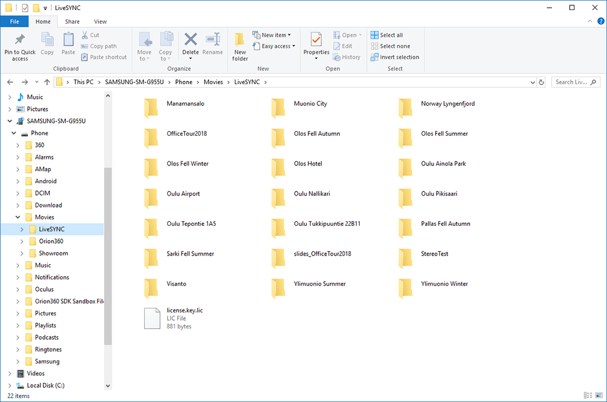

5. On your computer, find the folder that contains the assets for your presentation. Then drag it over *LiveSYNC* directory in *Explorer*, and drop it there. It will be copied to your Android device. The progress will be shown in a separate dialog.

    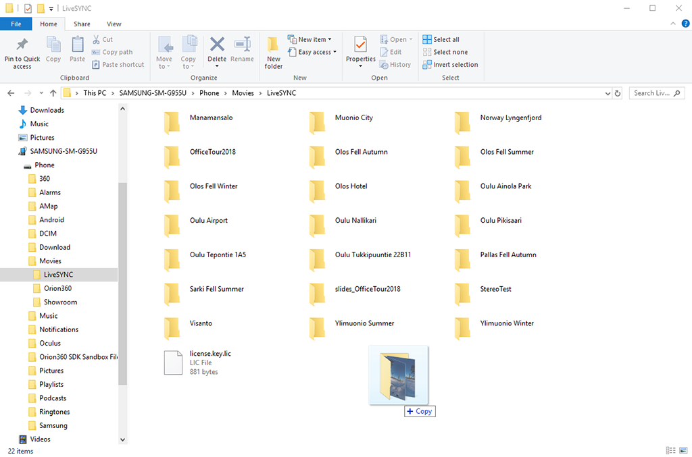

**Mac**

Unfortunately, macOS does not have a built-in support for transferring files to Android devices. The solution is to install *Android File Transfer* application. It is made by Google and available for free.

1. On your computer, open web browser and go here to download the Android File Transfer application:

    <https://www.android.com/filetransfer/>

    Once the download has completed, install the application on your computer just like any other app.

2. Your Android device came with a bundled *USB to microUSB* or *USB to USB-C* cable. It is the same one you use for charging your Android device. Connect your Android device to your computer using this cable.

    

3. When you connect the cable, your Android device asks your permission for file access. Tap *Allow* to grant permission.

    

4. On your computer, Android File Transfer application should start automatically. Expand the folder structure until you see the contents of **/Movies/LiveSYNC** directory. From LiveSYNC's point of view, this is the root of its media repository. It is the location where you copy all your presentation's assets.

    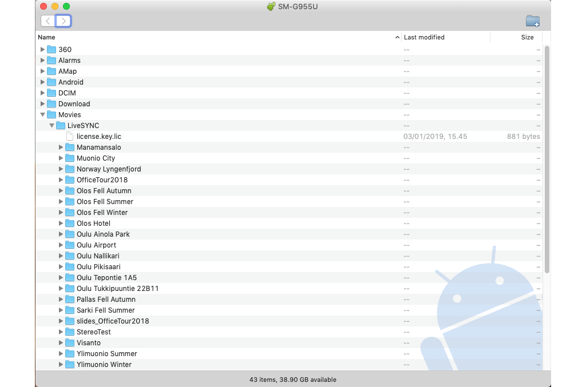

    !!! note
        Android File Transfer often shows a warning dialog similar to the one below. It means that you have not granted a permission for file access on your Android device. Do it now, then click OK. The dialog disappears and a moment later a working file manager window opens.

    

5. On your computer, find the folder that contains the assets for your presentation. Then drag it over *LiveSYNC* directory in *Android File Transfer*, and drop it there. It will be copied to your Android device. The progress will be shown in a separate dialog.

    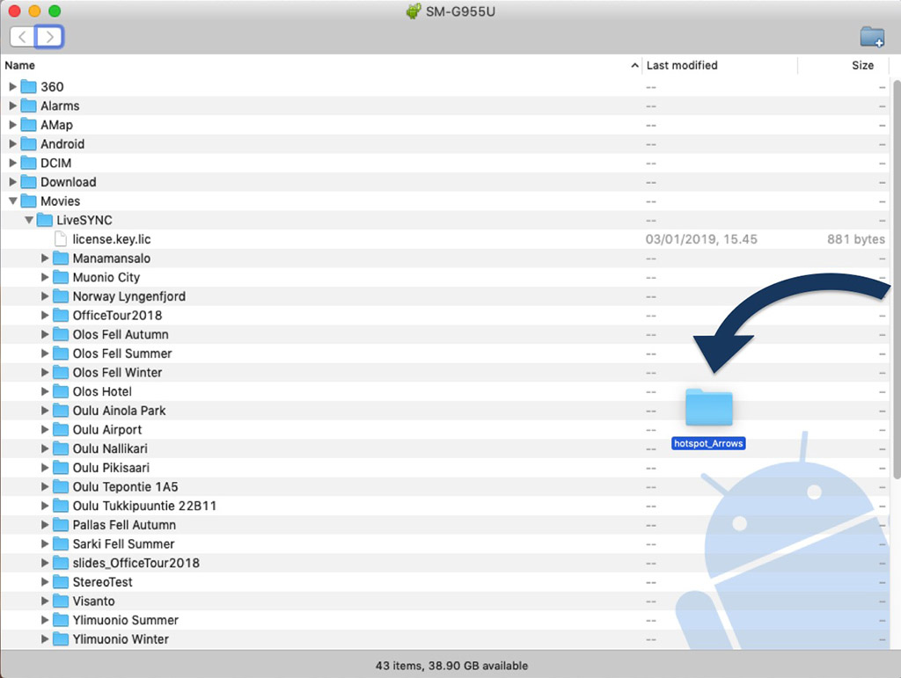

### Oculus

Supported Oculus devices (Samsung GearVR and Oculus Go) are both based on Android operating system. Hence, **copying files to Oculus devices is the same as copying to other Android devices.** Follow the [instructions](asset_management.md#android_1) that were given for Android.

!!! note
    In Step 3. you need to grant file access permission on your Android device. This also applies to Oculus Go. You must put the headset on your face and use the hand remote to select *Allow*. See the image below.

## Alternative Solutions

### USB Memory Stick

### DropBox

