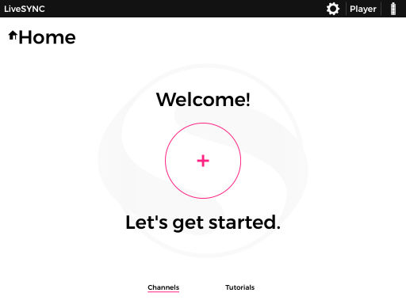
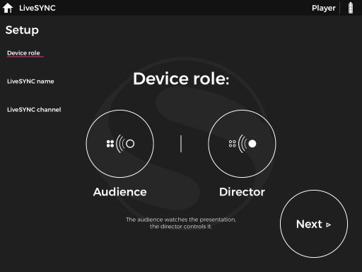
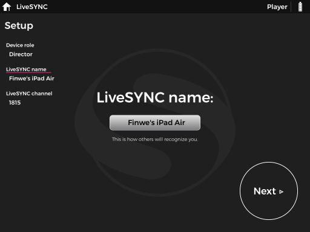
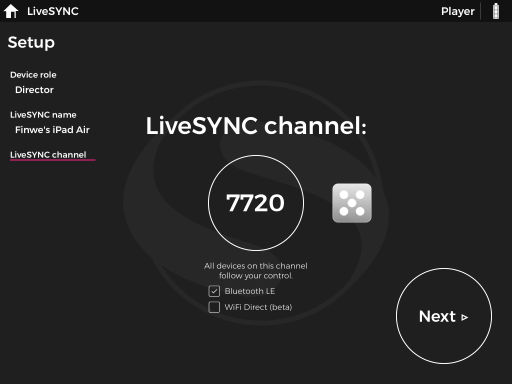
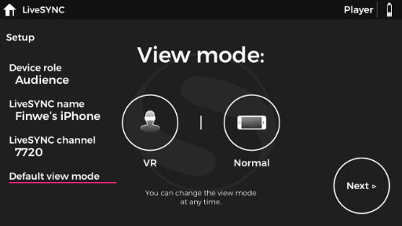

## LiveSYNC director configuration

1. Open the installed LiveSYNC app. 
2. From the home screen press + button inside the pink circle.

3. From Setup page choose "Director" and press Next. 

4. Give a device name and press Next.

5.  LiveSYNC will auto-generate 4 digit channel number, press Next.
    Note: This channel number is what going to be used by all participating audiences. 

6. Copy all the presentation content.  
    [How to copy presentation content to the director iPad?](../user_guide/asset_management.md)
    
7. Press Next and when you see Setup completed! press OK. Make sure Bluetooth is on so that audience devices can join director iPad. 
8. Tap on the channel number that was created in Step 5. If you haven't purchased a license yet you can use in trial mode. In a trial mode watermark logo of our company will be shown. 

## LiveSYNC audience configuration

1. Turn Bluetooth on and open the installed LiveSYNC app. 
2. From the home screen press + button inside the pink circle.
3. From Setup page choose "Audience" and press Next. 
4. Give a device name and press Next.
5. Enter channel number OR scan the QR code that was generated and used by the Director device and press Next.
6. Choose view mode and press Next. 

    !!! Note
        If you connect an Android or iOS phone as an audience device, you can choose if you want to watch the content directly from screen, or if you want to put the phone inside Google Cardboard or similar headset for VR viewing. This setting is used for deciding in which mode the app should start.

7. Copy presentation contents. Make sure all the presentation contents that are on director device are also copied to all audience devices. 
8. Setup is now completed, press OK. 
9. From home screen choose a channel to join. 