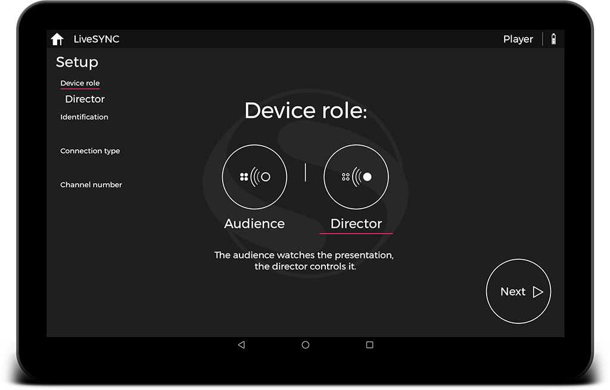

# 3. Configuration

## Overview

With LiveSYNC, you can present 360-degree and ordinary 2D content to other people.  The content can be shown using a common big screen device and/or a set of viewing devices shared to the audience. The viewing devices must be able to *communicate* with the presenter's control device. For example, the control device sends a command to change the slide. The viewing devices respond that the slide was found and is now loaded on screen.

This communication takes place via *a wireless connection*. It is opened between the control device and each viewing device. Before the connection can be opened, it must be *configured* to each device. For example, a device must know which role to adopt in the presentation. It also needs to know which connection type to use, and which channel number to join. In LiveSYNC, this is called *a channel configuration*. 

A set of devices that use the same connection type and the same channel number form *a device group*. They can exchange messages with each other. A device group is controlled by a single control device. This is the device that is configured to the director role. All other devices in the group must be configured to the audience role. Multiple device groups can operate in parallel even in the same room. Each group has its own control device.

Creating a channel configuration is a one-time operation. Whenever you start a presentation, you can re-use the same configuration. However, it is possible to create multiple channel configurations for each device. This is useful in dynamic environments ie. if multiple presentations take place simultaneously and device group sizes vary. On each device, only one connection can be open at a time.

Channel configuration is slightly different depending on the device's role (director or audience). Next, we will go through both cases.

## Director Role

### iOS & Android

In a device group, one device must be configured to the director role. This device is typically an iPad or an Android tablet. The configuration is very similar on both platforms.

Follow the steps below to configure your device to the director role:

1. Start the LiveSYNC app. The *Home* screen appears. Initially, channel configurations do not exist. To create a new channel configuration, tap the big (+) button.

    

2. The *Setup* screen appears. First, tap the *Director* button to select the director role. Your selection is marked by underlining it, as in the image below. The selected role also appears in the setup progress menu on the left. Tap *Next* to proceed.

    

    !!! note
        Current setup page is underlined in the setup progress menu on the left. You can navigate through the setup pages by tapping the page titles in the progress menu. You can also swipe the pages towards left or right, or tap the *Next* button on the bottom right corner. On Android, you can also use the device's *Back* button to return to the previous page.
        
        Your input is validated on each page. You cannot proceed to the next page before your input is accepted. If you return to the first page and change the role, your input to the other pages will be cleared.
        
        If you want to cancel channel configuration, tap the *Home* button on the top left corner. Then answer *OK* to the confirmation dialog that appears.

3. Other users can identify you by your LiveSYNC name. This can be for example your own name, a name that you have given to your device, or your device's model name. The name cannot be left empty. Its maximum length is 32 characters. Tap the text field to type a name. Tap *Next* to proceed.

    

4. Communication between the control device and viewing devices uses a wireless connection. The currently available connection types are listed. Choose a connection type that you wish to use. **The director device and the audience devices must use the same connection type**. Tap *Next* to proceed.

    

    !!! note
        A connection type may be temporarily unavailable. If so, it is marked as *Not available* in the list. Tap the info button (i) next to it to learn why it is not available. As an example, you may need to enable Wifi or Bluetooth feature from the device's settings. Use pull-to-refresh gesture to update the list after fixing the issue.

5. Devices using the same connection type and the same channel can exchange messages. Devices on different channels will not see them. A random free channel number is given. If you want to get another one, tap the dice button next to the number. The channel numbers are in the range 1000-9999. Tap *Next* to proceed.

    

    !!! note
        You may wonder why the channel number is given randomly instead of asking it from the user. This is to prevent abuse. Consider a lesson in elementary school. Ms. Williams is about to begin a presentation and asks her students to join channel number 1234. However, young Mr. Smart Guy in the back seat configures his tablet *as the director* on that same channel. Now, there are two competing control devices. Other students' devices will form a connection randomly to one of them. Not being able to input the channel number prevents mischief.

6. Android only: a dialog appears to ask your permission to access the files on your device. Without permission the app cannot create the directory where your assets will go. Also, it cannot read from this directory even if you create it manually. Tap *Allow* to give file access permission.

    

7. The channel configuration is almost complete. This setup page reminds you that the presentation's assets must be copied to the device. This task will be covered in detail in the next chapter [Managing assets](asset_management.md). You can copy the assets in place now, but you can also do that after completing the setup phase. Tap *Next* to proceed.

    

8. The channel configuration is now created and the setup phase has been completed. Tap *OK* to return to the *Home* screen.

    

    !!! note
        Channel configurations are stored to your device's permanent memory. Closing the app or powering off the device will not make them disappear. They will also survive updating the app to the latest version. Not so if you reinstall the app. For example, to change between the store version and the beta version. Then, the channel configurations will be lost and you need to re-create them. Notice that you will not get the same channel numbers, as they are given randomly.

9. Your new channel configuration now appears on the *Home* screen. If you create many channel configurations, swipe them to left or right to find the one you wish to use.

    

10. If you wish to edit an existing channel configuration, *long tap* it. This will bring its editing controls in the view. Tap the cog wheel to return to the *Setup* screen where you can edit the configuration. Tap the cross to delete the channel configuration. Tap anywhere else to hide the editing controls.

    

11. If you long-tap a channel configuration and then tap the cross button, a confirmation dialog is shown. Select *OK* to permanently delete the channel configuration.

    

    !!! warning
        This action cannot be undone. Once you confirm removing a channel configuration, it is gone. You have to re-create it from scratch to get it back. Notice that you will not get the same channel number, as they are given randomly.

### Oculus

Currently, the director mode is not supported on VR-only devices such as GearVR and Oculus Go. You cannot use these devices for controlling a presentation. However, you can configure them to the audience role to view a presentation. This is explained [later in this chapter](configuration.md#oculus_1).

## Audience Role

### iOS & Android

In a device group, all but one device must be configured to the audience role. These devices are often iOS or Android phones and tablets. The configuration is very similar on both platforms.

Follow the steps below to configure your device to the audience role:

1. Start the LiveSYNC app. The *Home* screen appears. Initially, channel configurations do not exist. To create a new channel configuration, tap the big (+) button.

    

2. The *Setup* screen appears. First, tap the *Audience* button to select the audience role.

    

3. Your selection is marked by underlining it, as in the image below. The selected role also appears in the setup progress menu on the left. If you are using a phone, a new page *View mode* appears at the end of the progress menu (it is related to VR mode). Tap *Next* to proceed.

    

    !!! note
        Current setup page is underlined in the setup progress menu on the left. You can navigate through the setup pages by tapping the page titles in the progress menu. You can also swipe the pages towards left or right, or tap the *Next* button on the bottom right corner. On Android, you can also use the device's *Back* button to return to the previous page.
        
        Your input is validated on each page. You cannot proceed to the next page before your input is accepted. If you return to the first page and change the role, your input to the other pages will be cleared.
        
        If you want to cancel channel configuration, tap the *Home* button on the top left corner. Then answer *OK* to the confirmation dialog that appears.

4. Other users can identify you by your LiveSYNC name. This can be for example your own name, a name that you have given to your device, or your device's model name. The name cannot be left empty. Its maximum length is 32 characters. Tap the text field to type a name. Tap *Next* to proceed.

    

5. Communication between the control device and viewing devices uses a wireless connection. The currently available connection types are listed. Choose a connection type that you wish to use. **The director device and the audience devices must use the same connection type**. Tap *Next* to proceed.

    

    !!! note
        A connection type may be temporarily unavailable. If so, it is marked as *Not available* in the list. Tap the info button (i) next to it to learn why it is not available. As an example, you may need to enable Wifi or Bluetooth feature from the device's settings. Use pull-to-refresh gesture to update the list after fixing the issue.

6. Devices using the same connection type and the same channel can exchange messages. Devices on a different channel will not see them. Tap the text field to type a channel number. Use the same channel number that you configured to your control device. The channel numbers are in the range 1000-9999. Tap *Next* to proceed.

    

7. If you are configuring a phone, select the view mode. If you plan to use Google Cardboard or similar passive VR headset, select *VR*. Else, select *Normal*. Tap *Next* to proceed.

    

    !!! tip
        You can change the view mode also during a presentation by long tapping the screen.

    !!! note
        This page does not appear on tablets. Tablets are physically too big to fit inside a VR headset.

8. Android only: a dialog appears to ask your permission to access the files on your device. Without permission, the app cannot create the directory where your assets will go. Also, it cannot read from this directory even if you create it manually. Tap *Allow* to give file access permission.

    

9. The channel configuration is almost complete. This setup page reminds you that the presentation's assets must be copied to the device. This task will be covered in detail in the next chapter [Managing assets](asset_management.md). You can copy the assets in place now, but you can also do that after completing the setup phase. Tap *Next* to proceed.

    

10. The channel configuration is now created and the setup phase has been completed. Tap *OK* to return to the *Home* screen.

    

    !!! note
        Channel configurations are stored to your device's permanent memory. Closing the app or powering off the device will not make them disappear. They will also survive updating the app to the latest version. Not so if you reinstall the app. For example, to change between the store version and the beta version. Then, the channel configurations will be lost and you need to re-create them. 

11. Your new channel configuration now appears on the *Home* screen. If you create many channel configurations, swipe them to left or right to find the one you wish to use.

    

12. If you wish to edit an existing channel configuration, *long tap* it. This will bring its editing controls in the view. Tap the cog wheel to return to the *Setup* screen where you can edit the configuration. Tap the cross to delete the channel configuration. Tap anywhere else to hide the editing controls.

    

13. If you long-tap a channel configuration and then tap the cross button, a confirmation dialog is shown. Select *OK* to permanently delete the channel configuration.

    

    !!! warning
        This action cannot be undone. Once you confirm removing a channel configuration, it is gone. You have to re-create it from scratch to get it back.

### Oculus

TODO

## Configuration Tips

### Device Role

You should always **start configuring from the device that will act in the director role**. This is because you need to know the channel number to be able to configure the audience devices. You will get that number during the director role configuration.

### Identification

During a presentation, you may notice that one of the users needs help. Or, a particular device has problems. For example, you forgot to copy the assets to one of the devices. You will see the devices' LiveSYNC names on your control device's screen. To find which device to go to, you need a way to match the LiveSYNC name to a particular device. Hence, you should always use descriptive names.

If your audience is using their own personal devices, it is a good idea to **ask them to use their own first name** as the LiveSYNC name. Then, you can recognize each user right away from the control device's screen. *Isabella, you seem to be lost, do you need help?*

If you provide the viewing devices for the audience, it is a good idea to **mark the LiveSYNC name to the device**. For example, use a label printer. Another good alternative is to use color coding. Attach labels of different colors to the devices and use colors as LiveSYNC names. When *Green* headset has problems, you immediately know where to go. If you have lots of devices, use numbers. *Everybody, listen up! Who has headset number 56? Please raise your hand and someone will come to assist you.*

### Connection Type

The control device and viewing devices need to be able to communicate. There are multiple connection types that can be used. Which one should I use, you may wonder. This table will help you choose.

Connection | Type | Network | Scalability | Channel Reservation
-----------|------|---------|-------------|--------------------
Bluetooth | Standalone[^1] | Bluetooth LE 4.0[^2] | 1-8 clients[^3] | Permanent[^4]
GlobalSYNC | Cloud service[^5] | Wifi or mobile data | 1000+ clients | Short-time lease[^6]

!!! example
    Sophie is a tourist guide in Rome. Every night she will take a small group of tourists to a tour. Sophie will share VR headsets before they start. Every once in a while, they will stop in front of a building or a market square. Sophie will show them photos and videos via the VR headsets. The tourists love the way how this will bring the history of the city alive in front of their eyes. Sophie uses a Bluetooth connection. She doesn't need to pay for mobile data access. They can stop anywhere because Wifi access is not needed either.
    
!!! example
    Tina works in the manufacturing industry. Clients often come to visit the factory. They are taken to a tour in groups of five. For safety reasons, some parts of the factory are closed from visitors. Tina shows 360-degree video clips from the closed areas. She uses a Bluetooth connection. Wifi signal reception in the factory is poor.

!!! example
    Joan's marketing team is participating in a trade show. Their company is launching a new product. Joan's team is using a 360-degree video to showcase it at their booth. They are controlling six Oculus Go headsets with LiveSYNC. Joan uses a Bluetooth connection. In most trade shows the Wifi network is congested.

!!! example
    Mark is a teacher in elementary school. They have a rack of 20 Android tablets, which any of the teachers can reserve for their class. Mark uses GlobalSYNC connection. The school has Wifi access and he needs to control more devices than Bluetooth can handle.

!!! example
    Anthony has purchased a set of 360 Video Starter kits for his construction company. They are building in several cities. Anthony wants to keep himself up-to-date without spending his days traveling. Twice per week his site managers take a set of 360-degree photos and annotate the progress and next tasks. Sometimes, Anthony needs to intervene. They will have a short teleconference. During the meeting, Anthony wants to show other site managers how one of them cleverly handled a difficult case. Anthony uses GlobalSYNC over mobile data. He and the site managers are all in different cities and the construction sites do not have Wifi access.

### Channel Number

When configuring a device to the director role you must choose a channel number. This cannot be selected freely. Instead, you are given a randomly selected number. However, you can press a button to ask a different one. When should you do that?

If you select a standalone connection type, such as Bluetooth, channel numbers are reserved from a local pool. There is a small chance that a channel number, which is already being used in another control device nearby, is offered. In such a case, get another channel number.

If you use multiple channel configurations on a single device, it is easier to remember and distinguish them if the numbers are not too similar.

### View Mode

On phones that are being configured to the audience role, you can select a view mode. This is used for making either the VR mode or the normal mode as the default for a particular channel.

If you plan to use a passive VR headset with your audience phones, select the VR mode. It is easier for the users if the app starts in the correct mode. If not, always select the normal mode. The VR mode can look very confusing without a VR headset!

[^1]: Standalone means that the connection type does not require *any infrastructure*. You could use this connection type even on a deserted island.
[^2]: Bluetooth 4.0 is the minimum requirement. You can, of course, use devices that have newer versions.
[^3]: The maximum number depends on the license type and the features of the control device's Bluetooth chipset and operating system. We encourage you to test your hardware in advance.
[^4]: Channels are reserved from a local pool and you can use them as long as you want.
[^5]: Cloud service requires an active Internet connection to work throughout the presentation.
[^6]: Channels are reserved from one common pool. After 7 days of inactivity, a reserved channel will be returned to the pool. The next time you will need to reserve a new channel. Hence, your channel number will change.
