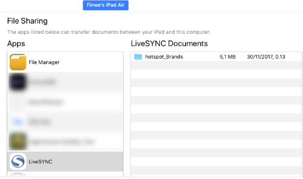
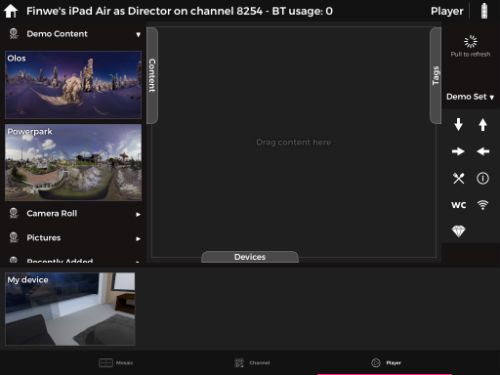
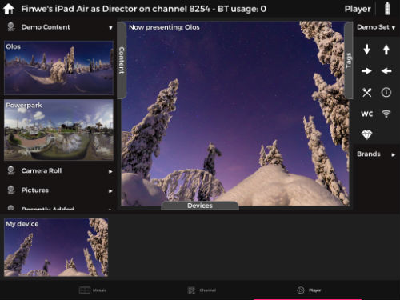
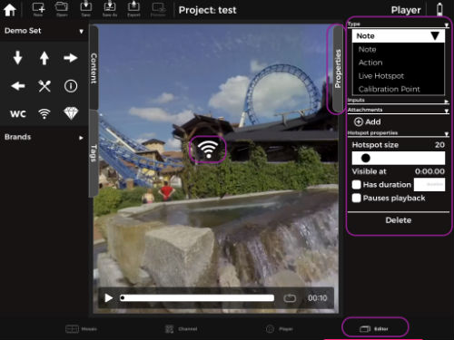
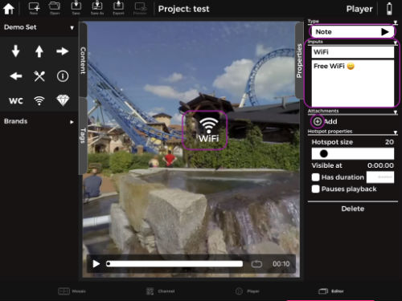
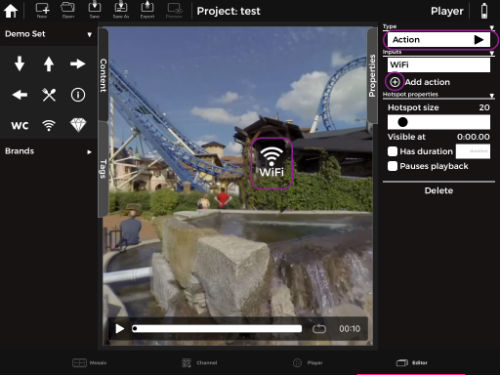
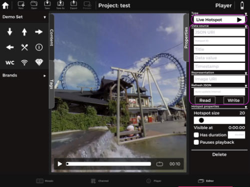
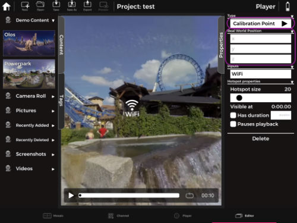
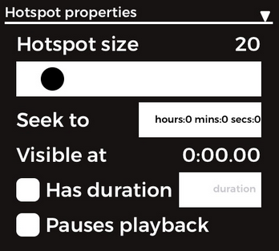

### Adding Tags

[Adding Tags](../user_guide/presenting.md#adding-tags)

### Marking with tags

[ Marking with tags](../tutorials/oculus_go_presenting.md#marking-with-tags)

### Is it possible to add own tags?

In LiveSYNC it is possible to add own tags. Make sure the icons are in **.png** format and all your icons are in a folder. Add *"hotspot_"* before folder name e.g. hotspot_Brands then copy the folder to LiveSYNC directory.  

 Pull *Tags* section from the director device to refresh its content. 
 
 
  
  
  After refreshing the tags section you will see your tags added to the list by the name you provided after "hotspot_", in this case, icons will be seen in Brands folder with a drop-down arrow icon. 
 
  
 
 

 The enterprise version of LiveSYNC has a fourth tab called [**Editor**](..//user_guide/editor.md).  The Editor tab is designed for clients and industries who require an interactive annotation using hotspots and tags. This enterprise version comes with a feature to save projects, edit or reuse saved projects, add tags with title and remarks, and later export presentations as pdf format. 
 
On the *Editor* tab once you add a hotspot you're able to see properties window on right side. From properties window, you can choose the type of hotspot by tapping on the drop-down arrow under *Type*. Hotspot type can be **Note (default)**, **Action**, **Live Hotspot** or **Calibration Point**. It is also possible to adjust and customize hotspot size and visibility for the same window. 

## Hotspot types

### Note

Note is default hotspot action type. With Note type, you have an option to add a title and long description text to your hotspot icons and add multiple attachments by pressing the + Add button. 

!!! note
    Make sure you tap **Save** every time you make a change. After saving the project choose preview .  

### Action

With *Action* it is possible to open/redirect to other contents by tapping on the hotspot. Select hotspot -> choose Action from Type -> Add action -> choose the content you want to show when that hotspot is tapped from auto popup project window and you're all set.  

**Save** the changes, tap preview  to test the action you defined.  

### Live Hotspot

*Live Hotspot* is a feature to fetch hotspot icons from web server without copying them to the device. Note that hotspots need to be provided in JSON format.  

### Calibration Point

*Calibration point* is used for camera normalization. Normalization converts a camera path's coordinates to another coordinate space with given reference points. Click [here](..//user_guide/workflows.md#camera-path-normalization) to read more about camera path normalization. 

## Hotspot properties

**Hotspot size:** Using the slider it is possible to adjust hotspot icon size. The default value for an icon size is 20. 

**Seek to:** (for video file) it seeks to time stamp provided by the user when the user taps hotspot icon. 

**Has duration:** (for video file) check the box and give a numeric value if you want to display the hotspot for a predefined time duration. 

**Pauses playback:** (for video file) check the box if you want the video to pause when the hotspot is tapped and a predefined action is executed (for example opening a new content).  

## Tags resolution
 
 Make sure you use .png format for hotspots. PNG is a bitmapped image format, which just means it’s a raster image format. There are two PNG formats: PNG-8 and PNG-24. The numbers are shorthand for saying “8-bit PNG” or “24-bit PNG.” 
 
 PNG-24 can handle a lot more color and is good for complex images with lots of color such as photographs (just like JPEG), while PNG-8 is more optimized for things with simple colors, such as logos and user interface elements like icons and buttons.
 
 The recommended hotspot resolution for LiveSYNC is **512pixel X 512pixel**. Sample hotspot icons can be downloaded from [here](). 
                                                                                                                          
 [comment]: <> (add link to downloadable hotspots)

