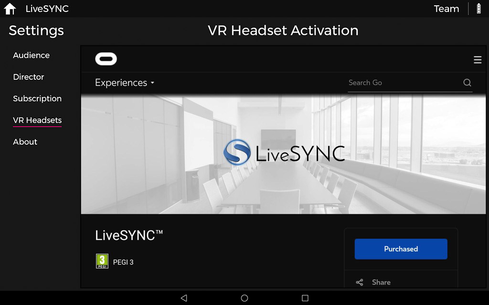
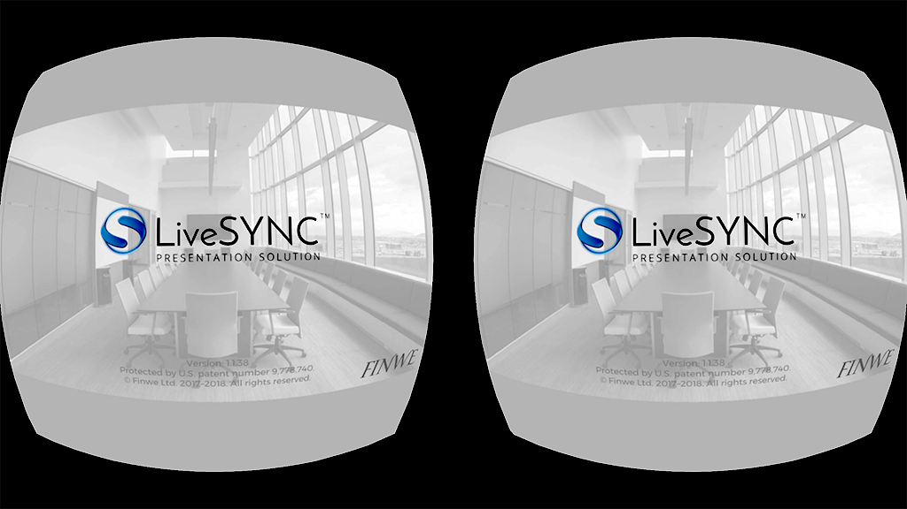

# 2. Installing

## Versions

The LiveSYNC app is available as different *versions*. Read this section first to understand which version is best for you and what hardware you need for using it.

### Platforms

The LiveSYNC app can be installed and run on multiple *platforms*. Currently, the supported platforms include **iOS**, **Android**, and **Oculus**. Each platform has its own version of the app. They are compatible with each other, but not exactly the same.

The app works on multiple *device types*. Currently, the supported device types include **phones**, **tablets**, and **VR headsets**. All these are great for viewing content. A tablet is recommended for creating, editing, and presenting content.

Some device types allow viewing content in **VR mode** via a passive or an active VR headset. The availability of VR mode varies. Tablets are not physically compatible with VR headsets. Hence, the VR mode is not available on tablets. On phones, the VR mode is *selectable*. You can view content via the touchscreen but you can also put the phone inside a passive VR headset. For example, Google Cardboard or compatible. On devices that were made for VR, such as GearVR and Oculus Go, the VR mode is always active.

The supported device types and the availability of the VR mode are summarized below.

Platform | Device Type | VR Mode
---------|-------------|--------
iOS | iPhone and iPad | Selectable on iPhone, N/A on iPad
Android | Phones and tablets | Selectable on phones, N/A on tablets
Oculus | VR headset | Always on

!!! example
    Tina works in the manufacturing industry. Clients often come to visit the factory. They are taken to a tour in groups of five. For safety reasons, some parts of the factory are closed from visitors. Tina wants to show 360-degree video clips from the closed areas. Hence, she chooses to buy an iPad and 5 Oculus Go headsets. At the beginning of the tour, she shares the headsets to the visitors and keeps the iPad herself. During the tour around the factory, they often stop in front of a closed area to watch a video clip via the headsets.

!!! example
    Mark is a teacher in elementary school. They have a rack of 20 Android tablets, which any of the teachers can reserve for their class. Mark wants to use 360-degree video clips around the World in his geography lessons. He shares 19 tablets to his students and uses one of them for controlling his presentation.

!!! example
    Kate is participating in a voluntary project. They are documenting an old building that used to be a boarding school. Now it is about to get demolished. To preserve precious memories, they have shot a 360-degree image of each of the rooms of the building. The plan is to present them in a class reunion. The team has only a small budget, hence they have ordered 30 pieces of Google Cardboards. During the reunion, they will circulate among the former students and copy the photos to everyone's mobiles. Kate uses her own phone for controlling the presentation.

### Store vs. Beta

The LiveSYNC app is installed to a device via the platform's own app store. On iOS it is **Apple iTunes AppStore**, on Android, it is **Google Play Store**, and on Oculus it is **Oculus Store**. The app version that is publicly available for everyone is called *the store version*. This is the recommended version for most users.

LiveSYNC is continuously being developed further. New features are added and existing ones improved. Feedback from users is essential. Thus, new features are made first available via beta channels. Users who wish to try out new things and provide feedback can choose to install *the beta version* instead.

Installing the beta version is only slightly different than installing the store version. Instructions are given separately for both later in this chapter.

!!! note
    The store version and the beta version cannot exist simultaneously on a single device. For each device, you can install either but not both at the same time. Of course, it is possible to reinstall the app to get a different version.

!!! note
    On some platforms, the maximum number of beta testers is limited by the platform. Hence, we may not be able to accept all requests to become a beta tester. The beta tester status may be given for a specific need such as testing a particular new feature. We may later need to remove the user from the beta channel (switch to the public store version).

!!! example
    Jerome has a business where he sells 360-degree kits to retirement homes. They are used for relaxation and entertainment. Most popular are videos where old-style working methods are documented. Each of Jerome's kits consists of an Android tablet and an Oculus Go headset. The nurse helps in placing the headset comfortably to the senior's face. Then she selects from the tablet a video he wishes to see. Jerome uses the store version on kits that have been delivered. He uses the beta version on his own devices, just to stay on top of what's coming.


!!! example
    Anthony has purchased a set of 360 Video [Starter kits](starter_kit.md) for his construction company. They are building in several cities. Anthony wants to keep himself up-to-date without spending his days traveling. Twice per week his site managers take a set of 360-degree photos and annotate the progress and next tasks. They email a PDF report to Anthony straight from LiveSYNC. They use the beta version because it has some new annotation features they wish to test.


### Roles

When you are presenting content with LiveSYNC, each device adopts a role. A device acts either as *the viewing device* of an audience member or as *the control device* of the presenter. You can read more about this [here](introduction.md#key-concepts).

The device's role (*audience* or *director*) can be selected in the setup phase. When you create a channel configuration, one of the choices you make is the role that the device assumes. Since the role is configurable, the same app version can be used for both roles.

However, the director role is not available in all versions of the app. For example, app versions made for VR headsets support only the audience role. In addition, the store version and the beta version may differ at times.

The table below summarizes the current situation ie. which roles are available in which version.

Platform | Store version | Beta version
---------|---------------|-------------
iOS | Audience & Director | Audience & Director
Android | Audience | Audience & Director
Oculus | Audience | Audience

!!! note
    In a presentation, you can freely mix all kinds of devices. For example, an iOS tablet can control a mix of iOS phones & tablets, Android phones & tablets, GearVR headsets, and Oculus Go headsets. Some of the phones can be in VR mode and some not.

!!! example
    Joan's marketing team is participating in a trade show. Their company is launching a new product. Joan's team is using a 360-degree video to showcase it at their booth. They are controlling six Oculus Go headsets with LiveSYNC. To reduce waiting time, they run two groups of three headsets in parallel. The groups are controlled with two iPads. Hence, the iPads act in the director role and the headsets act in the audience role. Joan configures two channels. The two groups will work in parallel without disturbing each other.

### Version Number

New features and fixes are implemented and tested frequently. Then, a new software build is pushed to the release channels and release notes are published.

Each build has a version number. To learn what has changed, take note of the version number from your app installation. Then compare it to the release notes document.

To check which version (build) you have, start the LiveSYNC app and notice the version number from the splash screen.


On iOS and Android, you can find the version number and other build details also in another way. Start the LiveSYNC app, navigate to *Settings*, then *About*, and scroll down the page near the end until you find *Version* section.


When you send a support request from the LiveSYNC app, version information is pre-filled. The support email link appears just below version details.

## System Requirements

Your hardware must meet the minimum technical specifications outlined below to run and use the LiveSYNC app. If you plan to purchase new hardware, consider our recommendations.

### iOS

Feature | Minimum requirement | Recommendation
---------|--------------------|---------------
Form factor | iPhone or iPad[^1] | iPad for the director mode, either for the audience mode
Model | iPhone 6[^2] or iPad Air[^3] | iPad 5th/6th gen. or any iPad Pro
Operating system | iOS 8.0 or later | iOS 11.0 or later
Accessories | - | AV adapter[^4]

!!! tip
    All iPad Pro models are much more expensive than the standard iPad. When using the LiveSYNC app, they are usually not worth the extra cost. Unless you prefer to have a larger screen.

    You cannot extend the storage size. LiveSYNC does not support memory sticks on iOS. Not even those that are sold as iOS compatible (they only work with the manufacturer's own app). Hence, we recommend that you invest in a model with large storage capacity.

    In most cases, the Wifi-only model is enough. Mobile LTE network can be useful if you plan to control other devices via GlobalSYNC and do not rely on Wifi availability.

[^1]: iPhone and iPad are supported. iPod Touch and Apple TV are iOS devices but not supported. Apple Watch and Apple MacBook use different operating systems and are not supported.
[^2]: iPhone 6/6+/6s/6s+/7/7+/8/8+/X/XR/XS/XS Max are supported. iPhone 2007/3G/3GS/4/4s/5/5c/5s/SE are not supported. See [iPhone models](https://support.apple.com/en-us/HT201296) for reference.
[^3]: iPad Air/Air 2/5th gen./6th gen./Pro (all) are supported. iPad 2010/2/3rd gen./4th gen./mini/mini 2/mini 3/mini 4 are not supported. See [iPhone models](https://support.apple.com/en-us/HT201471) for reference.
[^4]: You can use the AV adapter for sharing your iPad's screen to a big screen via an HDMI cable. See [product info](https://www.apple.com/shop/product/MD826AM/A/lightning-digital-av-adapter) for reference.

### Android

Feature | Minimum requirement | Recommendation
---------|--------------------|---------------
Form factor | Phone or Tablet [^5] | Tablet for the director mode, either for the audience mode
Model | n/a[^6] | Samsung Galaxy Tab S2/S3/S4 are known to work well
Operating system | Android 5.0 (API 21) or later | Android 6.0 (API 23) or later
Accessories | - | Micro SD card, Micro USB memory stick [^7]

[^5]: Android phones and tablets are supported. Android TV, Android Auto, and Android Wear devices are not supported. Chromebook uses a different operating system and is not supported.
[^6]: There are thousands of supported models. It is not possible to list them all here.
[^7]: If your device has a micro SD card slot, you can expand storage size (LiveSYNC supports SD card for media files). A micro USB to a USB memory stick (with OTG feature) is handy for copying media files from PC/Mac to tablet.

!!! tip
    There is a huge selection of devices to choose from. Many low-end Android devices have poor display resolution, no support for 4K video playback, and no gyro sensor. Check at least these features before purchasing a new Android tablet. We recommend ~10-inch screen size for the director mode.

    You can extend the storage size if your device has an SD card slot. LiveSYNC supports SD card for media files.

    In most cases, the Wifi-only model is enough. Mobile LTE network can be useful if you plan to control other devices via GlobalSYNC and do not rely on Wifi availability.

!!! warning
    LiveSYNC's director mode is more advanced on iOS than Android. If you plan to purchase a new director's device, we currently recommend iOS over Android. If you prefer to use Android, please check that the Android version of the app contains features that are relevant to you. It will take time before the Android version catches the iOS version in features.

### Oculus

Feature | Minimum requirement | Recommendation
---------|--------------------|---------------
Form factor | GearVR or Oculus Go[^8] | Oculus Go[^9]
Model | Galaxy S7/S7 Edge[^10] | Galaxy S8 & GearVR SM-324 (or newer), or Oculus Go
Operating system | Android 7.0 (API 24) or later | Android 7.0 (API 24) or later
Accessories | - | Micro SD card, Micro USB memory stick [^11]

[^8]: Oculus Quest will likely be supported later. Oculus Rift and HTC Vive are not supported.
[^9]: GearVR is also OK, but we prefer Oculus Go as it is a standalone low-cost device.
[^10]: GearVR compatible phones older than Galaxy S7 tend to overheat quickly.
[^11]: If your device has a micro SD card slot, you can expand storage size (LiveSYNC supports SD card for media files). A micro USB to a USB memory stick (with OTG feature) is handy for copying media files from PC/Mac to tablet.

!!! note
    You can try installing the LiveSYNC app also on models that are not officially supported. If the app is not visible in the store for a particular device, then that device is not supported (not even unofficially). If you use an unsupported device, performance may suffer and some features may not be available.

## Installing the Store Version

The store version is the official release version of the LiveSYNC app. It is available via each platform's own app store. This is the recommended version for most users.

### iOS

!!! tip
    If you are familiar with installing apps on iOS, you can use this direct link:
    
    <https://itunes.apple.com/us/app/livesync-presentation-solution/id1202200449?mt=8>

**Option A: Watch a video installation guide**

<iframe src="https://player.vimeo.com/video/221436477" width="640" height="480" frameborder="0" webkitallowfullscreen mozallowfullscreen allowfullscreen></iframe>

*Video not working? Click [here](https://vimeo.com/221436477) to open it in Vimeo.*

**Option B: Follow the steps described below**

1. Go to your iOS device and turn it on. When it starts, unlock it and enter the home screen. Look for *App Store* icon and tap it.

    

2. From the bottom bar, select *Search* tab.

    

3. Type *livesync* to the search box.

    

4. Tap *Search* button.

    

5. Select *LiveSYNC Presentation Solution* from the search results.

    

6. Select *Install* button (cloud symbol with an arrow). Wait a moment.

    
 
7. Once downloading and installation has completed, select *Open*.

    

8. The app starts. It is now listed in your device's application menu. The next time you can start it from there.

    

### Android

!!! tip
    If you are familiar with installing apps on Android, you can use this direct link:
    
    <https://play.google.com/store/apps/details?id=fi.finwe.livesync.player.android&hl=en>

**Option A: Watch a video installation guide**

<iframe src="https://player.vimeo.com/video/221453486" width="640" height="480" frameborder="0" webkitallowfullscreen mozallowfullscreen allowfullscreen></iframe>

*Video not working? Click [here](https://vimeo.com/221453486) to open it in Vimeo.*

**Option B: Follow the steps described below**

1. Go to your Android device and turn it on. When it starts, unlock it and enter the home screen. Look for *Play Store* icon and tap it.

    

2. Type *livesync* to the search box and tap *Enter*. (On some software keyboards it appears as the search button. You can recognize it from a magnifier icon.)

    

3. Select *LiveSYNC Presentation Solution* from the search results.

    

4. Select *Install*. Wait a moment.

    
 
5. Once downloading and installation has completed, select *Open*.

    

6. The app starts. It is now listed in your device's application menu. The next time you can start it from there.

    

### Oculus

!!! note
    Oculus has decided to use the *Oculus Keys* distribution mechanism for this app, similar to many other utility apps. It means that the app is not visible for your Oculus account in the Oculus Store until you unlock it with a 25-character key. After unlocking the app appears in the Store and can be installed as many times as you want. The key is personal, works only for the LiveSYNC app, and can be used only once. You can get it from Finwe for FREE.

!!! tip
    If you are familiar with installing apps on Oculus, you can use these direct links:
    
    Get a FREE Oculus Key for unlocking the LiveSYNC app:
    
    <https://keys.livesync.app>

    Unlock the LiveSYNC app by redeeming your Oculus Key:
    
    <https://secure.oculus.com/redeem-code/>
    
    Then, install the LiveSYNC app from the Oculus Store as usual:
     
    <https://www.oculus.com/experiences/go/1853395568040734>

!!! tip
    Read our [full step-by-step tutorial](../tutorials/oculus_go_device.md) about Oculus Go headset and learn how to use it with LiveSYNC.

Follow the instructions below to install *the store version* of the LiveSYNC app on your Oculus Go headset or GearVR compatible phone. The instructions are written for Oculus Go. When something differs for GearVR, it is mentioned.

**Option A: Watch a video installation guide**

TODO

**Option B: Use the wizard in the Android version**

If you have already installed LiveSYNC for your Android phone/tablet, we recommend using the wizard inside this app.

1. Start the LiveSYNC app on your Android device. You will enter the *Home* screen. Notice the top bar. On the right side, you will find text that indicates the current license status. Tap the cogwheel next to it.
 
    

2. The *Settings* screen opens. Select *VR Headsets* page from the left side menu. The wizard will load the introduction page. Click the *Redeem Code* page link to begin.

    

3. If you haven't used the wizard before on this device, you have probably not logged in yet. Click the *Go to Login* button to load the Oculus login page.

    

4. If you have a Facebook account, you can use that for logging in. Else, click *Sign in*.

    

5. Log in using your Oculus account credentials. If you have multiple Oculus accounts, log in with the one that you use on the target headsets.

    

6. After logging in the *Redeem Code* page loads. Click the *Get Code* button above the page to retrieve a personal Oculus key from Finwe's cloud service. This will take a few seconds.

    

7. Next, you need to enter the key code to Oculus' input field. The easiest solution is to click the *Auto Fill* button, which will enter the code. You can also click *Copy* button and then paste the code to the text box, or click *Type* button and input the code by typing with software keyboard. Click *Redeem* button to use the code.

    

8. After the key has been redeemed, click the *Store Page* button to load the app's store page.

    

9. Turn on your Oculus devices. Then click the *Free* button to install the LiveSYNC app automatically on all Oculus devices that are using this same Oculus account.

    

10. Once completed, the button will read *Purchased*. Notice that despite of the text, the LiveSYNC app for Oculus is FREE. It will take a moment until all your Oculus devices have downloaded and installed the app.

    

11. Go to your Oculus device and start *LiveSYNC* by selecting it from the apps grid. (On GearVR, you can start the app from the Oculus app on your phone, or you can first enter VR and then start it from the Oculus Home.)

    

**Option C: Follow the steps described below**

Notice that the installation can be triggered either via the accompanying Oculus app on your phone (outside VR) or via Oculus Home (inside VR). We will cover both methods.

1. Installing apps via *Oculus Keys* distribution requires *a 25-character key*. You can get your personal key for unlocking the LiveSYNC app for FREE from here:

    <https://keys.livesync.app>

    
    
    !!! note
    
        You will need only one key for unlocking the app for one Oculus account. Notice that you can use the same Oculus account on multiple headsets. For example, if you have 8 Oculus Go headsets, you can use a single account on all of them. Thus, typically you need to get and redeem only one key. The website allows retrieving multiple keys, but there is a time lock to prevent abuse.

2. Next, redeem your Oculus key for the LiveSYNC app. There are multiple options, but perhaps the easiest is to use Oculus' website. Open the following link in a web browser, log in with your Oculus account, and copy-paste your key to redeem it:

    <https://secure.oculus.com/redeem-code/>

    

    !!! note
    
        Other options for redeeming an Oculus key are explained here:
    
        <https://support.oculus.com/2173343572940225/>

3. After redeeming the key you have multiple options on how to install the application:

    1. Using the Oculus app on your phone: tap the magnifier glass icon to open search, type *livesync* and select *LiveSYNC*, then click *Install on ...* button.
    
    2. You can also select *Library* tab from the bottom bar and see if *LiveSYNC* already appears in the apps list (GearVR: check *Not Installed* tab). Select it from the list and then click *Install on ...* button.
    
    3. Using the Oculus Go / GearVR headset, select *Search* from the bottom bar, type *livesync*, select *LiveSYNC*, then click *Get*.
    
    4. You can also select *Library* tab from the bottom bar and then *Not Installed* page from the left side menu to see if *LiveSYNC* already appears in the apps list. Select it from the list and then click *Get*.
    

4. When the installation has completed you will find *LiveSYNC* listed in the apps grid: Select *Library* tab from the bottom bar, and then *Apps* page from the left side menu (GearVR phone: *My Apps* tab from the top menu).

5. Start *LiveSYNC* by selecting it from the apps grid. (On GearVR, you can start the app from the Oculus app on your phone, or you can first enter VR and then start it from the Oculus Home.)

    

## Installing the Beta Version

The beta version is the official test version of the LiveSYNC app. It is available via each platform's own beta distribution method. Beta version is recommended for users who are eager to try out new features and provide feedback for developers.

!!! warning
    We test all releases internally before pushing them to beta channels. Be aware that beta versions are more likely to contain bugs. Feature and user interface changes occur frequently based on user feedback. What you see on a beta release may not end up to store release. Releases are published more often via beta channels. Also, documentation for new features may not be available at the time of release.

### iOS

Follow the instructions below to install *the beta version* of the LiveSYNC app on your iOS device.

!!! note
    Currently, we accept only customers to iOS beta channel. You must have a valid license to become a tester.

1. Installing software from iOS beta channel requires *an invite*. [Contact us](../support/support.md) and tell that you want to join LiveSYNC beta channel for iOS. **We need your email address, first name, and last name to be able to add you**.

2. Once you receive an invite email from Apple, accept the invite by clicking *View in TestFlight*. Notice that we must send each invite manually, so it can take a while before the email arrives.

    

3. When you click the button in the email, a web page opens in the browser. Read the instructions and write down the code shown in step 3.

    

4. Go to your iOS device and turn it on. When it starts, unlock it and enter the home screen. Look for *App Store* icon and tap it.

    

5. From the bottom bar, select *Search* tab.

    

6. Type *testflight* to the search box. Select *Search*.

    

7. Select *TestFlight* from the search results.

    

8. Select *Install* button (cloud symbol with an arrow). Wait a moment.

    
 
9. Once downloading and installation has completed, select *Open*.

    

10. TestFlight starts. Select *Continue*.

    

11. Accept Apple's Terms of Service.

    

12. Initially, you don't have any test apps. Select *Redeem* from the top right corner.

    

13. Input here the code that you got in Step 3.

    

14. LiveSYNC appears in your TestFlight apps list. Select *INSTALL*. Wait a moment.

    

15. After downloading and installing has completed, select *OPEN*.

    

16. The app starts. It is now listed in your device's application menu. The next time you can start it from there.

    

!!! note
    When a new release is pushed to TestFlight, you will get a notification to your iPad and to your email. Unless you have disabled these notifications from TestFlight app. If you want to update to the new version, open TestFlight, select
    LiveSYNC, and select *UPDATE*. This is similar to Steps 14-16 above.

### Android

!!! note
    Currently, there is no need to request access to the beta version on Android. It is open to everyone.

Follow the instructions below to install *the beta version* of the LiveSYNC app on your Android device.

1. Go to your Android device and turn it on. When it starts, unlock it and enter the home screen. Start the web browser (*Chrome* or *Internet*) and open this link:

    <https://play.google.com/apps/testing/fi.finwe.livesync.player.android>
  
2. Once the following page appears, click the button that says *BECOME A TESTER*.
    
    
  
3. You are now a beta tester. Read the instructions on the page. If you haven't installed the app yet, click the link that has been framed in the screen capture. Then follow normal Android install instructions from [here](installing.md#android_1), continuing from Step 4 onwards.

    

!!! note
    If you want to switch back to the store version, uninstall the beta version and install the app again from the store. You are still part of the beta program and can switch back to the beta version at any time.

    If you want to leave the beta program completely, repeat steps 1 and 2. Then click the button that says *LEAVE THE PROGRAM*. You are not a beta tester anymore.

### Oculus

Follow the instructions below to install *the beta version* of the LiveSYNC app on your Oculus Go headset or GearVR compatible phone. The instructions are written for Oculus Go. When something differs for GearVR, it is mentioned.

Notice that the installation can be triggered either via the accompanying Oculus app on your phone (outside VR) or via Oculus Home (inside VR). We will cover both methods.

1. Installing software from Oculus beta channel requires *an invite*. First, check your Oculus username and email. Start the Oculus app on your phone, navigate to *Settings* (GearVR: *More*), and find the username and email. See the image below for reference:

    

2.  [Contact us](../support/support.md) and tell that you want to join LiveSYNC beta channel for Oculus. **We need the email address from Step 1 to be able to add you**. This cannot be just one of your email addresses; it has to be the one that is connected with your Oculus account.

3. Once you receive an email from Oculus, accept the invite by clicking a confirmation link. Notice that we must send each invite manually, so it can take a while before the email arrives.

    

4. After accepting the invite you have multiple options on how to install the application:

    1. Using the Oculus app on your phone: tap the magnifier glass icon to open search, type *livesync* and select *LiveSYNC*, then click *Install on ...* button.
    
    2. You can also select *Library* tab from the bottom bar and see if *LiveSYNC* already appears in the apps list (GearVR: check *Not Installed* tab). Select it from the list and then click *Install on ...* button.
    
    3. Using the Oculus Go / GearVR headset, select *Search* from the bottom bar, type *livesync*, select *LiveSYNC*, then click *Get*.
    
    4. You can also select *Library* tab from the bottom bar and then *Not Installed* page from the left side menu to see if *LiveSYNC* already appears in the apps list. Select it from the list and then click *Get*.
    
5. When the installation has completed you will find *LiveSYNC* listed in the apps grid: Select *Library* tab from the bottom bar, and then *Apps* page from the left side menu (GearVR phone: *My Apps* tab from the top menu).

6. Start *LiveSYNC* by selecting it from the apps grid. (On GearVR, you can start the app from the Oculus app on your phone, or you can first enter VR and then start it from the Oculus Home.)

    

## License

!!! warning
    LiveSYNC is a commercial product. You can install it from the stores free of charge to try it out. Continuing using the product requires purchasing a license.

### Trial Period

After installation, the app starts in the *trial mode*. This means that some features are not available. Watermarks are overlaid over your own content.

We encourage you to test the app with your own devices. Take your time. For your convenience, the trial period is not limited. Of course, this does not mean that actively using the product without a license is allowed. After a reasonable trial period, you must purchase a license to continue using the product.

### Licensing Model

A license needs to be purchased for a device that is being used for creating, editing or presenting content (the director role). Devices that are used *only* for viewing presentations do not need a license (the audience role).

!!! example
    Kate is participating in a voluntary project. They have ordered 30 pieces of Google Cardboards. During the presentation, they will use everyone's own mobiles. Kate uses her personal phone for controlling the presentation. Kate is the only one who needs a license.

!!! example
    Anthony has purchased a set of 360 Video [Starter kits](starter_kit.md) for his construction company. Twice per week his site managers take a set of 360-degree photos and annotate the progress and next tasks. They email a PDF report to Anthony straight from LiveSYNC. Each site manager is creating content and needs a license. Anthony does not, since he only receives PDF reports via email.

The cost of the license depends on the selected features and subscription length. Check available license options from the app. You can also ask from your local distributor or Finwe (the makers of LiveSYNC).

A license is valid for a limited period of time. Typically a subscription is purchased for 12 months at a time. Subscriptions purchased via in-app payment (from the app stores) are auto-renewing. You can manage these subscriptions via the app stores. Once a paid subscription ends the license becomes invalid and the app returns to the trial mode. Watermarks will appear, etc.

### Watermarks

When you are using the product without a license, watermarks are overlaid over your own content. The watermarks disappear from all connected devices when the controlling device (the one running in the director role) has a valid license.


### Buying

You can get a license directly via the app. It is easy, you can purchase a subscription using an in-app payment as follows:

1. Start the LiveSYNC app. You will enter the *Home* screen. Notice the top bar. On the right side, you will find text that indicates the current license status. *Player* means the trial mode. Tap the cogwheel next to it.
 
    

2. The *Settings* screen opens. Select *Subscription* page from the left side menu. Available license options will be shown. Tap the option that suits you best. The usual Apple AppStore / Google Play Store in-app payment process begins. Follow the instructions on the screen to complete the purchase.

    

3. Once the purchase has completed, the license will be applied. The text in the top bar changes to indicate your new license type. Your subscription type is marked active. Its expiration date appears at the bottom of the license button.

    

!!! note
    If you cannot use the in-app payment mechanism, ask for assistance from your local distributor or Finwe (the makers of LiveSYNC). The license can be activated also with a prepaid code.

!!! note
    If you received the LiveSYNC app pre-installed with a kit such as [the 360 Video Starter Kit](starter_kit.md) , the software is probably already licensed. However, the license may need to be activated when you take the kit in use the very first time. Follow the instructions in the kit. If in doubt, please check from your reseller.

### License Code

If you have received your license as a code, follow the steps below. A license code looks like this:

```
FAZBB-PWYXP-XYSND-RACKR-JGGFX
```

1. Start the LiveSYNC app. You will enter the *Home* screen. Notice the top bar. On the right side, you will find text that indicates the current license status. *Player* means the trial mode. Tap the cog wheel next to the text.
 
    

2. The *Settings* view opens. Select *About* page from the left side menu. Scroll down the page until you see *License Code* section. Tap the link *Enter license code*.

    

3. Type the code into the text field. Make sure to type it exactly as given, including the dashes '-'. Notice that the code is case sensitive. Select *OK* when ready.

    

    !!! note
        You need a working network connection to complete this step.

4. In a few seconds, a pop-up asks your permission to take the new license in use. Select *OK*.

    

5. The license will be applied and the text in the top bar changes to indicate your license type. Select *Subscription* page from the left side menu. Your subscription type is marked active. Its expiration date appears at the bottom of the license button.

    

### Store vs. Beta

On iOS, the string that uniquely identifies an app installation is different between the store and the beta version. This is a platform feature. As a consequence, the same license cannot work on both installations.

**We recommend that you activate the license when the store version is installed**. If you wish to use the beta version for a while, we can provide a temporary license code that will work with the beta version.

### Locked Features

Some features can be locked from use based on the active license type.

For example, a feature may be reserved for a customer who has funded developing that feature (for a limited period of time).

In another example, a customer may request that a certain feature is disabled for security reasons. An example could be insecure sharing via email.

To avoid confusion, locked features are usually hidden from the app.
### Enterprise Features


Enterprise features are not included in the standard license that you can purchase from the app stores. They are always enabled with a license code or a license file.


### 360 Video Starter Kit

The [kit](starter_kit.md) contains a tablet where the LiveSYNC app is pre-installed. The bundled license only needs to be activated. Follow the instructions that are included in the kit.
