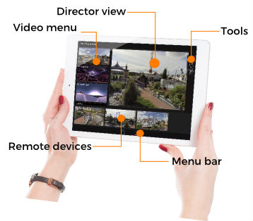

#### LiveSYNC presentation solution

LiveSYNC is a technology that allows **controlling** and **observing** 360 VR video playback on a large number of local and remote devices from a single master device. 

LiveSYNC also supports [**mirroring**](../quick_start/presentation_mirroring.md) the view of a local device to a big screen via the master device. LiveSYNC is easy to use, lightweight and works well also in crowded places. 

 
 
*LiveSYNC's director view.*

 Make sure you copy presentation contents to both director and audience devices. To start a presentation drag a photo/video content from *video menu* to *director view* and all audience devices will have the same presentation content as director's view.  
 
 
!!! tip
    Connected audience devices will be seen on the bottom of director device.