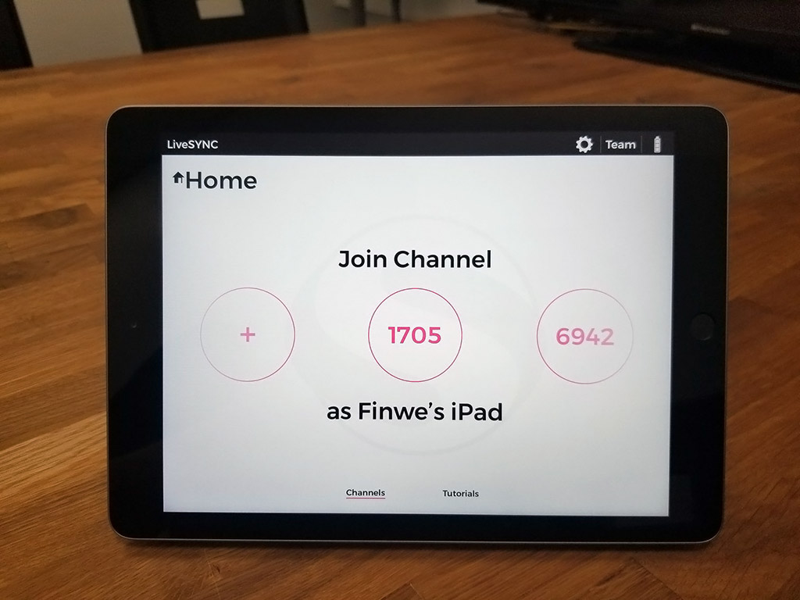
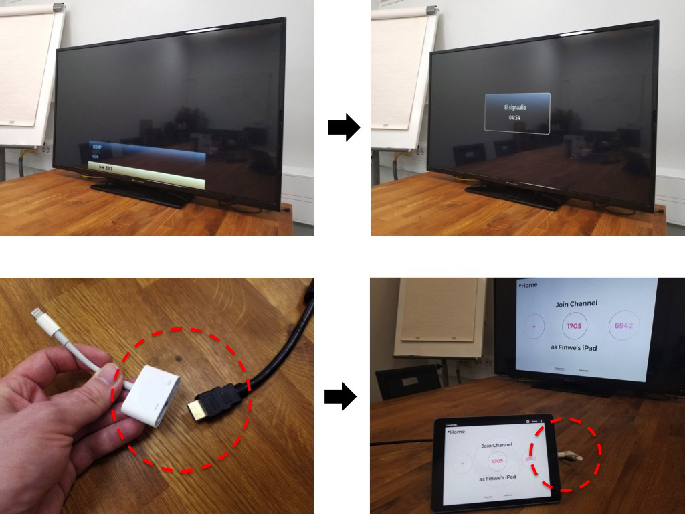
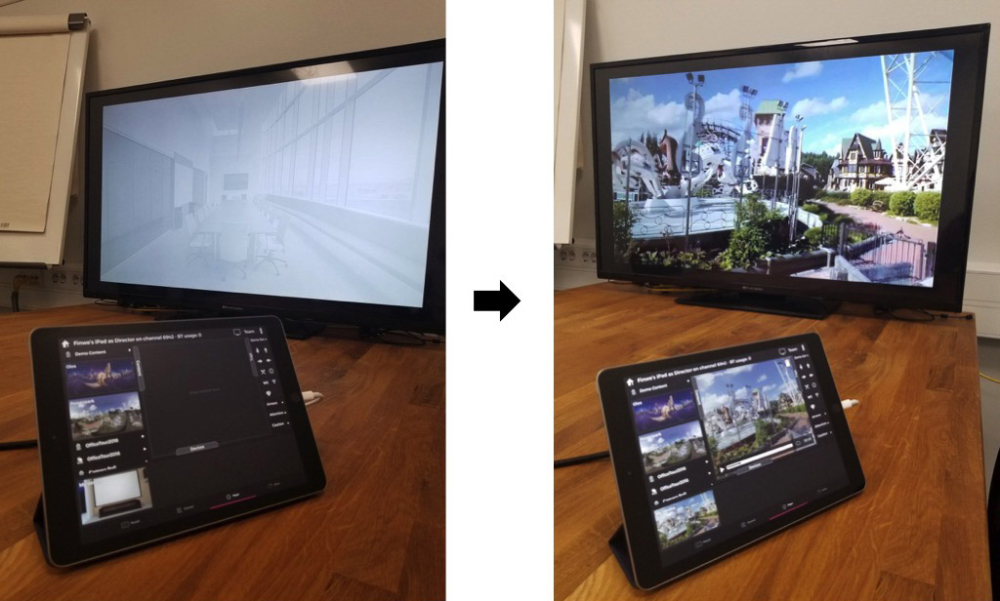
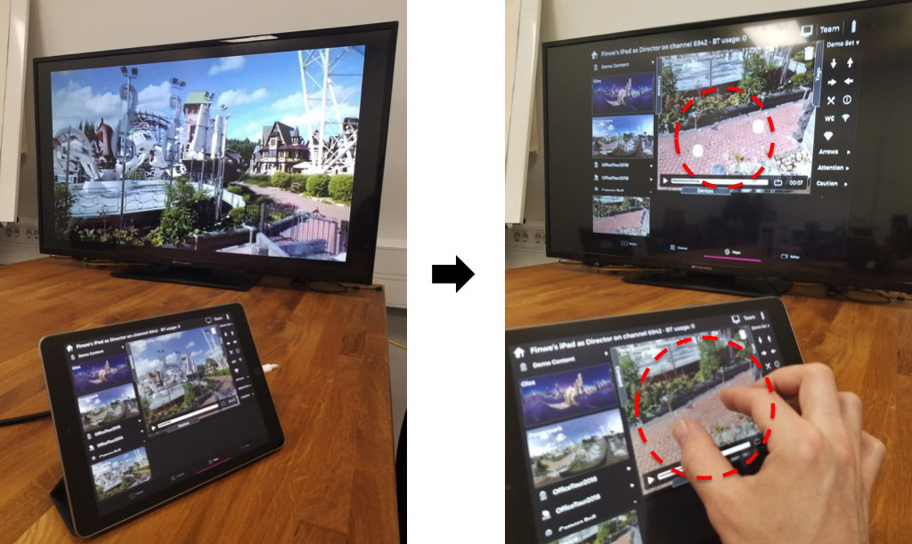
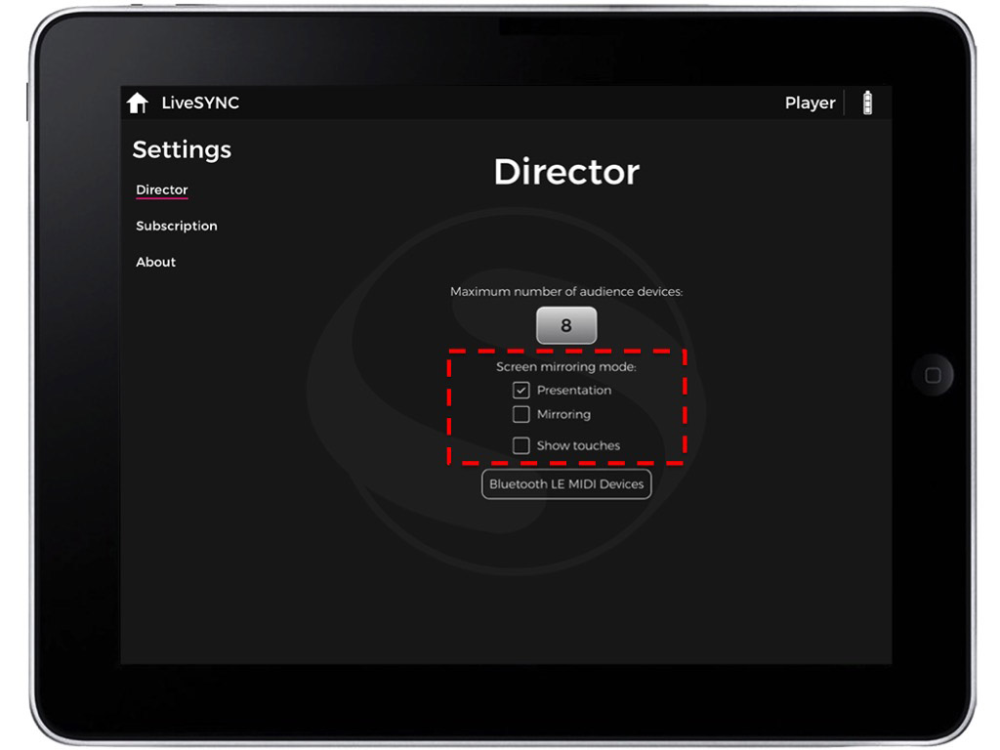
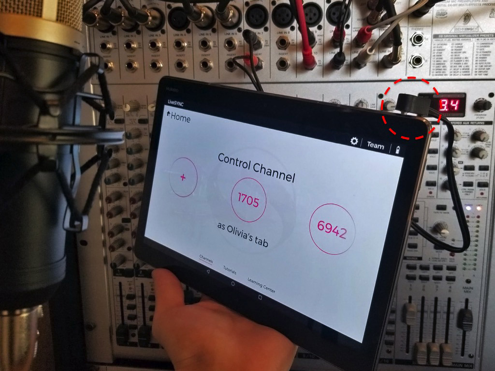
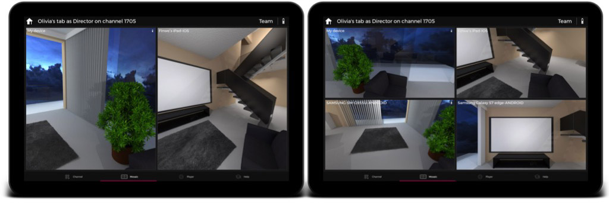

# 6. Presenting

## Overview

In this chapter, we discuss presenting content with LiveSYNC. The material follows the sequential phases of giving a presentation. We begin from the preparations that often take place a few days before a presentation. Then, we discuss what happens just before, during, and after a presentation.

## Preparing For a Presentation

Giving a presentation is usually a well-prepared situation. Many people come together to discuss, to learn, or to make decisions. Their time is valuable. As a presenter, you must use it wisely. Besides, preparing well for a presentation is *expected*. 

Here we discuss how to prepare when you use LiveSYNC as the presentation tool. It is not much different from preparing for any other presentation. Despite of different technology, the focus should still be in *communicating your message*. 360-degree content can be very useful in achieving that goal. Yet, it doesn't change the basics of preparing for a presentation.

There are many kinds of presentations. Giving a lecture in a university, demonstrating a product in a trade show, or proposing a new marketing plan in a meeting room are very different presentations. Hence, in this section we will not provide step-by-step instructions. Instead, a number of questions are given. Answering them will take you a long way forward.

### Planning

The very first thing in preparing for a presentation is planning. The amount of time available for planning varies. Sometimes you have the luxury of careful planning and sometimes you are invited ad-hoc to join a meeting and give a brief presentation. In any case, your presentation will be much more successful if you build a good routine for preparing. Here are some questions to consider:

1. **Goal**

    Why are you giving this presentation? What is the goal you want to achieve? How this presentation helps in achieving that goal? What is your core message? What are the key points that your audience should remember or learn?

2. **Audience**

    What kind of audience are you addressing? How many people? Where are they coming from? How uniform is their background? How can you connect with them? What do they know about your topic already? What are the stepping stones you can build your presentation on? What will they laugh at? What makes them act differently after your presentation?

3. **Event**

    What type of event it is? What is the culture? What kind of presentation style is expected?  What kind of room you are in? Where are you standing and where is the audience? How much space everyone has around themselves? What equipment is available and what you need to bring yourself?

4. **Outline**

    What are the main points that you want to cover? In which order you will discuss them? How do you start? When it is time to drop your core message? What will you include to the summary? How will you end?

5. **Content**

    How do you turn your outline into a logically progressing story? What kind of content communicates your message in each point - a slide, an image, a video? When will 360-degree material help and when you should stick to 2D content? What benefit will the feeling of *being there* bring? How can you make use of human's spatial memory with 360-degree material? How will you use drag'n drop tags to focus attention or to annotate things? What about interactivity?

6. **Technology**

    Which devices are needed in your presentation - a control device, a big screen, a set of viewing devices? Are the viewing devices personal or shared? How do you organize distributing and collecting them back? Will you use hand remote controllers with VR headsets? Headphones or room audio? What do you do if someone needs assistance? What if one of the devices fails?

7. **Feedback**

    How can you collect feedback? Casually asking afterwards? Formal questionnaire via email? What will you ask? What the audience thought about your presentation? What did they learn? Did you make an impact? Did they decide to change their behavior after the presentation? In what way? Would they recommend what you proposed for their friends or colleagues?

!!! warning
    LiveSYNC gives you capabilities that are kind of like *super powers*. Especially when using VR headsets, the presenter will gain almost total control of his audience's visual and auditory senses. You can also observe what other people are looking at. Don't be a villain. Use your super powers responsibly, and be respectful.

### Material

Once you have a plan, it is time to prepare the material that you need in your presentation. This can be for example a single 360-degree video, but often it is a mix of different content types. Here's an example:

- Prepare a set of slides using your favorite editor such as PowerPoint or Keynote. Export the slides as .PNG or .JPG images.

- Create a set of 2D or 360-degree photos and videos. Capture new material, dig your own archives, or license content from online image and video banks. Remember that you can also render 360-degree images from CAD or 3D modelling software.

- Consider what kind of tag icons are needed. Search from LiveSYNC's bundled and downloadable icon sets. Search online image banks. Or, create your own icons.

!!! note
    Timing is crucial in presentations. Usually we create too much material - less is more!
     
     Also remember to take into account the time that is required for managing the viewing devices. If your audience is not familiar with them or 360-degree content, they require a minute or two before they can focus on your message again.

### Devices

Once the material is ready, consider what kind of devices are needed for presenting it. Typically the bare minimum is a tablet for controlling the presentation and a big screen where the content appears. For example, a TV or a projector. If you use 360-degree content, a set of personal viewing devices makes your presentation much more interesting. Some questions to think about:

1. Who owns the devices? Should each member of the audience bring their own phones? Can you buy or borrow a set of devices? What is your hardware budget? Or will you loan them your own personal devices?

2. Do you have enough devices? Can they view the content individually or must they share the devices and take turns? What if more people than you expected show up?

3. What type of devices are best suited - phones, tablets, or VR headsets? If you need to buy hardware, which platform, brand and model? How familiar are you and your audience in using them?

4. When will the devices become available for you? How much time you need for configuring and copying assets? Can you do this alone or do you need help?

5. How do you organize distributing and collecting the devices? What are the most common issues that your audience will run into? Will you have assistants to help them? How can you ensure that you get everything back? Can you mark the devices?

### Configuring

Configuring the devices is quick but an important step. It is explained in detail [here](configuration.md). Some things to consider:

- How to identify the devices during the presentation? Will you give each device a name or will the audience use their own names? How about color coding the devices and using colors as names? Or, if you have lots of devices, maybe numbers?

- Which communication type to use between the control device and the viewing devices? Bluetooth or GlobalSYNC?

- If the audience is supposed to use their own devices, how do you handle channel configuration? Will you show them the channel number to join on the big screen? Will you use your own device as an example and do a configuration live using the big screen?

!!! note
    You cannot freely choose the channel number. You are given a random free number when you configure the control device. You can request another one, but not input your own number.

### Copying Assets

Copying your presentation's assets takes some time and cannot be done before you get access to the devices. It is explained in detail [here](asset_management.md). Also consider these tips:

- Prepare a *master directory* for your content on your computer. This directory should contain only those files that you need to copy to the devices.

- Install the necessary applications on your computer in advance. Get familiar with transferring files to your target devices.

- Measure the time that it takes to copy *your* assets to the target devices. Then calculate what is the minimum time you need for copying assets for all devices and compare to the time that is available. Consider if you need help.

### Rehearsing

Everyone enjoys a presentation that goes smoothly. Rehearsing is the key to success. Study your material and become familiar with LiveSYNC as a tool well in advance. If you use personal viewing devices, rehearse with friends, family or colleagues as your audience. You will quickly see in which parts they need help, how long they want to explore a particular 360-degree photo, etc. 

!!! note
    Don't be afraid to revise your presentation at this step. Often you need to make it more compact by leaving out material. Remember, less is more! It is much better if you leave your audience hungry for more than bored.

!!! note
    Once you are ready, remember to recharge the batteries of all devices. Then turn them off for transporting to the target location.

## Before a Presentation

The time just before a presentation is often tense and nervous - even scary. Also experienced performers feel stressed. While this is a fact of life, there are a few things you can do:

- Come early and reserve enough time to set up everything. Both technology and people tend to surprise us in various ways. Extra time will help you get familiar with the location, the equipment, and the staff. You will feel more confident during your presentation.

- Reserve a few spares of everything. Maybe you forgot to bring something important. Maybe something that was suppose to be there isn't anymore. Maybe something went broken. Maybe you need an adapter. Maybe the battery in the VR headset's hand remote just died. If possible, get a trusted person that you can sent out to look for a missing object.

- Come up with a plan B. Nothing ever goes exactly as planned - another fact of life. People are used to that, but they expect that you are on top of things. At least, you should have a plan how to proceed. The more important your presentation is, the more *what if*s you should prepare for.

### Connecting to Big Screen

When you get the chance to set up your equipment for the presentation, begin the setup from your control device:

1. Turn on your control device. Start the LiveSYNC app.

    

2. Turn on the big screen device and select correct video input, e.g. HDMI 1. The device begins to wait for video signal. Connect your control device to the big screen e.g. via an HDMI cable. If you are using an Apple device, there's an adapter for that. Once the cable is connected, the whole screen of your control device appears on the big screen.

    

    !!! tip
        If you have trouble getting a picture, try removing the cable, wait a few seconds, and reconnect it. Also, check that correct video input is selected.

    

    !!! tip
        On Apple devices, you need the [Lightning Digital AV Adapter](https://www.apple.com/shop/product/MD826AM/A/lightning-digital-av-adapter). This is shown in a picture above. 
        
        Notice that the adapter has also a female Lightning jack. You can connect a charging cable here and continue charging your device while you are using the big screen.

3. From the *Home* screen, select a channel that you want to control. Navigate to *Player* tab using the bottom navigation bar. Initially, only a background image is shown on the big screen. On the control device, drag any content to the presentation area. The playback begins on the control device, and the content also appears on the big screen.

    

    !!! note
        This is how the *Presentation* mode works. It is the default configuration and recommended for normal use.
        
    !!! tip
        If you want to share the view of one of the audience devices to the big screen, switch to *Mosaic* tab and double tap that device's view to make it full screen.

4. Notice the small TV icon in the top bar. It is only visible when a connection to a big screen device is active. Tapping the icon switches between *Presentation* and *Mirroring* modes. In the latter mode, the whole screen is mirrored. Observe the difference on the big screen.

    

5. If you need to show the audience what you do with the LiveSYNC app, switch to *Mirroring* mode. Notice how your touches on the control device are visualized as white dots on the big screen.

    

    !!! tip
        This mode is very useful when training other people to use the LiveSYNC app.

6. You can change the default mode from settings. Navigate to *Settings* screen and *Director* page. Check *Screen mirroring mode*. Depending on whether you want to mirror the presentation view or the whole screen by default, select either *Presentation* or *Mirroring*.

    

    You can also select if you want that your touches are visualized on the screen. This will help the audience understand *why* things happen when they don't see your fingers. Enable *Show touches* if necessary.

### Connecting to Room Audio

Often presentation material contains *sound*. This can be for example the sound track of a video clip or a recorded voice message in an audio hotspot.

As a presenter, you must choose a method for audio playback. Some devices make this easy as they have built-in audio. For example, TVs and Oculus Go headsets have built-in speakers. Some viewing devices do not have speakers, their audio quality is poor, or it is not loud enough considering the room size or background noise level. 

In such a case, you may want to use *room audio*. Typically meeting rooms, conference venues, etc. are equipped with a powerful audio system. You need to find how to turn it on, connect your control device to it, select correct audio source, and adjust volume. 

If you decide to use room audio, follow the steps below:

1. Plug a 3.5mm stereo audio cable to your control device's headphone jack. The connector of the cable looks similar to the connector of a typical headphone cable.

    !!! note
        If you are using a big screen device, you may not need to use a separate audio cable for sound. HDMI cable carries also audio. The big screen device may have a powerful audio system or it may have been connected to room audio system. This is the best option, so check it first.

2. Check that audio can be now heard via the room audio system. For example, play some music with the control device's audio player. Notice that the control device's own speakers are muted the 3.5mm connector is plugged in.

    If you cannot hear the sound, check that the room audio system is turned on, correct input is selected, cable connected, and volume turned on / not muted in the control device and the room audio system.

3. Adjust the sound volume of your control device to a reasonable level. Phones and tablets usually have physical volume buttons on the side.

!!! tip
    If possible, check the volume levels using presentation material that has the loudest passages. Everyone hates to hear the sound crackling.

!!! tip
    To avoid routing a long cable from the room audio system to the presenter's podium, consider adding an extra viewing device. Place it near the room audio system and use a short cable to connect audio. The viewing device needs to join the presentation channel just like any other viewing device. Nobody is *looking* at the screen of this device, but it will still play all the content. Thus, it can be used as an audio source for the room audio system.

### Connecting to Viewing Devices

If you use personal viewing devices, connect them to your control device. This allows the devices to communicate with each other ie. exchange command and status messages. Connect all viewing devices to the control device as follows:

1. On your control device, start the LiveSYNC app. From the *Home* screen, select a channel that you want to use. The *Mosaic* view appears. The control device is now waiting for viewing devices to join the channel.

    

2. On each of your viewing devices, start the LiveSYNC app. From the *Home* screen, select the same channel that you selected on the control device. The *Lobby* view appears. The viewing device is now looking for the control device. It will attempt to join the specified channel.

3. Connections are created one by one. Live views from the viewing devices appear in the control device's *Mosaic* view. Wait until all connections are established and you have a live view from each viewing device.

    

*Connected devices appear in the *Mosaic* view. It is easy to observe what every member of the audience is looking at and guide them if necessary*.

!!! note
    The grid cells are automatically resized so that maximum amount of screen real estate is used. Once the maximum cell count is reached, you can scroll the video mosaic vertically to observe the rest of the viewing devices.

!!! warning
    If you are setting up the equipment well in advance, do not leave the devices on in the presentation mode for too long. You don't want them to run out of battery before your presentation begins.

## During a Presentation

It's showtime! Your presentation begins. Presenting with LiveSYNC is made extremely easy. In principle, all you need to do is drag'n drop content and tags to the presentation area.

### Changing Content

Changing content is simple:

1. If necessary, tap the *Content* panel title to open the panel.

2. Find the content item you wish to use by vertically scrolling through the content library. You can open and close folders by tapping their titles.

3. Once you find the item you wish to show, put your finger on top of its thumbnail. The thumbnail is lifted out of the panel and it begins to follow your finger.

4. Drag the item by moving your finger. When you pass the border of the presentation area, it turns white. 

5. Raise your finger from the surface of the touch screen. The item will be "dropped" to the presentation area. 

6. The item will be automatically loaded on your control device. The control device will send a command for all viewing device to load the same content.

!!! note
    If a viewing device cannot find the specified content from its mass storage, a message is shown both on the viewing device and in the control device. Double check that you have copied all the assets. Make sure that the content item's filename matches between the control device and the viewing device.

### Panning

If you dragged a 360-degree item to the presentation area, you can pan the content in the control device as follows:

1. Put your finger over the content in the presentation area. 

2. Move your finger to pan the image to the desired direction. You can also quickly move your finger and then lift it up to give the image some inertia. A friction model will slow it down smoothly.

This will NOT pan the content in the connected viewing devices - the audience will pan the view by themselves, where applicable.

!!! note
    With 360-degree content, there are no limitations in panning. You can turn the image around as many times you want, both horizontally and vertically. However, if you turn the image in such a way that horizon gets tilted, automatic horizon alignment feature takes action. It will smoothly turn the view to align the horizon.

### Zooming

If you dragged a 360-degree item to the presentation area, you can zoom the content in the control device as follows:

1. Put two fingers over the content in the presentation area.

2. Move the fingers close to each other to zoom in, or farther away from each other to zoom out.

This will NOT zoom the content in the connected viewing devices - the audience will zoom the view by themselves, where applicable.

!!! tip
    You can also pan simultaneously by moving *both* fingers horizontally or vertically.

!!! note
    Zooming in and out is limited in both directions. The resolution of the material make the image fuzzy when zoomed far in. The rectilinear projection makes the image severely distorted when zoomed far out.

### Controlling Playback

If you dragged a 2D or 360-degree video item to the presentation area, the video controls panel appears at the bottom of the presentation area. All your actions with the controls are mirrored from the control device to the viewing devices.

1. Use Play/Pause button to start and stop playback at any time.

2. Drag the seekbar handle to seek to a different position at any time.

3. Tap the Loop button to toggle looping on/off.

4. Observe the remaining playback time in minutes and seconds to know when it is time to change content again.

### Adding Tags

If you dragged a 360-degree item to the presentation area, you can drag'n drop tags over the content. All your actions with the tags are mirrored from the control device to the viewing devices.

1. If necessary, tap the *Tags* panel title to open the panel.

2. Find the tag item you wish to use by vertically scrolling through the tag library. You can open and close folders by tapping their titles.

3. Once you find the item you wish to show, put your finger on top of its icon. The icon is lifted out of the panel and it begins to follow your finger.

4. Drag the item by moving your finger. When you pass the border of the presentation area, it turns white. 

5. Raise your finger from the surface of the touch screen. The item will be "dropped" to the presentation area.

6. The item will be automatically "glued" to the location where you dropped it. This means a particular location on the sphere where the 360-degree content is rendered to. When you pan the image, the tag follows as if it was part the world you are observing.

7. To fine tune the position of the tag, put your finger on top of the tag the you added, and drag your finger to move it.

!!! tip
    You can add *a title* to a tag. Tap a tag's icon in the tag library. A dialog appears. Enter the text to be used as a title and select *OK*. The title now appears below the tag in the library. Drag'n drop the tag over the content as usual.

!!! tip
    You can add as many tags as you like. To remove all the tags, tap the trash can icon in the top right corner of the presentation area. The trash can only appears when you have added tags.

!!! tip
    You can save the tag configuration to a sidecar file of the current content item. Tap the disk icon in the top right corner of the presentation. The next time you load the same content, the tags will be automatically added to the same locations. The disk icon only appears when you have unsaved changes (added, deleted, or moved tags).
    
!!! tip
    If you are using video content, you can utilize tags in two ways:
    
    a. Seek to the very beginning of the video. Add tags and save the configuration. The tags will be visible *throughout the video*.
    
    b. Seek to a different position in the video. Add tags and save the configuration. When you play the video, it will automatically stop at this position. The tags will appear. Press Play to continue playback. The tags will disappear. You can use tags to create multiple stops if you like.
    
    The former is useful for photos and video clips where the camera does not move. The latter works best if your video has a moving camera.

!!! note
    If a viewing device cannot find the specified tag from its mass storage, it will not appear. Double check that you have copied all the assets. Make sure that the tag item's filename matches between the control device and the viewing device.

### Guiding Users

To observe and assist audience members, follow these steps:

1. Live view from each connected device appears in the *Mosaic* tab, and also in the *Devices* area of the *Player* tab. Make a quick glance to see if someone in the audience appears to need guidance. Or, if someone has already asked for help, find his headset based on the name given to that headset. The names appear over the live views.

2. Assist the user. Observe from the live view coming from his headset that the problem is solved. For example, if someone in the audience cannot find a point-of-interest, the presenter can instruct him to turn to the correct direction.

3. If necessary, switch to *Mosaic* view and double tap a particular users' live view to make it full screen. In full-screen mode it is easier to follow another user's view. Double tap the view again to resize it back to normal size. Scroll the view vertically to see more devices.

!!! tip
    It is a good idea to mark the viewing devices. You will see their LiveSYNC names listed in the video mosaic. Mark the same name, number, or color to the viewing devices so that you can recognize them easily.

### Handling Latecomers

You may wonder what happens if someone arrives late to the presentation. Usually this is not a problem at all.

- A device that has not been used can join the presentation channel during a presentation. Once connected, its view appears in the video mosaic. It works just like all the other devices.

- The device that appeared late will show the same content that everyone else is watching. The control device will send commands to load the same video, seek to the same position, and even to show the same tags.

!!! note
    If all the devices are reserved when a latecomer arrives, it is often too disturbing for the presentation to stop for configuring a new device and copying all the assets in place. In such a case, it is probably best if the latecomer observes the presentation via the big screen or a person next to him shares his view.

### Handling Connection Issues

During a presentation, sometimes an unwanted yet possible situation may occur: a connection issue. There are two kinds of connection issues:

a. Minor issue. For example, the view of one of the devices is not updated to the video mosaic. However, content change and playback commands still go through. This is possible for example when Bluetooth connection is used near the device's limits. Low-priority messages, such as view direction updates, may not go through. Usually, the presentation can continue without corrective actions.

b Major issue. For example, a connection between a viewing device and the control device drops. Or, connection exists but mandatory commands such as content change and playback commands do not go through. This is possible for example when Bluetooth connection is used over the device's limits or network issue occurs while using GlobalSYNC. The presentation may not continue without corrective actions.

Read more about problem solving from [here](troubleshooting.md).

## After a Presentation

Congratulations, you've had your presentation. Now it is time relax a bit. There are some final actions before you are done.

### Disconnecting

After the presentation, you should disconnect the viewing devices from the control device. There are two ways:

a. Using the control device. Tap the *Home* icon in the top left corner of the title bar. Answer *OK* to the confirmation dialog. The control device will disconnect from the viewing devices. The viewing devices will return to the *Lobby*.

b. Using viewing devices. From each viewing device, tap the *Home* button or *Back* button. Answer *OK* to the confirmation dialog.

### Exiting LiveSYNC

You can save power by returning from the director or audience mode back to the *Home* screen. This way the 3D world can be torn down and the communication services shut down. To maximize power saving, exit from the LiveSYNC app.

### Powering Off

It is not uncommon that you are asked to repeat part of your presentation afterwards, for example for a VIP who has heard about it. Power off your control device and viewing devices to save power.

### Cleaning Up

If you are using shared or loaned devices, remember to clean up the devices after your presentation. Especially video files consume a lot of storage space. Sometimes, a material may not be intended for all eyes.
