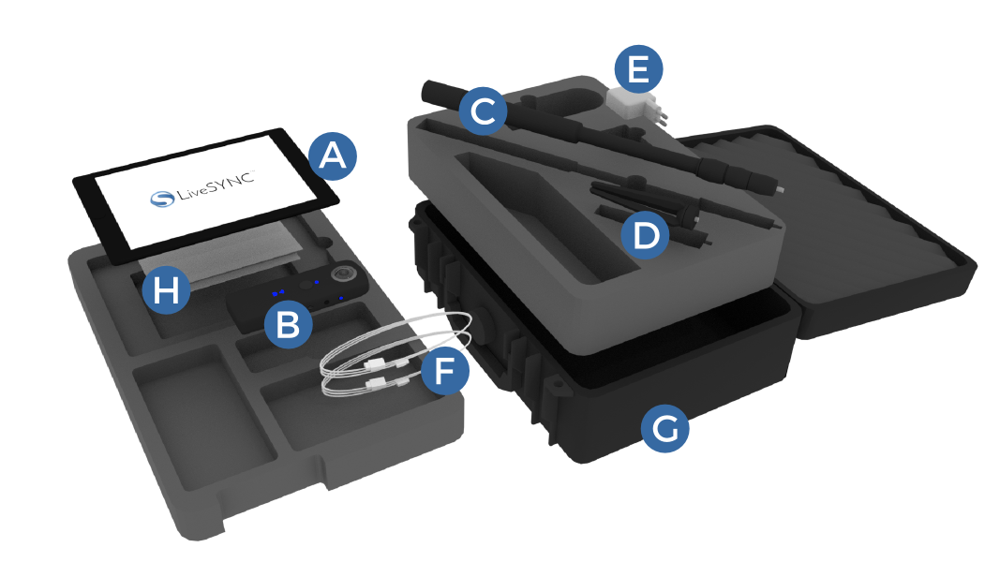
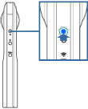
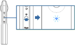
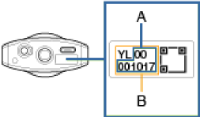
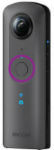

# 360° VIDEO STARTER KIT

** Starter Kit includes:  **

**A**. Apple iPad 9.7” 128 GB WiFi with pre-installed LiveSYNC app

**B**. Ricoh Theta V 4K 360° video camera with soft protective casing

**C**. Monopod

**D**. Mini tripod

**E**. iPad charger

**F**. Cables

**G**. Durable carrying case

**H**. Quick start guide and manuals

<iframe src="https://player.vimeo.com/video/303020134" width="640" height="360" frameborder="0" webkitallowfullscreen mozallowfullscreen allowfullscreen></iframe>

*Video not working? Click [here](https://vimeo.com/303020134) to open it in Vimeo.*

## Charging the batteries

The supplied tablet computer and camera contain **built-in non-user replaceable batteries** that allow wireless use of the 360° kit on the field.

Although the batteries may have some charge left, it is recommended to charge them in full before initial use (as always when preparing for field work).

Charge the tablet and the camera using the charger and cables (supplied).

## Assembling the stand

The 360° kit includes a mini tripod and a monopod. The camera can be mounted and left as a standalone unit or carried along while walking around (selfie stick style).

Attach the mini tripod to the bottom of the monopod by screwing them together. Then extend the monopod up to the desired length.

Always place the assembled stand on a level surface before screwing the camera onto the monopod.

**Be careful not to overtighten the screws or push the stand.**

## Connecting to the camera

The accompanying Ricoh Theta mobile app allows **remote operation** and hence hiding the operator from the camera’s view, as well as access to advanced features. This free app is pre-installed on the tablet, and can also be installed on a smartphone.

### Connecting the tablet to the camera via WiFi

(1) Turn the camera on. 

(2) Press the wireless button to turn the WiFi on.

!!! note
    The WiFi indictor flashes
    
(3) Open the WiFi settings on the tablet.

(4) Select the SSID displaying the camera’s serial number, and enter the password.

*The serial number is printed at the bottom of the camera. The SSID is “THETA + [Serial number indicated by (B)] + .OSC” (for example, “THETAYL00001017.OSC”). The password is the number indicated by (A) (in this case “00001017”)*

(5) Open the Ricoh Theta app on the tablet to capture & view 360° photos and videos or to access advanced camera functions.

### Camera WiFi indicator

**Lit**: The WiFi function is on and the camera is connected to a network.

**Flashing**: The WiFi function is on, but the camera is NOT connected to a network.

**Unlit**: The WiFi function is off.

## Capturing photos/videos

### Standalone mode (without the tablet)

1. Turn on the power of the camera.

2. Select photo or video mode by pressing the [Mode] button from the side.

3. Keep the camera steady and press the big round capture button in the front.

### Remote operation mode (with the tablet)

1. Connect the tablet to the camera via WiFi and start the Ricoh Theta app.

2. Select photo or video mode from the top bar.

3. Tap the big round capture button at the bottom bar.

## Managing files

Both the tablet and the camera contain **internal memory only** (tablet: 128GB, camera: 19GB). There are no memory card slots. The contents are transferred via WiFi.

### Transferring captured 360° photos and videos to the tablet

1. Turn the camera on and connect the tablet to the camera via WiFi. Start the Ricoh Theta app. The shooting screen is displayed.
2. Tap [x] in the upper left-hand corner of the screen. A timeline of already transferred images is displayed and [Device images] is selected in the bottom bar.
3. Select [Cam images] from the bottom bar. A list of images saved in the internal memory of the camera is displayed.
4. Tap  from top right corner. The selection screen appears.
5. Select the images to be transferred by tapping them. Multiple images can be selected (a check mark appears for selected images). Tap   (Select All button) to select all images. Tap   (Cancel button) to cancel all selections.
6. Tap [Transfer]. The transfer will start and progress is displayed on the screen. From the popup notification choose **"Transfer with slant top/bottom correction"** .To cancel the transfer, tap [x] and then tap [Cancel transfer]. Tap [Device images] to view transferred content.

!!! caution
    Long videos may take awhile to transfer. The battery may run our if the camera and the tablet are not connected to the chargers.

### Deleting photos/videos from the camera with Ricoh Theta app

1. Follow the steps 1-4 above (as if transferring photos/ videos), but select the items you want to delete.
2. Tap [Delete] and confirm removal of selected content.

### Deleting photos/videos from the tablet with Ricoh Theta app

1. Start the Ricoh Theta app and navigate to Device images.
2. Find a photo/video to be deleted and tap the trashcan icon (the trashcan icon appears in Timeline view, and also after selecting a photo/video from the list).
3. Tap [Delete] to confirm removal of selected content.

### Deleting photos/videos from the tablet via Camera Roll

(1) Start the Photos app from the application menu.

(2) Tap [Camera Roll], and then tap [Select] from top right corner.

(3) Select items to delete.

(4) Tap the trashcan icon from the top bar, and confirm removal of selected content.
