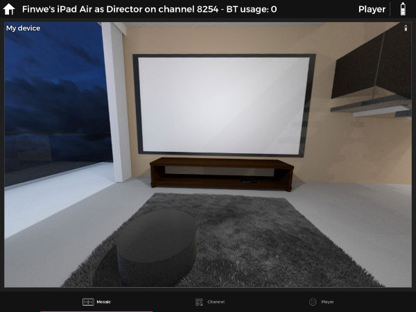
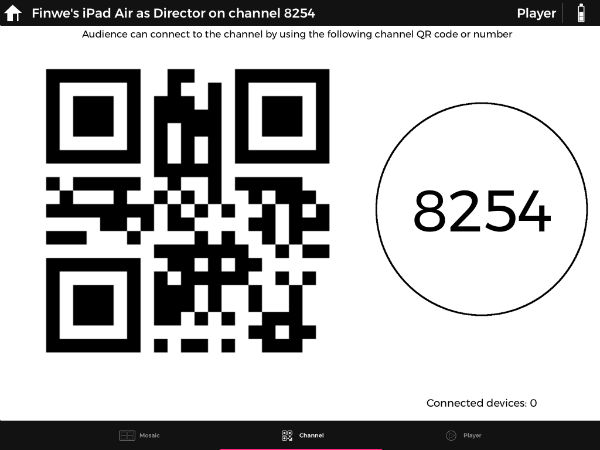
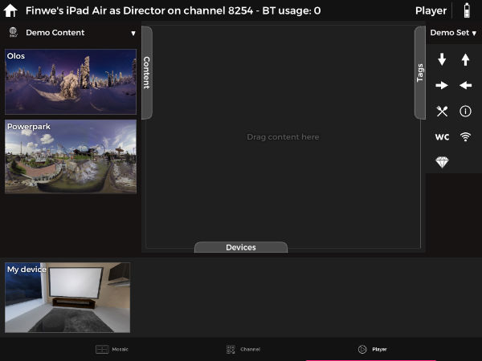

After choosing a channel number from the **Home** page, the first view that you will be seen is the *Mosaic view*. 

!!! Tip
    If you don't have a valid license, it is possible to use LiveSYNC in a trial mode. 

 On *Mosaaic* view You can see the views from your audience devices. The next tab is the *Channel tab*. On the channel tab there is 4 digit channel number and a QR code generated for audience devices to connect. Number of connected devices can also be seen on this tab. 
 

The *player tab*. The player tab is where the magic happens. Contents including bundled demo contents are located on the left side of the view. If own contents are copied make sure to pull contents to refresh the contents list. 
The *Content* area is where contents are presented on, choose a content you want to present and drag and drop it to the content area.

When playing videos, a Control Panel appears at the bottom of the Presentation area. Play, Pause and Seekbar controls work just like in any other video player. It is also possible to enable Looping to continuously repeat the video. Keep an eye on the remaining playback time so that you know when it is time to change content.

Change content whenever necessary by simply drag another media item to the Presentation area. Existing photo or video will be immediately replaced with the new one.

Connected devices are listed on the bottom side of the screen. Bundled tags are listed on the right side of the window. It is possible to add own tags and hotspot icons. 

!!! Tip
    It is possible to hide/show *Content*, *Devices* and *Tags* views by simply tapping on the text "Content", "Devices" and "Tags. "