# 5. Workspace

## Overview

In this chapter, we will go through the different views of the LiveSYNC app. Only an overview of each screen is presented here. For detailed usage instructions, refer to chapters that discuss a particular feature or view.

## Splash

When you start the LiveSYNC app, the *Splash* screen appears. The version number of the release you are using is shown in the small print. There is nothing you need to do while the *Splash* screen is visible. It disappears automatically in a few seconds once the loading completes.

Read more about LiveSYNC versions and installing from [here](installing.md).

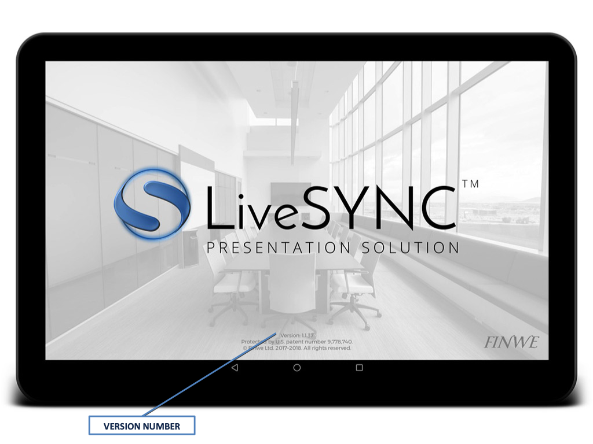

## Home

When the *Splash* screen disappears, you will enter the *Home* screen. The title bar at the top of the screen allows you to check battery and license status. Access *Settings* by tapping the cog wheel symbol. Use the navigation bar at the bottom of the screen to access *Channels*, *Tutorials*, and *Learning Center*. 

### Channels

The *Channels* page allows you to configure new presentation channels via the (+) button. You can also begin to control a channel as the director or join a channel as a member of the audience: simply tap a channel button.

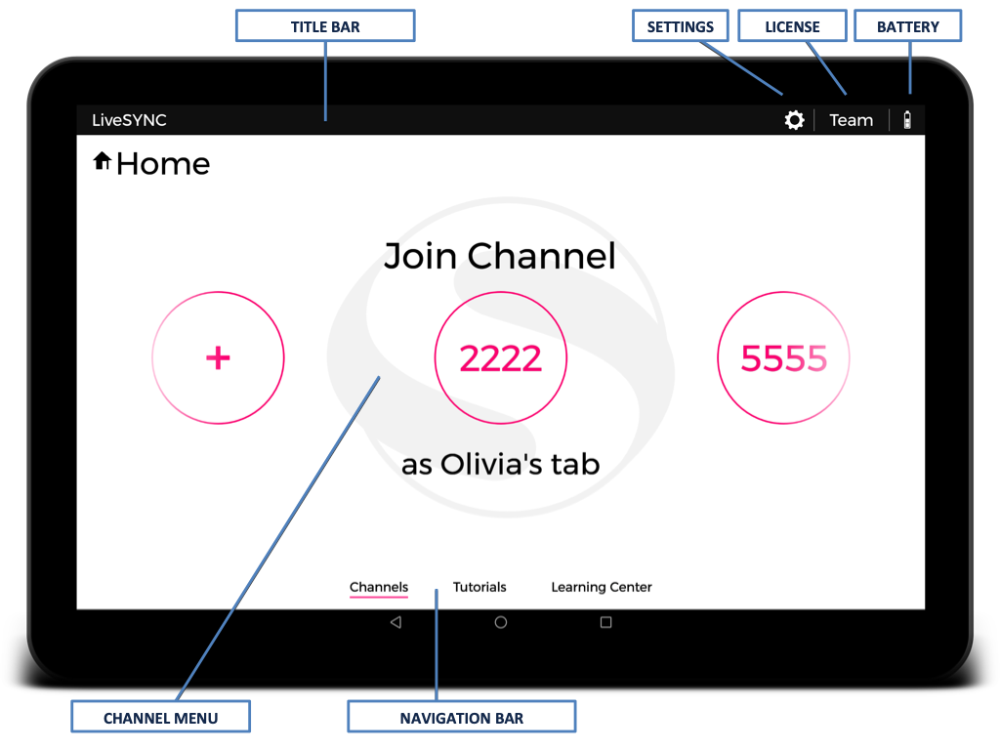

### Tutorials

The *Tutorials* page contains a set of tutorial videos. To quickly learn the basics, you can watch the tutorials directly inside the app.

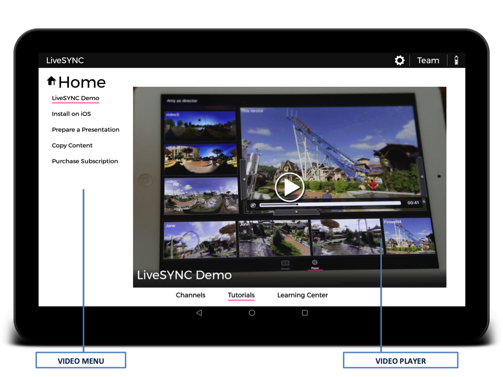

!!! note
    You will need a network connection for watching the tutorial videos.

### Learning Center

The *Learning Center* page contains a browser view where this documentation site is loaded. Read guides, articles, or dive into the full user guide.

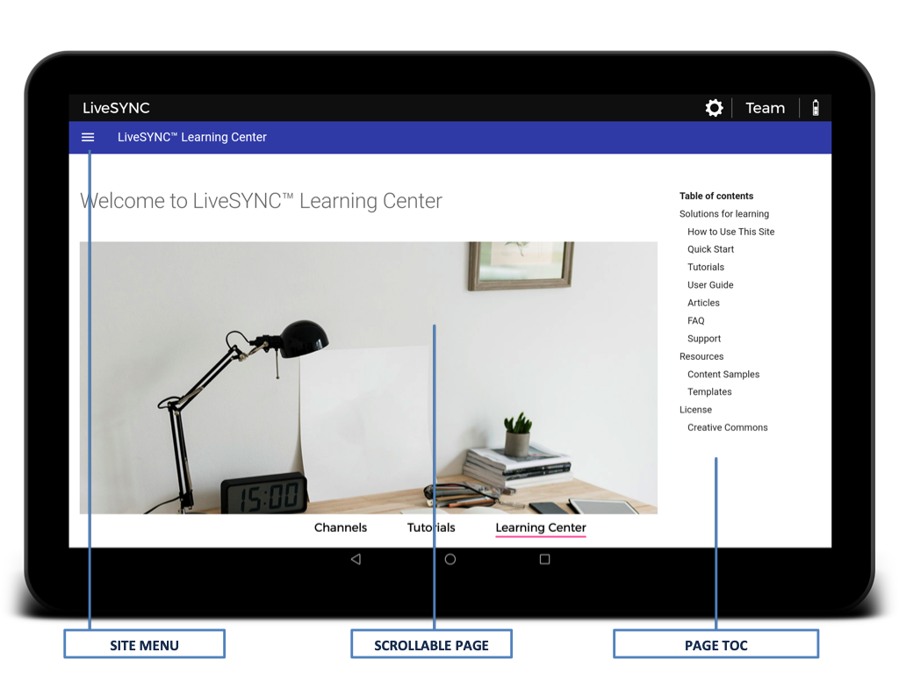

!!! note
    You will need a network connection for reading the documentation.

## Settings

Tap the cog wheel from the title bar to access the *Settings* screen. Here you can manage app settings, purchase a subscription, and read information about the app you are using.

### Director

The *Director* page in the *Settings* screen is used for adjusting your preferences related to controlling a presentation.

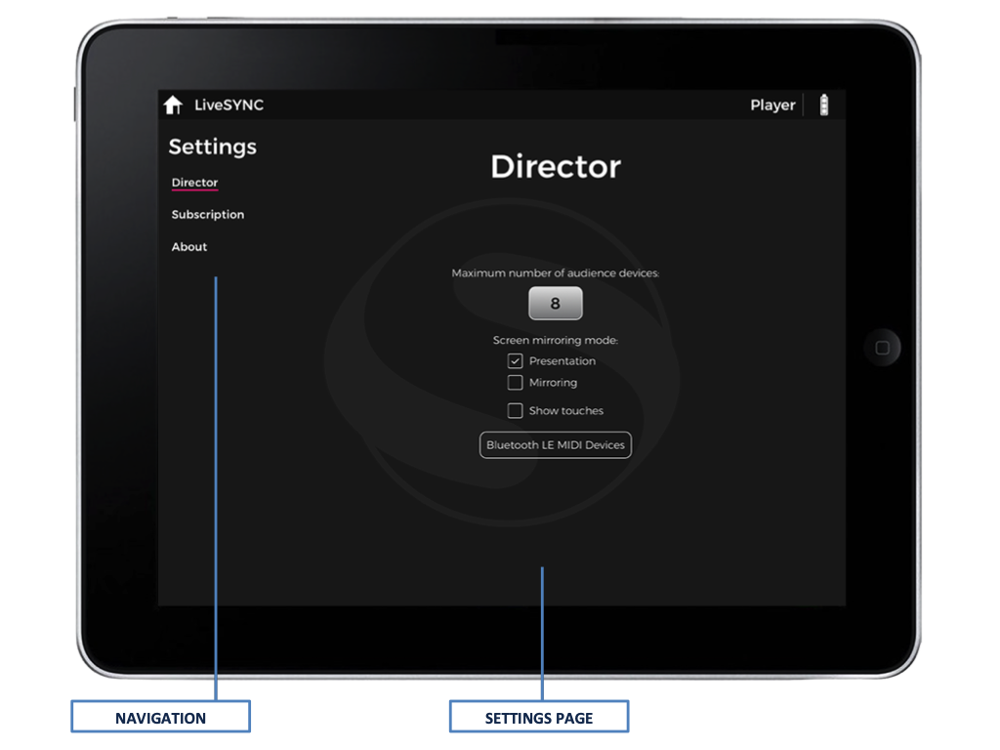

### Subscription

The *Subscription* page shows available subscription options. Here you can also purchase a subscription via in-app payment or manage your existing subscription.

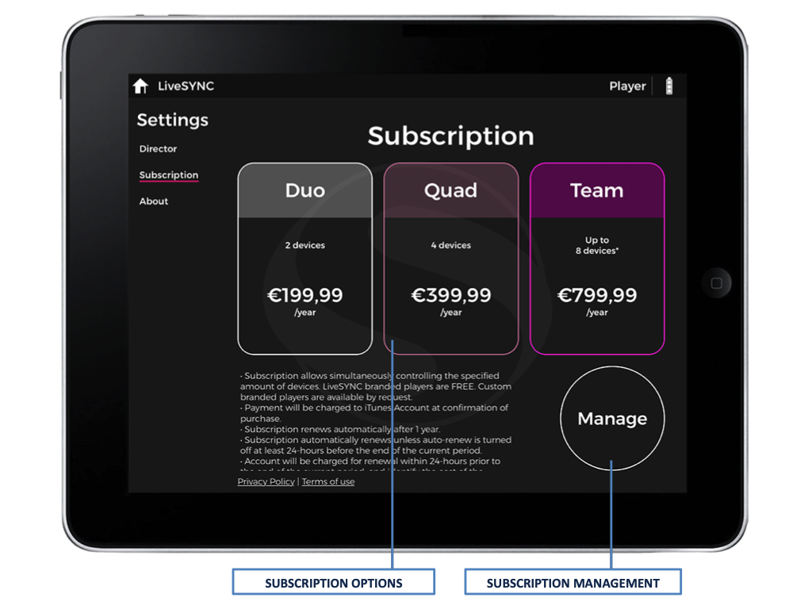

### About

The *About* page provides various information about the app. Scroll to the end of the page to send a support request email or to input a license code.

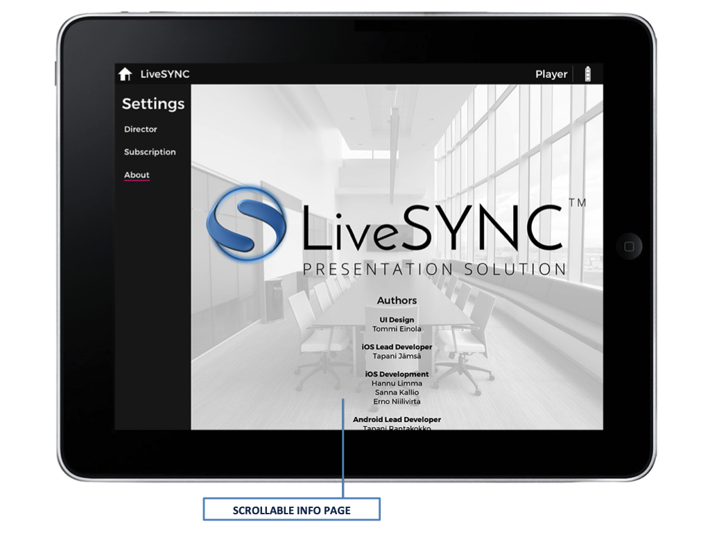

## Audience

Tap a channel configuration from the *Home* screen. If you configured the device to the audience role, you will enter the *Lobby* screen.

### Lobby

This is a 360-degree environment with an info screen. You will wait here until a connection to the control device is established. The info screen is used for showing messages about the connection.

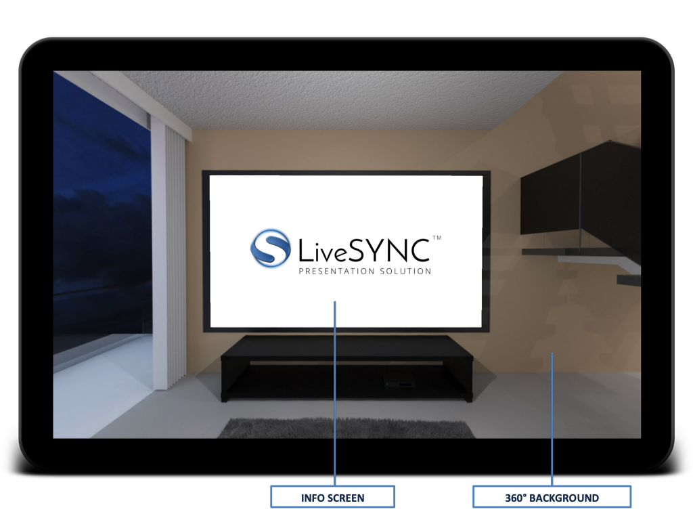

### Player

Once the connection is established and the presenter begins the presentation, the *Player* screen appears. This is where you view the presentation and interact with the hotspots.

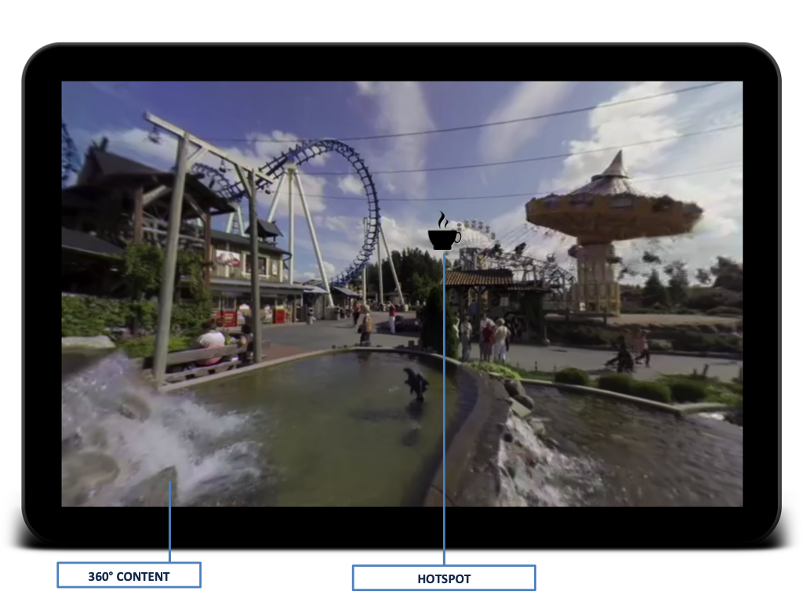

!!! note
    When the presentation ends (or if the connection is lost), you will return to the *Lobby*.

## Director

Tap a channel configuration from the *Home* screen. If you configured the device to the director role, you will enter the director's workspace and start from the *Mosaic* tab.

### Channel

The *Channel* tab is a summary of the channel configuration you are using. You can share the view on the big screen to make it easier for the audience to join the channel.

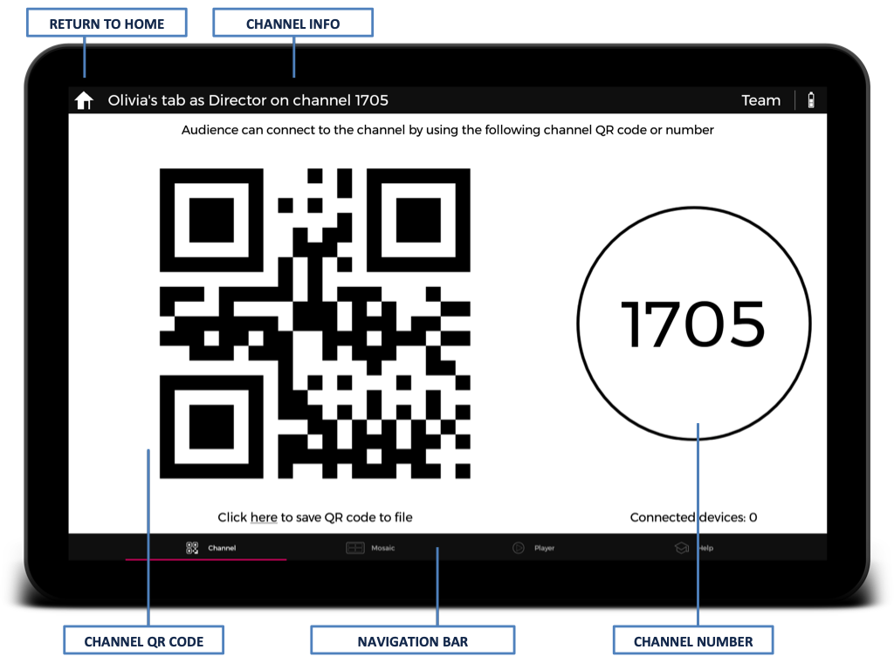

### Mosaic

The *Mosaic* tab allows observing the views of all connected devices. Initially, you will see only your own view. Every time an audience member joins, a new view will appear and the layout will be adapted. Double tap any view to expand it to full screen. Another double tap will bring back the mosaic.

### Player

The *Player* tab is where the magic happens. Drag photos, videos, and slides to the presentation view. Drag tags from the tag library. Control the playback via the video controls panel. Observe device views from the mini-mosaic. Open/close panels depending on what you need. Double tap the presentation view to quickly hide all panels. Another double tap will bring back the panels that were open.

When playing video content, video controls panel appears at the bottom of the *Presentation view*. Play, pause, and seekbar controls work just like in any other video player. It is also possible to enable *looping* to continuously repeat the video. Keep an eye on the remaining playback time so that you know when it is time to change content.

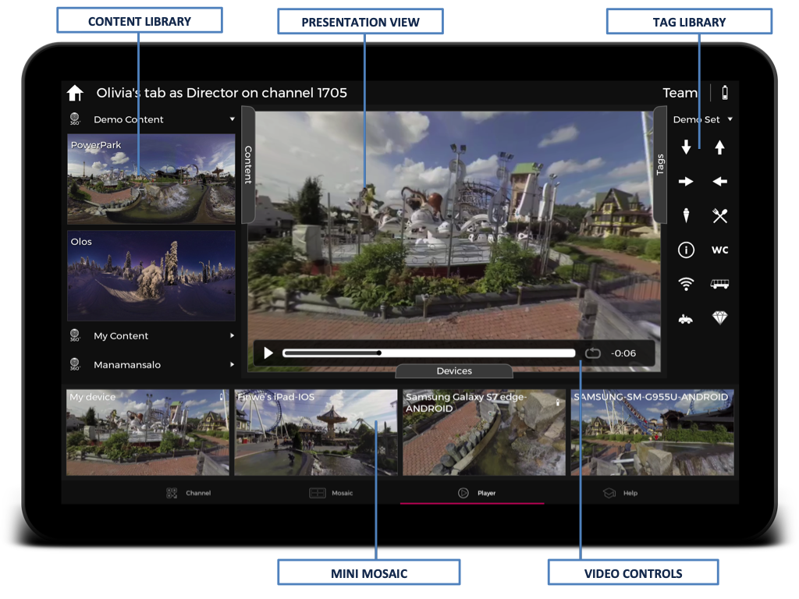

!!! Tip
    You can drag the panels from their titles to open or close the panels. There is also a shortcut: simply tap on a panel's title to toggle its visibility.

### Help

The *Help* tab allows you to check documentation *during a presentation*. Open the site menu to quickly navigate to correct page, then click a title in the page's table-of-contents on the right to jump to the desired location. You can also use an integrated search feature.

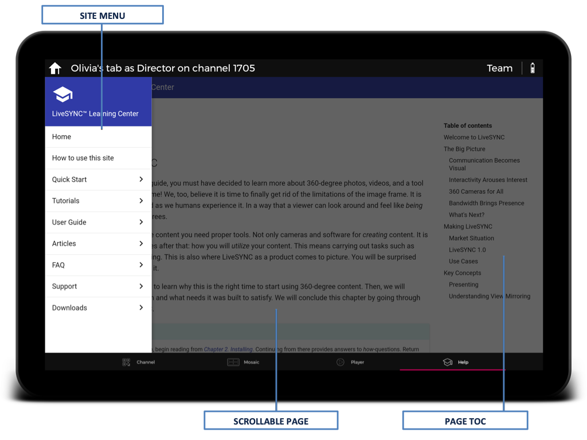

!!! note
    You will need a network connection for reading the documentation.

### Editor

The enterprise version contains the *Editor* screen. Here you can create a new project, add annotations, action hotspots, or live sensor feeds. Configure the properties of each item you add. Save the project. Preview it. Or export all the annotations as a pretty PDF report that you can email straight from the app.

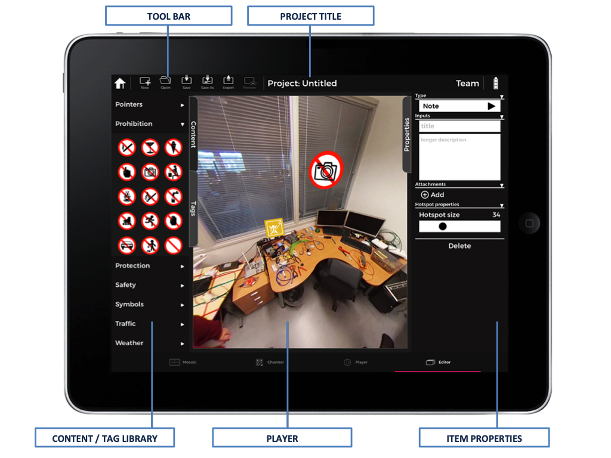

!!! tip
    In the *Editor* screen, you will find the *Tags* tab from the left side panel. 

---
